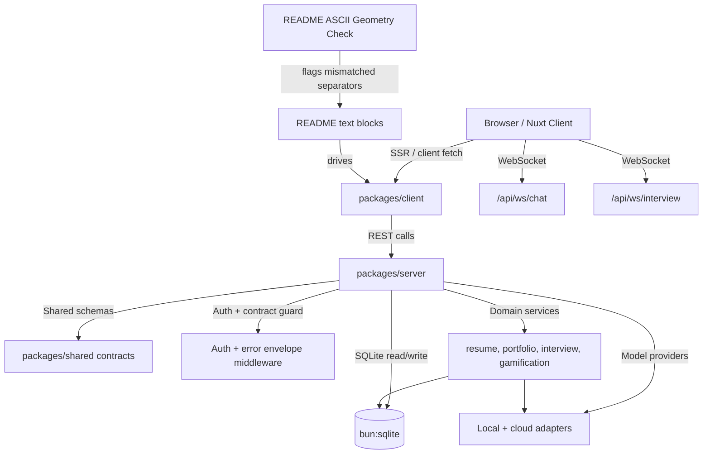

# BaoBuildBuddy Local Setup Guide

```text
+----------------------+     +----------------------+     +----------------------+
| [1] SAVE STATION     | --> | [2] LEVEL SELECT     | --> | [3] READY?           |
+----------------------+     +----------------------+     +----------------------+
|        BOOT          |     |       CONFIG         |     |        START         |
+----------------------+     +----------------------+     +----------------------+
```

This repository is a full-stack TypeScript monorepo for an AI-powered career assistant
focused on game-industry workflows:

- `packages/server` — Bun + Elysia API + direct Drizzle ORM access on SQLite
- `packages/client` — Nuxt app (SSR-first by default) with Tailwind v4 + daisyUI v5
- `packages/shared` — shared types, validation helpers, constants, and contracts



```text
 +----------------------------------------+
 |            /\                          |
 |           /__\                         |
 |          /|  |\                        |
 |          \|  |/                        |
 |      LEVEL 42 BOSS: BROKEN BUILD       |
 |  "A true gamer checks every stat"      |
 |          - BaoBuildBuddy               |
 +----------------------------------------+
```

## Stack and standards

- Runtime: Bun 1.3.x (Bun-native scripts only)
- Language: TypeScript strict mode
- Frontend: Nuxt (SSR by default; hydrate only where needed)
- Styling: Tailwind CSS v4 + DaisyUI v5
- Backend: Elysia + Bun
- Data layer: Drizzle ORM + `bun:sqlite`
- Shared contracts: `packages/shared`

No separate Node-based package manager, wrapper package manager, runtime shim layer, or
transport bridge is used for local setup. Every command in this guide is Bun-native.

## Quick reference for project scripts

- From repo root:
  - `bun install`
  - `bun run dev` (server + client)
  - `bun run dev:server` (API only)
  - `bun run dev:client` (UI only)
  - `bun run build`
  - `bun run typecheck`
  - `bun run lint`
  - `bun run lint:fix`
  - `bun run test`
  - `bun run db:generate`
  - `bun run db:push`
  - `bun run db:studio`
  - `bun run navi-omega/scripts/validate-ascii-geometry.ts navi-omega/README.md`

```text
 +----------------------------+
 |  /\___/\                   |
 | (  o o  ) if (health.ok && |
 |  \  -  /   schema.synced)  |
 |   `---'   runBossFight();  |
 +----------------------------+
```

```text
 +---------------------------+
 | [QUEST] BOOT SEQUENCE     |
 +---------------------------+
 | READY?                    |
 +---------------------------+
 | [A] Start                 |
 | [B] Configure             |
 | [X] Debug                 |
 | [Y] Repeat                |
 +---------------------------+
         \      \      \
          \      \______\___ Boot path
```

## Setup playbook (from zero to active service)

1. Start the database-facing services first to keep WS and API initialization deterministic.
2. Move to local values in `.env` (no hardcoded endpoints in code).
3. Validate auth state for your lane:
   - safe local dev: `BAO_DISABLE_AUTH=true`
   - protected mode: initialize and persist API key via `/api/auth/init`
4. Validate the contract surface by polling `/api/health` until it returns `healthy`.
5. Run test and lint gates before opening the UI.

```text
 +----------------------------------------+
 |             BOSS CHECKLIST             |
 +----------------------------------------+
 | - Memory & port availability           |
 | - CORS origin set                      |
 | - WS handshakes                        |
 | - DB path write permission             |
 | - Local AI endpoint reachable          |
 +----------------------------------------+
```

## Local setup: complete, step-by-step

### 1) Clone and enter the workspace

```bash
cd /path/to/workspace
git clone https://github.com/d4551/baobuildbuddy.git
cd baobuildbuddy
```

### 2) Install Bun dependencies

```bash
bun install
```

### 3) Create environment configuration

```bash
cp .env.example .env
```

Review `.env` and replace only values that are environment-specific.

### 4) Populate server/runtime values

`packages/server/src/config/env.ts` and `packages/client/nuxt.config.ts` are the source of truth
for runtime defaults and parsing behavior.

| Variable | Location | Purpose | Default (if set) |
|---|---|---|---|
| `PORT` | Server | HTTP bind port | `3000` |
| `HOST` | Server | HTTP bind host | `0.0.0.0` |
| `DB_PATH` | Server | SQLite file path | `~/.bao/bao.db` |
| `LOG_LEVEL` | Server | Logging verbosity | `info` |
| `CORS_ORIGINS` | Server | Comma-separated CORS whitelist | `http://localhost:3000,http://127.0.0.1:3000,http://localhost:3001,http://127.0.0.1:3001` |
| `BAO_DISABLE_AUTH` | Server | Skip auth validation for local workflows when `true`/`1` | empty |
| `NUXT_PUBLIC_API_BASE` | Client | Base URL for API calls | `/` |
| `NUXT_PUBLIC_WS_BASE` | Client | Base URL for WS calls | `/` |
| `NUXT_PUBLIC_API_PROXY` | Client | Optional dev proxy target | empty |
| `NUXT_PUBLIC_QUERY_STALE_TIME_MS` | Client | Default cache stale time | `60000` |
| `NUXT_PUBLIC_QUERY_RETRY_COUNT` | Client | Default query retry count | `1` |
| `NUXT_PUBLIC_QUERY_REFETCH_ON_FOCUS` | Client | Refetching on focus when set to `true` (or omitted) | `true` |
| `GEMINI_API_KEY` | Server/Settings | Google Gemini key (optional) | empty |
| `OPENAI_API_KEY` | Server/Settings | OpenAI key (optional) | empty |
| `CLAUDE_API_KEY` | Server/Settings | Anthropic key (optional) | empty |
| `HUGGINGFACE_TOKEN` | Server/Settings | Hugging Face token (optional) | empty |
| `LOCAL_MODEL_ENDPOINT` | Server/Settings | Local model endpoint | `http://localhost:8080/v1` |
| `LOCAL_MODEL_NAME` | Server/Settings | Local default model name | `llama3.2` |

### 5) Start local services

```bash
bun run dev
```

- Server listens on `http://localhost:3000`
- Client listens on `http://localhost:3001`
- Server health probe:
  - `GET http://localhost:3000/api/health`
- API docs via Swagger plugin:
  - `http://localhost:3000/swagger` (default path)

To isolate startup:

```bash
# API only
bun run dev:server

# UI only (assumes proxy or same-origin server available as configured)
bun run dev:client
```

### 6) Database boot and drift workflow

The server initializes the SQLite schema at startup and seeds baseline gaming studio records if missing.
Still, database migrations remain part of the workflow and should be versioned.

```bash
# generate migration SQL from schema changes
bun run db:generate

# push migrations
bun run db:push

# inspect DB schema in UI
bun run db:studio
```

## Runtime behavior and auth gate

Request authorization is guarded by `authGuard` in Elysia and is intentionally disabled in local
single-host scenarios (`127.0.0.1`, `localhost`, or `::1`) or when `BAO_DISABLE_AUTH=true`.

For protected local development without auth:

- Set `BAO_DISABLE_AUTH=true` in `.env`.

With auth enabled, use the status/init flow:

- `GET /api/auth/status` — discover whether auth is required
- `GET /api/auth/configured` — check if an API key exists
- `POST /api/auth/init` — generate and persist a key once

## Contract surfaces and route map

- API base path: `/api`
- WebSocket paths:
  - `/api/ws/chat`
  - `/api/ws/interview`
- Route modules (all under `/api`):
  - `/auth`
  - `/user`
  - `/settings`
  - `/jobs`
  - `/resume`
  - `/cover-letter`
  - `/portfolio`
  - `/interview`
  - `/studio`
  - `/scraper`
  - `/ai`
  - `/gamification`
  - `/skill-mapping`
  - `/search`
  - `/stats`

## Local AI strategy (no hardcoding behavior)

Provider selection is preference-driven and configured at runtime:

- `local` is preferred by default
- `LOCAL_MODEL_ENDPOINT` supports RamaLama/Ollama-compatible servers
- cloud providers are optional failover

Treat endpoint/model names as configuration-only values; avoid hardcoding any provider URL in
application code or tests.

```text
 +-------------------------------------------------------------+
 |                   /\___/\                                   |
 |                  /       \  "Critical missions require      |
 |                 |  O   O  |  reliable defaults."            |
 |                 |   \_/   |                                 |
 |                 |  /   \  |                                 |
 |                 |_________|                                 |
 |                   | .-. |                                   |
 |                   |/   \|                                   |
 |                      "HARD MODE ACTIVE"                     |
 +-------------------------------------------------------------+
```

## No-hardcode posture

- Environment is controlled by `.env` and runtime config files.
- API endpoints, database paths, and provider URLs are parameterized via env values.
- Values in this setup document are sourced from these runtime files:
  - `packages/server/src/config/env.ts`
  - `packages/server/src/config/paths.ts`
  - `packages/client/nuxt.config.ts`
- Local tests and UI flows should reference env-backed config, not embedded literals.
- Avoid hardcoded secrets by never writing runtime credentials into source files.
- Do not add bridge/shim/wrapper layers for local service wiring; prefer native Bun/Nuxt integration points.
- Treat migrations and runtime settings as source-controlled, reviewable config instead of manual runtime edits.

```text
 +--------------------------------------------------------------+
 |             [BOSS MODE: CONFIG CHECKPOINT]                   |
 +--------------------------------------------------------------+
 | - Default DB path: ~/.bao/bao.db (configurable via           |
 |   DB_PATH)                                                   |
 | - API port: 3000 by default                                  |
 | - UI default port: 3001 (via Nuxt)                           |
 | - Auth can be disabled for local loops via                   |
 |   BAO_DISABLE_AUTH=true                                      |
 | - WS routes: /api/ws/chat and /api/ws/interview              |
 +--------------------------------------------------------------+
```

## Local diagnostics playbook

```text
 +-----------------------------------+
 | [LEVEL COMPLETE?]                 |
 +-----------------------------------+
 | [1] bun run typecheck             |
 | [2] bun run lint                  |
 | [3] bun run test                  |
 | [4] bun run db:generate           |
 | [5] bun run dev                   |
 | [6] /api/health healthy           |
 +-----------------------------------+
```

```text
 +--------------------+
 | READY CHECKLIST    |
 +--------------------+
 | 1) typecheck       |
 | 2) lint            |
 | 3) db:generate     |
 | 4) dev             |
 | 5) health probe    |
 | 6) WS ping         |
 +--------------------+
```

```text
 +---------------------------+
 |            READY          |
 +---------------------------+
 |        .-------.          |
 |       /  .--.    \        |
 |      /   (OK)     \       |
 |     +-------------+       |
 |     |   PLAYER    |       |
 |     |    CHECK    |       |
 |      \           /        |
 |       \_________/         |
 |          ||   ||          |
 |         [======]          |
 |          RAILGUN          |
 |       8-BIT RESPAWN       |
 |            ||             |
 +---------------------------+
```

## Verification and quality checks

```bash
# Type check all workspace packages
bun run typecheck

# Linters
bun run lint

# Full test suite (server + client)
bun run test

# Build artifacts
bun run build
```

## Front-end references and component conventions

The UI system is driven by daisyUI components, with examples used from:

- `button` (`btn`, `btn-primary`, `btn-outline`, `btn-loading`, `btn-block`)
  - https://daisyui.com/components/button/
- `card` (`card`, `card-body`, `card-actions`, `card-title`, `card-side`)
  - https://daisyui.com/components/card/
- `loading` (`loading`, `loading-spinner`, `loading-dots`, sizing modifiers)
  - https://daisyui.com/components/loading/
- `modal` (`modal`, `modal-box`, `modal-backdrop`, `modal-open`, `modal-top`, `modal-end`)
  - https://daisyui.com/components/modal/
- `stats` (`stats`, `stat`, `stat-title`, `stat-value`, `stat-desc`)
  - https://daisyui.com/components/stat/
- daisyUI plugin install and Tailwind integration:
  - https://daisyui.com/docs/install/
- daisyUI v5 notes and migration details:
  - https://daisyui.com/docs/what-s-new/
- Nuxt + Vite + Tailwind integration pattern:
  - https://daisyui.com/docs/nuxt/

## ASCII geometry validation for local docs

The README now includes a deterministic geometry validator for all fenced `text` diagrams.

```bash
bun run navi-omega/scripts/validate-ascii-geometry.ts navi-omega/README.md
```

What the validator enforces:

- Graph extraction uses only `+`, `-`, and `|` as geometric primitives.
- Each connected component is analyzed independently, and only components that include at least one `+` are treated as box geometry.
- Horizontal runs are measured with exact start/end indices. A valid boxed run must satisfy:
  - `start` index has a left connector (`+` or `|`)
  - `end` index has a right connector (`+` or `|`)
- Vertical runs are measured with exact start/end indices and require top/bottom `+` connectors for boxed geometry.
- Degree checks use strict connector math:
  - `-` must keep horizontal continuity (2 neighbors)
  - `|` must keep vertical continuity (2 neighbors)
  - `+` must remain a junction node (`>= 2` neighbors)
- Any mismatch is emitted with block, line, and column so you can fix start/end alignment precisely.

## Folder map

- `packages/server/` — API routes, service layer, middleware, migrations
- `packages/client/` — UI pages, composables, plugins, and assets
- `packages/shared/` — contract schemas, constants, and provider defaults
- `bun.lock` — lock file, do not hand-edit

## Troubleshooting quick wins

### API server won’t start

- Confirm `bun install` completed
- Confirm port `3000` is free
- Confirm `DB_PATH` points to a writable directory
- Increase log visibility with `LOG_LEVEL=debug`

### Client can’t reach API

- Verify server is running at `PORT` expected by the client
- For separate processes, set `NUXT_PUBLIC_API_PROXY=http://localhost:3000`
- Verify `NUXT_PUBLIC_API_BASE` is correct for your runtime (`/` for same-origin SSR)

### WebSocket sessions fail

- Confirm both WebSocket routes are reachable
- Check browser console for WS handshake failures
- Confirm proxy rules if using custom hostnames or Docker boundaries

## Why this repo is setup-safe by design

- SSR-first rendering keeps first paint and SEO behavior predictable.
- All environment-specific values are injected through dotenv-backed config, not hardcoded.
- Contracts are centralized in shared modules.
- Error handling is shared through middleware and typed responses.
- Authentication is explicit and environment-toggleable.
- DB migration lifecycle is scripted via Bun + Drizzle.

## Gaming references and extra ascii powerups

- This service can be read like a game loop:
  - `spawn` (`bun run dev`)
  - `collect pickups` (`bun run db:generate`)
  - `gear up` (`bun run lint`, `bun run typecheck`)
  - `final boss` (`/api/health` + end-to-end routes + websocket connect)
- Keep one runbook and one state machine in mind: `idle -> loading -> success/error` (match your UI flows).
- Treat failed setup as a quick respawn checkpoint: fix one layer, re-run diagnostics, continue.

```text
 +--------------------------------------------------------+
 |               /\          /\                           |
 |              /  \        /  \                          |
 |     /\      /____\______/____\      /\                 |
 |    /  \____|  @@  |    |  @@  |____/  \                |
 |   /       /      \    /      \         \               |
 |  /       /        \  /        \         \              |
 +--------------------------------------------------------+
 |         LEVEL: LOCAL SETUP                             |
 |         BAO-UI / API CORE                              |
 +--------------------------------------------------------+
 |          "Press Start -> Production"                   |
 +--------------------------------------------------------+
```

```text
 +-----------------------------------------------------------+
 |   .-"-.          .-"-.          .-"-.          .-"-.      |
 |  /     \        /     \        /     \        /     \     |
 | | M E M |      | 8 B I |      | T R E |      | Q U E |    |
 | |  E S  |      |  T    |      | A S U |      | S T   |    |
 |  \     /        \     /        \ R E /        \     /     |
 |   `---'          `---'          `---'          `---'      |
 |                                                           |
 +-----------------------------------------------------------+
```

```text
 +------------------------------------------------+
 |                 8-bit vault                    |
 +------------------------------------------------+
 |            +-------+   +-----------+           |
 |            | GAME  |-->| DOCS SAFE |           |
 |            +-------+   +-----------+           |
 +------------------------------------------------+
```
