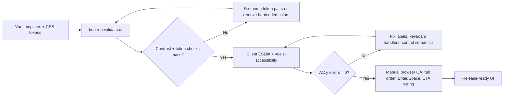

```text ascii-box
    ____              ____        _ _     _ ____            _     _
   | __ )  __ _  ___ | __ ) _   _(_) | __| | __ ) _   _  __| | __| |_   _
   |  _ \ / _` |/ _ \|  _ \| | | | | |/ _` |  _ \| | | |/ _` |/ _` | | | |
   | |_) | (_| | (_) | |_) | |_| | | | (_| | |_) | |_| | (_| | (_| | |_| |
   |____/ \__,_|\___/|____/ \__,_|_|_|\__,_|____/ \__,_|\__,_|\__,_|\__, |
                                                                      |___/
                     v1.0  ~  Local Operations Manual
```

# BaoBuildBuddy v1.0 Local Setup Guide

[](https://bun.sh/)
[](https://nuxt.com/)
[](https://www.typescriptlang.org/)
[](https://github.com/d4551/baobuildbuddy/blob/main/LICENSE)
[](https://github.com/d4551/baobuildbuddy/commits/main)

## Quick links

- [Getting Started (First-time setup)](docs/STARTER_GUIDE.md)
- [Automation Guide](docs/AUTOMATION.md)
- [Desktop (Tauri) Packaging](#89-desktop-tauri-installer-path)

### Documentation index

- [First-time Setup Guide](docs/STARTER_GUIDE.md)
- [Automation and RPA Guide](docs/AUTOMATION.md)
- [Server routes and contracts in `packages/server`](packages/server/src/routes)
- [UI and accessibility standards](#ui-implementation-standards)

```text ascii-box
/------------------------------\
|           BAO WORLD          |
|     Press START to begin!     |
|------------------------------|
| 1) Prepare environment       |
| 2) Configure services        |
| 3) Start server and client   |
| 4) Verify contracts          |
| 5) Run your automation       |
\------------------------------/
```

BaoBuildBuddy is a full-stack, Bun-first monorepo for building game-industry career automation workflows. It aggregates job listings from studios, helps build resumes and cover letters, runs AI-powered mock interviews, automates job applications via browser RPA, and tracks your progress with a gamification system.

Treat this file as the campaign handbook for your first setup quest; once you master it, you can unlock the deeper sections.

This readme is your in-game tutorial before the main campaign.

- `packages/server` -- Bun + Elysia API, drizzle-orm ORM, WebSocket endpoints, process orchestration
- `packages/client` -- Nuxt 4 (SSR-first), Tailwind CSS v4, daisyUI v5
- `packages/shared` -- shared types, contracts, constants, schemas, validation utilities
- `packages/scraper` -- Python RPA scripts executed via Bun native subprocess I/O

If you want the simplest path with minimal technical detail, use `docs/STARTER_GUIDE.md`.

## 1) Scope of this document

This is the canonical local setup runbook for BaoBuildBuddy v1.0. It covers:

- Local install and startup for all four packages
- Environment configuration via `.env` and source-of-truth config files
- Data flow between UI, API, DB, AI providers, and RPA
- How automation and AI requests are validated, executed, and persisted
- The job provider registry and how studio aggregation works
- Service layer architecture including skill extraction, data export, and CV questionnaires
- Troubleshooting and verification steps

## 2) Architecture overview

```text
          _____
         |     |
         | GLa |    "The cake is a lie."
         |  D  |     But the architecture diagram is real.
         | 0S  |
         |_____|

    Browser ──> Nuxt SSR ──> Elysia API ──> SQLite
       |                        |    |
       |── WebSocket ──> /ws/chat        |── AI providers (5 adapters)
       |── WebSocket ──> /ws/interview   |── RPA subprocess (Bun.spawn)
       |── WebSocket ──> /ws/automation  |
                                    |
                          Job provider registry
                          (ATS + gaming boards + company boards)
```



```mermaid
flowchart TD
  Browser["Browser / Nuxt SSR"] -->|render + initial payload| Client["packages/client"]
  Client --> Composables["Nuxt composables (typed)"]
  Composables --> ChatVoice["useChatVoice + useSpeech"]
  ChatVoice --> VoicePrefs["useState keys: AI_CHAT_AUTO_SPEAK + AI_CHAT_VOICE_ID"]
  Composables --> Normalizers["api-normalizers.ts"]
  Composables --> EdenClient["plugins/eden.ts (Eden Treaty client)"]
  ServerTypes["packages/server/dist-types (generated API type contract)"]
  EdenClient -->|function-param route calls| API_PREFIX["/api prefix (Nuxt config runtimeBase)"]
  EdenClient -->|type import| ServerTypes
  API_PREFIX --> Server["packages/server (Elysia)"]

  Browser -->|WebSocket| ChatWS["/api/ws/chat"]
  Browser -->|WebSocket| InterviewWS["/api/ws/interview"]
  Browser -->|WebSocket| AutomationWS["/api/ws/automation"]
  Server -->|auth + error envelope| AuthMiddleware["auth middleware"]
  Server -->|contracts| Shared["packages/shared"]
  Server -->|build:types| ServerTypes

  Server -->|register routes| RouteGroup["route modules under packages/server/src/routes/index.ts"]
  RouteGroup --> AuthRoutes["authRoutes"]
  RouteGroup --> UserRoutes["userRoutes"]
  RouteGroup --> SettingsRoutes["settingsRoutes"]
  RouteGroup --> JobsRoutes["jobsRoutes"]
  RouteGroup --> ResumeRoutes["resumeRoutes"]
  RouteGroup --> CoverLetterRoutes["coverLetterRoutes"]
  RouteGroup --> PortfolioRoutes["portfolioRoutes"]
  RouteGroup --> InterviewRoutes["interviewRoutes"]
  RouteGroup --> StudioRoutes["studioRoutes"]
  RouteGroup --> ScraperRoutes["scraperRoutes"]
  RouteGroup --> AiRoutes["aiRoutes"]
  RouteGroup --> GamificationRoutes["gamificationRoutes"]
  RouteGroup --> SkillMappingRoutes["skillMappingRoutes"]
  RouteGroup --> SearchRoutes["searchRoutes"]
  RouteGroup --> StatsRoutes["statsRoutes"]
  RouteGroup --> AutomationRoutes["automationRoutes"]
  RouteGroup --> AutomationScreenshotRoutes["automationScreenshotRoutes"]

  AuthRoutes --> AuthSvc["Auth service + authGuard policy"]
  JobsRoutes --> JobsSvc["jobs service"]
  JobsSvc --> JobAggregator["job-aggregator.ts"]
  JobAggregator --> ProviderRegistry["provider-registry.ts"]
  ProviderRegistry --> Greenhouse["greenhouse.ts"]
  ProviderRegistry --> Lever["lever.ts"]
  ProviderRegistry --> CompanyBoards["company-board.ts"]
  ProviderRegistry --> GamingProviders["gaming-providers.ts"]
  JobsSvc --> MatchingSvc["matching-service.ts"]
  JobsSvc --> DedupSvc["deduplication.ts"]

  ResumeRoutes --> ResumeSvc["resume service"]
  CoverLetterRoutes --> CoverLetterSvc["cover-letter service"]
  PortfolioRoutes --> PortfolioSvc["portfolio service"]
  InterviewRoutes --> InterviewSvc["interview service"]
  StudioRoutes --> StudioSvc["studio service"]
  ScraperRoutes --> ScraperSvc["scraper service"]
  AiRoutes --> AiSvc["AI service + context manager"]
  GamificationRoutes --> GamificationSvc["gamification service"]
  SkillMappingRoutes --> SkillMappingSvc["skill mapping service"]
  SkillMappingSvc --> SkillExtractor["skill-extractor.ts"]
  SearchRoutes --> SearchSvc["search service"]
  StatsRoutes --> StatsSvc["statistics service"]
  SettingsRoutes --> SettingsSvc["settings service"]
  AutomationRoutes --> AutoSvc["application-automation-service.ts"]
  AutoSvc --> RpaRunner["rpa-runner.ts (Bun.spawn)"]

  RpaRunner -->|JSON via stdin/stdout| Scraper["packages/scraper/*.py"]
  Scraper -->|result JSON| RpaRunner
  RpaRunner --> AutomationSchema["automation_runs persistence"]
  AutomationSchema --> DB[(SQLite via bun:sqlite)]

  JobsSvc --> DB
  ResumeSvc --> DB
  CoverLetterSvc --> DB
  PortfolioSvc --> DB
  InterviewSvc --> DB
  StudioSvc --> DB
  ScraperSvc --> DB
  SearchSvc --> DB
  StatsSvc --> DB

  AiSvc --> AIBackends["provider-interface.ts"]
  AIBackends --> LocalProvider["local-provider.ts"]
  AIBackends --> OpenAIProvider["openai-provider.ts"]
  AIBackends --> GeminiProvider["gemini-provider.ts"]
  AIBackends --> ClaudeProvider["claude-provider.ts"]
  AIBackends --> HuggingFaceProvider["huggingface-provider.ts"]
  LocalProvider --> LocalModel["LOCAL_MODEL_ENDPOINT"]
  OpenAIProvider --> OpenAIAPI["OpenAI API"]
  GeminiProvider --> GeminiAPI["Gemini API"]
  ClaudeProvider --> ClaudeAPI["Anthropic API"]
  HuggingFaceProvider --> HFAPI["HuggingFace Inference API"]
```

## 3) Implementation principles

Each Elysia route module owns its service directly -- routes call services, services call the database or external providers. Typed contracts in `packages/shared` are the source of truth for request/response shapes across client and server. Python automation runs in a Bun subprocess with JSON over stdin/stdout. Runtime values are sourced from environment configuration and persisted settings in the `settings` table.

## 3.1 Internationalization and language support

BaoBuildBuddy ships the following runtime UI locale packs:

- `en-US` — `packages/client/locales/en-US.ts`
- `es-ES` — `packages/client/locales/es-ES.ts`
- `fr-FR` — `packages/client/locales/fr-FR.ts`
- `ja-JP` — `packages/client/locales/ja-JP.ts`

Single source of truth:

- `packages/client/plugins/i18n.ts` registers locale catalogs in `I18N_MESSAGE_CATALOG`.
- `packages/client/nuxt.config.ts` defines default i18n runtime config (`NUXT_PUBLIC_I18N_*`).
- Locale files follow the typed schema in `packages/client/locales/en-US.ts`.

App settings also store a locale preference in `settings.language` using the same supported locales:

- `en-US`
- `es-ES`
- `fr-FR`
- `ja-JP`

Default settings language is `en-US`, aligned with `DEFAULT_APP_LANGUAGE`.

Locale resolution order:

1. Saved cookie locale (from `NUXT_PUBLIC_I18N_LOCALE_COOKIE_KEY`).
2. `accept-language` header variants.
3. Browser locale.
4. Configured fallback locale.

To add a new language:

1. Add a new catalog file under `packages/client/locales`.
2. Register it in `I18N_MESSAGE_CATALOG`.
3. Add the locale to `NUXT_PUBLIC_I18N_SUPPORTED_LOCALES` at runtime (or environment variable).
4. Add matching preference/voice mapping where required.

## 4) Python RPA subsystem

```text
         ___
        |   |      ~~~~~~~~~~~~~~~~~~~~~~~~~~~~~~~
        | ! |      CAUTION: Entering RPA territory
        |___|
        /   \      Automation runs are persisted to
       / BAO \     automation_runs in SQLite for full
      /_______\    audit trail and replay capability.
                   ~~~~~~~~~~~~~~~~~~~~~~~~~~~~~~~
       "Do a barrel roll!" -- but only after
       verifying your Python venv is active.
```

Automation execution is invoked from `automationRoutes` and routed through `application-automation-service.ts` --> `rpa-runner.ts`.

### 4.1 Execution model

1. API route receives typed payload for a job apply request.
2. `application-automation-service.ts` resolves required domain entities from DB (resume and optional cover letter).
3. Service writes an `automation_runs` record with:
   - unique run ID
   - type (`job_apply`)
   - status (`pending` / `running` / `success` / `error`)
   - input/output snapshots and metadata
4. `rpa-runner.ts` starts Python with `Bun.spawn`.
5. Request payload is sent as JSON on `stdin`.
6. Python script executes RPA operations (navigation, field population, clicks, screenshot).
7. Script prints structured JSON result to `stdout`.
8. `rpa-runner.ts` parses and persists result, then updates the run status.

### 4.2 Required script contract

Python script must read JSON from `stdin`, produce JSON on `stdout`, and exit non-zero on hard failure.

**Input payload:**

```json
{
  "jobUrl": "https://example.com/job/application",
  "resume": {
    "personalInfo": {
      "fullName": "Player One",
      "email": "player@example.com",
      "phone": "+1 555 0100",
      "location": "Remote"
    },
    "education": ["..."],
    "experience": ["..."],
    "skills": ["..."]
  },
  "coverLetter": {
    "company": "Acme",
    "position": "Senior Game Designer",
    "content": {}
  },
  "customAnswers": {
    "q_salary": "120000",
    "q_relocation": "No"
  }
}
```

**Success response:**

```json
{
  "success": true,
  "error": null,
  "screenshots": ["step-01.png", "step-02.png"],
  "steps": [
    { "action": "navigate", "status": "ok" },
    { "action": "fill_full_name", "status": "ok" },
    { "action": "submit", "status": "ok" }
  ]
}
```

Screenshot names in `screenshots` are relative filenames. The client should request image bytes through:

```text
GET /api/automation/screenshots/:runId/:index
```

**Failure response:**

```json
{
  "success": false,
  "error": "No matching submit button",
  "screenshots": [],
  "steps": [{ "action": "click_submit", "status": "error" }]
}
```

### 4.3 Python API used by scripts

The Python entry points use these RPA primitives:

- `r.init(turbo_mode=True)`
- `r.url(jobUrl)`
- `r.type(selector, text)`
- `r.click(selector)`
- `r.snap("page", outputPath)`
- `r.close()`

Current scripts in `packages/scraper/`:

| Script | Purpose |
|--------|---------|
| `apply_job_rpa.py` | Automates job application form submission |
| `job_scraper_gamedev.py` | Scrapes jobs from GameDev.net |
| `job_scraper_grackle.py` | Scrapes jobs from GrackleHQ |
| `job_scraper_workwithindies.py` | Scrapes jobs from Work With Indies |
| `job_scraper_remotegamejobs.py` | Scrapes jobs from RemoteGameJobs |
| `job_scraper_gamesjobsdirect.py` | Scrapes jobs from GamesJobsDirect |
| `job_scraper_pocketgamer.py` | Scrapes jobs from PocketGamer.biz |
| `studio_scraper.py` | Scrapes studio directory data |

### 4.4 Bun subprocess contract

`rpa-runner.ts` calls `Bun.spawn` with:

- `stdin: "pipe"`
- `stdout: "pipe"`
- `stderr: "pipe"`

It passes payload to stdin, reads both stdout/stderr, and fails with structured context on non-zero exit.

## 5) Job provider registry

```text
       .-----------.
      /  JOBS BOARD  \      "War. War never changes."
     |  +-----------+ |      But job boards do. The provider
     |  | Greenhouse| |      registry normalizes provider behavior
     |  | Lever     | |      so the aggregator doesn't have to
     |  | Company   | |      care which ATS you're scraping.
     |  +-----------+ |
      \             /
       '-----------'
```

The job aggregation system lives under `packages/server/src/services/jobs/` and consists of:

| File | Responsibility |
|------|---------------|
| `job-aggregator.ts` | Orchestrates fetching across all registered providers |
| `matching-service.ts` | Scores job listings against user profile and skills |
| `deduplication.ts` | Deduplicates listings that appear on multiple boards |
| `providers/provider-interface.ts` | Common interface all providers implement |
| `providers/provider-registry.ts` | Registry for adding/removing providers at runtime |
| `providers/greenhouse.ts` | Greenhouse ATS integration |
| `providers/lever.ts` | Lever ATS integration |
| `providers/company-board.ts` | Direct company career page scraping |
| `services/jobs/providers/provider-settings.ts` | Settings-backed provider configuration for known company board URLs |
| `providers/gaming-providers.ts` | Game-industry-specific board aggregation |

The default provider set includes Greenhouse, Lever, Hitmarker, GameDev.net, GrackleHQ, Work With Indies, RemoteGameJobs, GamesJobsDirect, PocketGamer.biz, plus configured SmartRecruiters/Workday/Ashby company boards.

The aggregator calls each registered provider, deduplicates results, runs matching against the user's resume/skills profile, and persists to the `jobs` schema in SQLite.

## 6) AI integration and provider chain

```text
                    .-------------.
                   /    CHOOSE     \
                  /    YOUR CLASS   \
                 /                   \
                |  [1] Local Mage     |
                |  [2] OpenAI Knight  |
                |  [3] Gemini Ranger  |      "Would you kindly"
                |  [4] Claude Healer  |       configure at least
                |  [5] HF Summoner   |       one provider?
                 \                   /
                  \_________________/
```

The AI subsystem lives under `packages/server/src/services/ai/` with these files:

| File | Responsibility |
|------|---------------|
| `ai-service.ts` | Main service, routes requests to the active provider |
| `provider-interface.ts` | Common interface all providers implement |
| `local-provider.ts` | Connects to a local inference server (Ollama, LM Studio, etc.) |
| `openai-provider.ts` | OpenAI API adapter |
| `gemini-provider.ts` | Google Gemini API adapter |
| `claude-provider.ts` | Anthropic Claude API adapter |
| `huggingface-provider.ts` | HuggingFace Inference API adapter |
| `context-manager.ts` | Manages conversation history and context windows |
| `prompts.ts` | Prompt templates for resume review, interview prep, cover letters |

### 6.1 Environment keys

- `LOCAL_MODEL_ENDPOINT` -- local inference server URL
- `LOCAL_MODEL_NAME` -- model identifier for local provider
- `OPENAI_API_KEY` -- optional cloud OpenAI
- `GEMINI_API_KEY` -- optional cloud Gemini
- `CLAUDE_API_KEY` -- optional cloud Anthropic
- `HUGGINGFACE_TOKEN` -- optional cloud HuggingFace

### 6.2 Provider selection

1. Local provider is used when `LOCAL_MODEL_ENDPOINT` and `LOCAL_MODEL_NAME` are set.
2. Cloud adapters are selected based on which API keys are configured.
3. The AI context manager handles conversation state and prompt construction.

All AI calls are server-owned. The client communicates through API routes and WebSocket endpoints, never directly to AI providers.

## 7) Additional server services

```text
     ____________________________
    |     SERVICE INVENTORY      |
    |____________________________|
    |                            |
    | "I used to be an          |
    |  adventurer like you,     |
    |  then I took a service    |
    |  layer to the knee."      |
    |____________________________|
```

Beyond the route-specific services, the server includes:

| Service | File | Purpose |
|---------|------|---------|
| CV Questionnaire | `cv-questionnaire-service.ts` | Guided questionnaire flow for building resume data |
| Data Service | `data-service.ts` | Shared data access patterns across services |
| Export Service | `export-service.ts` | Export resumes, portfolios, and cover letters to PDF/JSON |
| Skill Extractor | `skill-extractor.ts` | Extracts and normalizes skills from job listings and resumes |
| Skill Mapping | `skill-mapping-service.ts` | Maps user skills to job requirements for match scoring |

## 8) First-Time Setup (Beginner Path)

```text
              ,    ,
             /(    )\        LEVEL 1: PREREQUISITES
            /  ||||  \
           /   ||||   \      You need these items in your
          /    ||||    \     inventory before proceeding.
         / ,   ||||   , \
        /  |   ||||   |  \   Missing items = Game Over.
             /___|___||||___|___\
```

This section is the canonical first-run path for new developers. It starts from a fresh clone and ends with a fully running stack with validation checks.

### 8.1 What happens during first setup

1. Required tool checks (`bun`, `git`, optional Python 3.10+, optional Chrome).
2. Dependency installation across workspace packages.
3. Python virtual environment bootstrap and scraper dependency install.
4. `.env` creation from `.env.example` if missing.
5. SQLite schema generation and push (`db:generate`, `db:push`).
6. Optional verification (`typecheck`, `lint`, `test`).

### 8.2 Prerequisites

| Required           | Purpose                                |
|--------------------|----------------------------------------|
| Bun                | Runtime, package manager, test runner  |
| Git                | Source control                         |
| Python             | RPA script execution                   |
| Chrome or Chromium | Browser automation target              |

Optional: `curl` and `jq` for command-line diagnostics.

Chrome/Chromium executable names checked by setup scripts:
- macOS/Linux: `google-chrome`, `chromium`, `chromium-browser`, `/Applications/Google Chrome.app`
- Windows: `chrome.exe` under `%ProgramFiles%`, `%ProgramFiles(x86)%`, or `%LOCALAPPDATA%`

#### 8.2.1 Installables (OS package commands)

Use one command per tool based on your platform:

| Tool | macOS (Homebrew) | Ubuntu / Debian | Windows (winget) |
|------|-------------------|------------------|------------------|
| Bun 1.3.x | `brew install oven-sh/bun/bun` | `curl -fsSL https://bun.sh/install \| bash` | `winget install --id Oven-sh.Bun -e` |
| Git | `brew install git` | `sudo apt-get update && sudo apt-get install -y git` | `winget install --id Git.Git -e` |
| Python 3.10+ | `brew install python@3.12` | `sudo apt-get update && sudo apt-get install -y python3 python3-venv python3-pip` | `winget install --id Python.Python.3.12 -e` |
| Chrome | `brew install --cask google-chrome` | `sudo apt-get update && sudo apt-get install -y chromium-browser` | `winget install --id Google.Chrome -e` |

If your Linux distro does not ship `chromium-browser`, install `google-chrome-stable` from Google's official package repository.

Pin Bun to the workspace baseline explicitly when needed:

```bash
curl -fsSL https://bun.sh/install | bash -s "bun-v1.3.9"
```

```powershell
iex "& {$(irm https://bun.sh/install.ps1)} -Version 1.3.9"
```

### 8.3 Prepare your workspace

```bash
git clone https://github.com/d4551/baobuildbuddy.git
cd baobuildbuddy
```

If you already have a checked-out copy, start at `git pull` and continue with section 8.4.

### 8.4 Automated setup (recommended)

One command handles dependency install, Python venv, database setup, and verification:

**macOS / Linux:**
```bash
bash scripts/setup.sh
```

**Windows (PowerShell):**
```powershell
powershell -ExecutionPolicy Bypass -File scripts\setup.ps1
```

Expected flow and outputs:
1. The script prints the OS and architecture.
2. `bun install` completes without errors.
3. `.venv` is created and Python packages from `packages/scraper/requirements.txt` install.
4. `.env` is created from `.env.example` if missing.
5. Database setup runs successfully.
6. Type/lint/test checks pass (unless checks are skipped).

### 8.5 Setup script options

| Flag | Bash | PowerShell | Effect |
|------|------|-----------|--------|
| Skip verification | `--skip-checks` | `-SkipChecks` | Skip typecheck, lint, and test runs |
| Skip Python | `--skip-python` | `-SkipPython` | Skip venv creation (Bun-only install) |
| Help | `--help` | `-Help` | Print usage and exit |

### 8.6 Manual setup (for controlled environments)

If you prefer manual control, follow these steps:

```bash
bun install
```

**Python environment:**

```bash
python3 -m venv .venv
source .venv/bin/activate  # Windows: .venv\Scripts\activate
python -m pip install -r packages/scraper/requirements.txt
```

Windows manual alternative:

```powershell
python -m venv .venv
.venv\Scripts\Activate.ps1
python -m pip install -r packages\scraper\requirements.txt
```

**Environment file:**

```bash
cp .env.example .env
```

Edit `.env` before first run:
1. Keep `NUXT_PUBLIC_API_BASE=/` and `NUXT_PUBLIC_WS_BASE=/` when running `bun run dev`.
2. Set `BAO_DISABLE_AUTH=true` only for local development without API-key flow.
3. Add provider keys only if you are using those providers.
4. Set `LOCAL_MODEL_ENDPOINT` and `LOCAL_MODEL_NAME` only if using local inference.
5. Update `DB_PATH` if you want a custom database location.

Then bootstrap the database:

```bash
bun run db:generate
bun run db:push
```

Optional sanity checks:

```bash
bun run scripts/validate-ascii-geometry.ts README.md docs/STARTER_GUIDE.md
bun run typecheck
bun run lint
bun run test
```

If any checks fail, fix issues before opening the UI.

### 8.7 First launch checklist

```bash
curl -fsS http://localhost:3000/api/health
curl -fsS http://localhost:3000/api/auth/status
curl -fsS http://localhost:3000/api/jobs?limit=1 | head
```

If all three requests respond, the API stack is reachable from defaults.

### 8.8 Source-of-truth config files

| File                                     | Governs                        |
|------------------------------------------|-------------------------------|
| `packages/server/src/config/env.ts`      | Server environment validation  |
| `packages/server/src/config/paths.ts`    | File system paths used by server |
| `packages/client/nuxt.config.ts`         | Client runtime config, proxy, modules |
| `packages/scraper/requirements.txt`      | Python RPA dependencies        |
| `.env.example`                           | Template for all env vars      |

### 8.9 Desktop (Tauri) installer path

```text
     ______________________
    /|                     |\     Desktop packaging uses a native shell and
   / |        TAURI        | \    no separate Electron runtime.
  /__|_____________________|\    It launches the existing Bun stack and opens
  |  |                     |  it in a desktop window.
  |__|  .-.\           .-. |  This keeps one codebase for web + desktop.
  |  |  |o|           |o| |
  |  |  '-'           '-' |
  |  |_____________________|
  |___________________________|
```

For this repository, Tauri is the best fit for desktop installers because:

1. You already use Bun tooling and `bun run dev` for the entire stack.
2. Tauri bundles a tiny native shell around existing web UI.
3. You avoid the duplicate runtime overhead and heavier package size of Electron.

If Electron is a hard requirement (for example, due an internal Electron-specific plugin), use
`bunx electron-builder` only for a separate packaging target.
This is not the default path because it adds Chromium + Node as a permanent UI runtime dependency.

#### 8.9.1 Prerequisites (desktop)

- Rust + `cargo` (for Tauri binary generation)
- macOS / Linux: `rustup` + system build tools
- Windows: Visual C++ build tools via Visual Studio Build Tools
- Existing Bun workspace prerequisites from section 8.2

#### 8.9.2 Start desktop wrapper (development mode)

From the repo root:

```bash
bun run dev:desktop
```

This command:

1. Starts `packages/desktop`.
2. Auto-starts `bun run dev` when server/client services are not already running.
3. Opens the app at `http://127.0.0.1:3001` inside a Tauri window.

#### 8.9.3 Build desktop installers

```bash
bun run build:desktop
```

Build outputs are placed under `packages/desktop/src-tauri/target`.

Expected installer artifacts by platform:

- macOS: `packages/desktop/src-tauri/target/release/bundle/macos/*.app`, `packages/desktop/src-tauri/target/release/bundle/dmg/*.dmg`
- Linux: `packages/desktop/src-tauri/target/release/bundle/appimage/*.AppImage`, `packages/desktop/src-tauri/target/release/bundle/deb/*.deb`, `packages/desktop/src-tauri/target/release/bundle/rpm/*.rpm`
- Windows: `packages/desktop/src-tauri/target/release/bundle/nsis/*.exe`, `packages/desktop/src-tauri/target/release/bundle/msi/*.msi`

Install locally after building:

- macOS: open the generated `.dmg` and drag the `.app` into `Applications`
- Linux: `chmod +x` for `.AppImage` and run directly, or install `.deb`/`.rpm` with your package manager
- Windows: run the generated `.exe` or `.msi` installer as a normal desktop installer

#### 8.9.4 Environment overrides for desktop

- `BAO_STACK_BOOTSTRAP_COMMAND` — command to execute for the background stack (default `bun`)
- `BAO_STACK_HOST` — host checked for readiness (default `127.0.0.1`)
- `PORT` — API port (default `3000`)
- `CLIENT_PORT` — client port expectation for readiness checks (default `3001`)
- `BAO_DISABLE_AUTH` — pass through to stack startup

## 9) Configuration reference

```text
      .---------.
     | .-------. |      ~~~ OPTIONS MENU ~~~
     | |  .env | |
     | |       | |      Every configurable value lives
     | '-------' |      in .env or a source-of-truth
     '----( )----'      config file. Nothing is hardcoded.
          | |
          | |           "Hey! Listen!" -- set your
          '-'            LOCAL_MODEL_ENDPOINT first.
```

### 9.1 Server (`.env`)

| Key | Purpose | Details |
|-----|---------|---------|
| `PORT` | API bind port | Validated in range `1..65535` |
| `HOST` | API bind host | Passed to Elysia listener |
| `DB_PATH` | SQLite database file location | Parent directory must be writable |
| `LOG_LEVEL` | Logging verbosity | `info`, `debug`, `warn`, `error` |
| `CORS_ORIGINS` | Comma-separated allowed origins | Defaults include localhost variants |
| `BAO_DISABLE_AUTH` | Disable auth for local dev | Set `true` or `1` to skip auth checks |

### 9.2 Client (`.env`)

| Key | Purpose |
|-----|---------|
| `NUXT_PUBLIC_API_BASE` | API base URL for `useFetch` / `$fetch` calls |
| `NUXT_PUBLIC_WS_BASE` | WebSocket base URL for chat, interview, and automation |
| `NUXT_PUBLIC_API_PROXY` | Dev proxy target for API server |
| `NUXT_PUBLIC_QUERY_STALE_TIME_MS` | TanStack Query stale time |
| `NUXT_PUBLIC_QUERY_RETRY_COUNT` | TanStack Query retry budget |
| `NUXT_PUBLIC_QUERY_REFETCH_ON_FOCUS` | Refetch on window focus |
| `NUXT_PUBLIC_I18N_DEFAULT_LOCALE` | Initial locale to load (`en-US` default) |
| `NUXT_PUBLIC_I18N_FALLBACK_LOCALE` | Locale fallback when missing translations are requested |
| `NUXT_PUBLIC_I18N_SUPPORTED_LOCALES` | Comma-separated locale codes (`en-US,es-ES,fr-FR,ja-JP`) |
| `NUXT_PUBLIC_I18N_LOCALE_COOKIE_KEY` | Cookie key for persisted user locale |

### 9.3 AI provider keys

| Key | Purpose |
|-----|---------|
| `LOCAL_MODEL_ENDPOINT` | Local inference server URL |
| `LOCAL_MODEL_NAME` | Local model identifier |
| `OPENAI_API_KEY` | OpenAI cloud provider |
| `GEMINI_API_KEY` | Google Gemini cloud provider |
| `CLAUDE_API_KEY` | Anthropic Claude cloud provider |
| `HUGGINGFACE_TOKEN` | HuggingFace Inference API |

### 9.4 Settings Table Runtime Configuration

Runtime provider tuning for job ingestion is persisted in `settings.automationSettings.jobProviders` and read by:
- `packages/server/src/services/jobs/providers/company-board.ts`
- `packages/server/src/services/jobs/providers/gaming-providers.ts`

Required `jobProviders` keys:
- `providerTimeoutMs`
- `companyBoardResultLimit`
- `gamingBoardResultLimit`
- `unknownLocationLabel`
- `unknownCompanyLabel`
- `hitmarkerApiBaseUrl`
- `hitmarkerDefaultQuery`
- `hitmarkerDefaultLocation`
- `greenhouseApiBaseUrl`
- `greenhouseMaxPages`
- `greenhouseBoards[]` (`board`, `company`, `enabled`)
- `leverApiBaseUrl`
- `leverMaxPages`
- `leverCompanies[]` (`slug`, `company`, `enabled`)
- `companyBoardApiTemplates` (`greenhouse`, `lever`, `recruitee`, `workable`, `ashby`, `smartrecruiters`, `teamtailor`, `workday`)
- `companyBoards[]` (`name`, `token`, `type`, `enabled`, `priority`)
- `gamingPortals[]` (`id`, `name`, `source`, `fallbackUrl`, `enabled`)

`automationSettings.jobProviders` is required for provider execution. The server does not inject runtime provider defaults. Populate this object via `PUT /settings` before running ingestion.

## 10) Start procedures

```text
     _____________
    |  ___  ___  |
    | | 1 || 2 | |      PLAYER SELECT
    | |___||___| |
    |  ___  ___  |      1 = Full stack   (bun run dev)
    | | 3 || 4 | |      2 = Server only  (bun run dev:server)
    | |___||___| |      3 = Client only  (bun run dev:client)
    |_____________|      4 = Split terminals

     "Press START to begin"
```

### 10.1 Full stack (recommended)

```bash
bun run dev
```

Runs both services in parallel:
- `bun run dev:server` (packages/server on `PORT`, default 3000)
- `bun run dev:client` (packages/client, default 3001)

### 10.2 Split terminal startup

Terminal 1:
```bash
bun run dev:server
```

Terminal 2:
```bash
bun run dev:client
```

### 10.3 Expected endpoints

| Endpoint | Default | Config key |
|----------|---------|-----------|
| API server | `http://localhost:3000` | `PORT` (server) |
| Client / UI | `http://localhost:3001` | `packages/client` dev script (`nuxt dev --port 3001`) |
| Client API base | `/` | `NUXT_PUBLIC_API_BASE` |
| Client API proxy target | unset | `NUXT_PUBLIC_API_PROXY` |
| Chat WebSocket | `ws://localhost:3000/api/ws/chat` | derived from `NUXT_PUBLIC_WS_BASE` |
| Interview WebSocket | `ws://localhost:3000/api/ws/interview` | derived from `NUXT_PUBLIC_WS_BASE` |
| Automation WebSocket | `ws://localhost:3000/api/ws/automation` | derived from `NUXT_PUBLIC_WS_BASE` |

### 10.4 All available scripts

| Script | Command | Purpose |
|--------|---------|---------|
| Dev (full) | `bun run dev` | Start server + client in parallel |
| Dev server | `bun run dev:server` | Start API server only |
| Dev client | `bun run dev:client` | Start Nuxt client only |
| Dev desktop | `bun run dev:desktop` | Start Tauri desktop wrapper (auto-starts server + client) |
| Build | `bun run build` | Build server and client packages |
| Build (macOS) | `bun run build:macos` | macOS entrypoint for CI/local build |
| Build (Linux) | `bun run build:linux` | Linux entrypoint for CI/local build |
| Build (Windows) | `bun run build:windows` | Windows entrypoint for CI/local build |
| Build desktop | `bun run build:desktop` | Build Tauri installer artifacts |
| Build desktop (debug) | `bun run build:desktop:debug` | Build Tauri debug installer artifacts |
| Server API type contract | `bun run --filter '@bao/server' build:types` | Generate `packages/server/dist-types` declarations used by client typecheck |
| Format | `bun run format` | Apply Biome formatter |
| Format check | `bun run format:check` | Verify formatter output |
| UI accessibility + token checks | `bun run validate:ui` | Enforce WCAG contrast pairs and block hardcoded UI colors in client source |
| No try/catch validation | `bun run validate:no-try-catch` | Enforce repository-wide no-`try/catch` policy in source files |
| Typecheck | `bun run typecheck` | TypeScript type checking across all packages |
| Test | `bun run test` | Run test suites for server and client |
| Lint | `bun run lint` | `validate:no-try-catch` + `validate:ui` + Biome lint + client ESLint |
| Lint fix | `bun run lint:fix` | `validate:no-try-catch` + `validate:ui` + auto-fix lint issues in Biome and client ESLint |
| DB generate | `bun run db:generate` | Generate Drizzle migration files |
| DB push | `bun run db:push` | Push schema changes to SQLite |
| DB studio | `bun run db:studio` | Open Drizzle Studio GUI for database inspection |
| ASCII validation | `bun run scripts/validate-ascii-geometry.ts README.md` | Verify ASCII-art geometry constraints |

## 11) End-to-end verification

```text
         ______
        |      |      ~~~ SAVE POINT ~~~
        | SAVE |
        |______|      Before you open the UI, run these
         /    \       verification checks. Every check that
        /  ()  \      passes is XP earned. Every check
       /________\     skipped is a Boo that haunts you later.
```

### 11.1 Build and lint checks

```bash
bun run format:check
bun run validate:no-try-catch
bun run validate:ui
bun run typecheck
bun run lint
bun run test
```

Client-side runtime tests for composables use `*.nuxt.spec.ts` and initialize Nuxt with a package-root `rootDir` so alias resolution stays deterministic in workspace runs. Keep those tests explicit about external dependencies (`useApi`) and avoid relying on unresolved auto-import side effects.
`bun run typecheck` generates server API declarations (`packages/server/dist-types`) before running package typechecks, so Nuxt client typechecking consumes contract types instead of server implementation internals.
`bun run lint` includes `validate:no-try-catch`, which fails when `try/catch` blocks appear in source. Error handling should follow Elysia/Eden typed response contracts and shared settled-result helpers.
Server-side tests run with deterministic in-process AI behavior (`BAO_TEST_MODE=1`), so test execution does not depend on external AI providers or network availability.
Rate-limited route groups use header-aware client-key generation (`x-forwarded-for` / `cf-connecting-ip` / `x-real-ip` fallback), which keeps behavior deterministic in local tests and proxy deployments.
For a non-technical runbook with copy/paste steps only, use `docs/STARTER_GUIDE.md`.

### 11.2 Database setup

```bash
bun run db:generate
bun run db:push
```

The seed directory (`packages/server/src/db/seed/`) contains initial data for gaming studios and industry data to bootstrap the database.

### 11.3 ASCII geometry validation

```bash
bun run scripts/validate-ascii-geometry.ts README.md
```

### 11.4 Live service checks

```bash
API_BASE="${NUXT_PUBLIC_API_BASE:-http://localhost:3000}"
curl -fsS "${API_BASE}/api/health"
curl -fsS "${API_BASE}/api/auth/status"
curl -fsS "${API_BASE}/api/jobs" | head
curl -fsS "${API_BASE}/api/automation/runs" | head
curl -fsS "${API_BASE}/api/stats/dashboard" | head
```

### 11.5 Route health matrix

| Endpoint | Purpose | Expected response |
|----------|---------|-------------------|
| `/api/health` | Readiness probe | JSON with `status` and `database` fields |
| `/api/auth/status` | Auth state | Whether auth system is initialized |
| `/api/studios` | Studio data | Studio list structure |
| `/api/jobs` | Job search | Paginated job list |
| `/api/resumes` | Resume CRUD | Resume list or creation response |
| `/api/cover-letters` | Cover letter CRUD | Cover letter list or creation response |
| `/api/portfolio` | Portfolio CRUD | Portfolio project list |
| `/api/interview/sessions` | Interview sessions | Interview history |
| `/api/skills/mappings` | Skill mapping CRUD | List, create, update, and delete mapped skills (`DELETE` returns `{ message, id }`) |
| `/api/skills/pathways` | Career pathways | Ranked pathways by match score |
| `/api/skills/readiness` | Career readiness | Readiness score and category breakdown |
| `/api/skills/ai-analyze` | Skill analysis | Suggested mappings and recommendations |
| `/api/automation/job-apply` | Start job application automation | `{ runId, status: "running" }` |
| `/api/automation/job-apply/schedule` | Schedule job application automation | `{ runId, status: "pending", scheduledFor }` |
| `/api/automation/email-response` | Generate AI email response | `{ runId, status: "success", reply, provider, model }` |
| `/api/gamification/progress` | XP and level progression | Gamification progress payload |
| `/api/automation/runs` | Automation audit | Persisted run records |
| `/api/automation/runs/:id` | Run detail | Single run snapshot |
| `/api/automation/screenshots/:runId/:index` | Run screenshot bytes | PNG/JPEG/WebP image stream |
| `/api/stats/dashboard` | Usage statistics dashboard | Aggregate stat payload |
| `/api/stats/weekly` | Weekly activity stats | Weekly metrics payload |
| `/api/stats/career` | Career progress stats | Career progression payload |
| `/api/ws/chat` | AI chat | WebSocket upgrade handshake |
| `/api/ws/interview` | Mock interview | WebSocket upgrade handshake |
| `/api/ws/automation` | Automation run progress events | WebSocket subscribe/unsubscribe event stream |

### 11.6 UI wiring and accessibility verification

```bash
bun run validate:ui
bun run --filter '@bao/client' lint
```

The UI verification pipeline enforces:

- WCAG AA color contrast for configured daisyUI theme pairs (`*-content` on semantic backgrounds)
- no hardcoded UI colors in client source (hex/rgb/hsl/oklch literals, Tailwind palette classes, arbitrary color literals)
- form controls are programmatically labeled (`label` + `for`, nesting, or ARIA label)
- clickable UI surfaces are keyboard-operable and focusable
- anchor and icon-only controls expose accessible names
- unsupported ARIA usage is rejected



Manual browser checklist for final sign-off:

1. Verify primary CTAs on each page trigger expected state transitions and API calls.
2. Verify keyboard-only navigation (`Tab`, `Shift+Tab`, `Enter`, `Space`) works on cards, menus, and dialogs.
3. Verify icon-only controls have accessible names and visible focus states.
4. Verify form submission and validation states are reachable without pointer input.

## 12) Project structure

```text
     "The right man in the wrong place
      can make all the difference in the world."
      -- But the right file in the wrong directory? Not so much.
```

```text
    baobuildbuddy/
    +-- packages/
    |   +-- server/                 Bun + Elysia API server
    |   |   +-- src/
    |   |   |   +-- routes/         17 route modules + test files
    |   |   |   |   +-- auth.routes.ts
    |   |   |   |   +-- user.routes.ts
    |   |   |   |   +-- settings.routes.ts
    |   |   |   |   +-- jobs.routes.ts
    |   |   |   |   +-- resume.routes.ts
    |   |   |   |   +-- cover-letter.routes.ts
    |   |   |   |   +-- portfolio.routes.ts
    |   |   |   |   +-- interview.routes.ts
    |   |   |   |   +-- studio.routes.ts
    |   |   |   |   +-- scraper.routes.ts
    |   |   |   |   +-- ai.routes.ts
    |   |   |   |   +-- gamification.routes.ts
    |   |   |   |   +-- skill-mapping.routes.ts
    |   |   |   |   +-- search.routes.ts
    |   |   |   |   +-- stats.routes.ts
    |   |   |   |   +-- automation.routes.ts
    |   |   |   |   +-- automation-screenshots.routes.ts
    |   |   |   +-- services/       Business logic layer
    |   |   |   |   +-- ai/         5 provider adapters + context manager + prompts
    |   |   |   |   +-- automation/ application-automation-service.ts, rpa-runner.ts
    |   |   |   |   +-- jobs/       Aggregator, matching, dedup, provider registry
    |   |   |   |   |   +-- providers/  greenhouse, lever, company-board, gaming-providers
    |   |   |   |   +-- resume-service.ts
    |   |   |   |   +-- cover-letter-service.ts
    |   |   |   |   +-- portfolio-service.ts
    |   |   |   |   +-- interview-service.ts
    |   |   |   |   +-- gamification-service.ts
    |   |   |   |   +-- scraper-service.ts
    |   |   |   |   +-- search-service.ts
    |   |   |   |   +-- statistics-service.ts
    |   |   |   |   +-- export-service.ts
    |   |   |   |   +-- data-service.ts
    |   |   |   |   +-- cv-questionnaire-service.ts
    |   |   |   |   +-- skill-extractor.ts
    |   |   |   |   +-- skill-mapping-service.ts
    |   |   |   +-- db/
    |   |   |   |   +-- schema/     13 Drizzle schema files
    |   |   |   |   |   +-- user.ts, auth.ts, resumes.ts, cover-letters.ts
    |   |   |   |   |   +-- portfolios.ts, interviews.ts, studios.ts, jobs.ts
    |   |   |   |   |   +-- skill-mappings.ts, gamification.ts, settings.ts
    |   |   |   |   |   +-- automation-runs.ts, chat-history.ts
    |   |   |   |   +-- migrations/
    |   |   |   |   +-- seed/       Initial gaming data and studio records
    |   |   |   |   +-- client.ts, init.ts
    |   |   |   +-- middleware/     auth.ts, error-handler.ts, logger.ts
    |   |   |   +-- ws/             chat.ws.ts, interview.ws.ts, automation.ws.ts
    |   |   |   +-- config/         env.ts (validation), paths.ts
    |   +-- client/                 Nuxt 4 SSR application
    |   |   +-- pages/              28 page components across 10 feature areas
    |   |   +-- components/         25 Vue components
    |   |   |   +-- ai/             AIChatBubble, AIStreamingResponse, BaoFairy
    |   |   |   +-- resume/         ResumePreview, ExperienceList, PersonalInfoForm,
    |   |   |   |                   SkillsEditor, EducationList
    |   |   |   +-- jobs/           JobCard, JobMatchScore, JobSearchBar, JobFilters
    |   |   |   +-- interview/      InterviewChat, ScoreCard, StudioSelector
    |   |   |   +-- gamification/   DailyChallenge, XPBar, AchievementBadge
    |   |   |   +-- portfolio/      PortfolioGrid, ProjectCard
    |   |   |   +-- layout/         AppNavbar, AppSidebar, AppDock
    |   |   |   +-- ui/             ConfirmDialog, LoadingSkeleton
    |   |   +-- composables/        25 composables
    |   |   |   +-- useApi, useAuth, useUser, useSettings, useSettingsQuery
    |   |   |   +-- useTheme, useWebSocket, useSpeech, useTTS, useSTT
    |   |   |   +-- useJobs, useSearch, useResume, useCoverLetter
    |   |   |   +-- usePortfolio, useStudio, useInterview, useAI
    |   |   |   +-- useAutomation, useGamification, useSkillMapping, useStatistics
    |   |   +-- plugins/            vue-query.ts, toast.client.ts, eden.ts
    |   |   +-- middleware/         auth.ts (client-side auth guard)
    |   |   +-- layouts/            default.vue, onboarding.vue
    |   |   +-- utils/              errors.ts
    |   |   +-- types/              nuxt.d.ts, speech.d.ts
    |   |   +-- assets/css/         main.css
    |   +-- shared/                 Cross-package contracts
    |   |   +-- src/
    |   |   |   +-- types/          12 type definition files
    |   |   |   |   +-- user, ai, resume, interview, jobs, cover-letter
    |   |   |   |   +-- portfolio, studio, gamification, skill-mapping
    |   |   |   |   +-- settings, search
    |   |   |   +-- schemas/        7 validation schemas
    |   |   |   |   +-- user.schema, resume.schema, job.schema
    |   |   |   |   +-- interview.schema, settings.schema
    |   |   |   |   +-- portfolio.schema, skill-mapping.schema
    |   |   |   +-- constants/      7 constant files
    |   |   |   |   +-- ai, branding, gaming-roles, gaming-technologies
    |   |   |   |   +-- salary-ranges, state-keys, xp-levels
    |   |   |   +-- utils/          4 utility modules
    |   |   |       +-- validation, date-helpers, salary-parser, resume-transform
    |   +-- scraper/                Python RPA scripts
    |       +-- apply_job_rpa.py
    |       +-- job_scraper_gamedev.py
    |       +-- job_scraper_grackle.py
    |       +-- job_scraper_workwithindies.py
    |       +-- job_scraper_remotegamejobs.py
    |       +-- job_scraper_gamesjobsdirect.py
    |       +-- job_scraper_pocketgamer.py
    |       +-- studio_scraper.py
    |       +-- requirements.txt
    +-- scripts/
    |   +-- setup.sh                    Automated setup for macOS / Linux
    |   +-- setup.ps1                   Automated setup for Windows (PowerShell)
    |   +-- validate-ascii-geometry.ts  ASCII art geometry checker
    |   +-- validate-no-try-catch.ts    Repository no-try/catch policy validator
    |   +-- validate-ui-accessibility.ts WCAG + hardcoded-color drift validator
    +-- docs/
    |   +-- STARTER_GUIDE.md            Non-technical getting-started guide
    |   +-- AUTOMATION.md               Automation contracts and runtime behavior
    +-- .env.example
    +-- package.json
    +-- drizzle.config.ts
    +-- biome.json
```

## 13) Client pages and features

```text
       _____________________
      |  _______________    |
      | |               |   |     "All your base
      | |  WORLD MAP    |   |      are belong to us."
      | |               |   |
      | |  10 regions   |   |      Navigate 28 pages across
      | |  28 zones     |   |      10 feature areas.
      | |_______________|   |
      |_____________________|
```

| Feature area | Pages | Key composables |
|-------------|-------|-----------------|
| **Home & Setup** | `index.vue`, `setup.vue`, `settings.vue` | `useAuth`, `useSettings`, `useTheme` |
| **Resume** | `resume/index`, `resume/build`, `resume/preview` | `useResume` |
| **Cover Letter** | `cover-letter/index`, `cover-letter/[id]` | `useCoverLetter` |
| **Portfolio** | `portfolio/index`, `portfolio/preview` | `usePortfolio` |
| **Interview** | `interview/index`, `interview/session`, `interview/history` | `useInterview`, `useWebSocket` |
| **AI Chat** | `ai/dashboard`, `ai/chat` | `useAI`, `useChatVoice`, `useSpeech`, `useTTS`, `useSTT` |
| **Studios** | `studios/index`, `studios/[id]`, `studios/analytics` | `useStudio` |
| **Jobs** | `jobs/index`, `jobs/[id]` | `useJobs`, `useSearch` |
| **Automation** | `automation/index`, `automation/job-apply`, `automation/email`, `automation/scraper`, `automation/runs`, `automation/runs/[id]` | `useAutomation` |
| **Skills & XP** | `skills/index`, `skills/pathways`, `gamification.vue` | `useSkillMapping`, `useGamification` |

### UI implementation standards

- SSR-first data loading by default; composables for client-side interactivity.
- `useFetch` for route/page-level data, `$fetch` for user-triggered actions.
- Async state (`idle`, `pending`, `success`, `error`) mapped to daisyUI components (`loading`, `alert`, `stat`, `card`, `table`).
- The Elysia Eden client (`plugins/eden.ts`) provides end-to-end type safety between Nuxt and the API.
- Dynamic API endpoints use Eden function-param invocation (for example `api.resumes({ id }).get()`), not string-index access.
- API payloads are normalized in `packages/client/composables/api-normalizers.ts` before binding to shared domain state.
- Error handling follows Elysia centralized `onError` middleware and Eden `{ data, error }` branching; source-level `try/catch` is blocked by `validate:no-try-catch`.
- TanStack Vue Query (`plugins/vue-query.ts`) manages cache, stale time, and retry for all API calls.

### daisyUI component references

- https://daisyui.com/components/button/
- https://daisyui.com/components/card/
- https://daisyui.com/components/stats/
- https://daisyui.com/components/table/
- https://daisyui.com/components/alert/
- https://daisyui.com/components/loading/

### Elysia / Eden references

- https://elysiajs.com/essential/life-cycle#on-error
- https://elysiajs.com/eden/treaty/response

## 14) Database schema

```text
      .-----------.
     /             \       "A man chooses. A slave obeys."
    |   13 TABLES   |       But a schema migrates.
    |   IN SQLite   |
     \             /       All tables are defined in
      '-----------'        packages/server/src/db/schema/
```

| Schema file | Tables | Purpose |
|------------|--------|---------|
| `user.ts` | users | User accounts and profiles |
| `auth.ts` | auth tokens | Authentication sessions and tokens |
| `resumes.ts` | resumes | Resume data with structured sections |
| `cover-letters.ts` | cover_letters | Generated and custom cover letters |
| `portfolios.ts` | portfolios, portfolio_projects | Portfolio collections and individual projects |
| `interviews.ts` | interviews, interview_messages | Mock interview sessions and transcript history |
| `studios.ts` | studios | Game studio directory |
| `jobs.ts` | jobs | Aggregated job listings from all providers |
| `skill-mappings.ts` | skill_mappings | User skill profiles and gap analysis |
| `gamification.ts` | achievements, xp_events | XP tracking, achievements, daily challenges |
| `settings.ts` | settings | User preferences and app configuration |
| `automation-runs.ts` | automation_runs | RPA execution audit trail with input/output snapshots |
| `chat-history.ts` | chat_messages | AI conversation history |

Migrations are in `packages/server/src/db/migrations/`. Seed data (`packages/server/src/db/seed/`) provides initial gaming studio records and industry reference data.

## 15) Troubleshooting

```text
        .--------.
       / YOU DIED \       Don't panic. Check the matrix below.
      |  ________  |      Every problem has a save file.
      | |CONTINUE| |
      | |________| |      "Had to be me. Someone else might
       \__________/        have gotten it wrong." -- debug carefully.
```

### 15.1 API does not start

| Check | Command / action |
|-------|-----------------|
| Dependencies installed? | `bun install` |
| Port already in use? | `lsof -i :3000` or change `PORT` in `.env` |
| DB path writable? | Verify parent directory of `DB_PATH` exists and is writable |
| Detailed logs | Set `LOG_LEVEL=debug` in `.env` and restart |

### 15.2 Client cannot reach API

| Check | Command / action |
|-------|-----------------|
| API base configured? | Verify `NUXT_PUBLIC_API_BASE` in `.env` |
| Proxy configured? | Verify `NUXT_PUBLIC_API_PROXY` points to running server |
| CORS issue? | Ensure `CORS_ORIGINS` includes client origin |
| Server running? | `curl http://localhost:3000/api/health` |

### 15.3 WebSocket handshake fails

| Check | Command / action |
|-------|-----------------|
| WS base correct? | Verify `NUXT_PUBLIC_WS_BASE` |
| Routes registered? | Server logs should show `/api/ws/chat`, `/api/ws/interview`, and `/api/ws/automation` |
| Firewall blocking? | Test with `wscat -c ws://localhost:3000/api/ws/chat` |

### 15.4 RPA automation fails

| Check | Command / action |
|-------|-----------------|
| Python venv active? | `source .venv/bin/activate && python -c "import rpa"` |
| Chrome available? | `which google-chrome` or `which chromium` |
| Script output? | Check server logs for stdout/stderr from subprocess |
| Run record? | Query `/api/automation/runs` for the run ID, check `error` and `screenshots` |

### 15.5 AI providers not responding

| Check | Command / action |
|-------|-----------------|
| Keys configured? | Verify API keys are set in `.env` |
| Local model running? | `curl ${LOCAL_MODEL_ENDPOINT}/api/tags` or equivalent health check |
| Provider logs? | Set `LOG_LEVEL=debug` and check AI service output |
| Context overflow? | `context-manager.ts` may be truncating -- check conversation length |

### 15.6 Job aggregation returns empty results

| Check | Command / action |
|-------|-----------------|
| Providers registered? | Check server logs for provider registration on startup |
| Network access? | Verify outbound HTTP access to provider targets (Greenhouse, Lever, Hitmarker, company boards, gaming boards) |
| DB seeded? | Run seed if studios table is empty |
| Dedup too aggressive? | Check `deduplication.ts` thresholds |

## 16) ASCII art and geometry validation

All ASCII art blocks in this document use consistent formatting. After editing any ASCII block, validate:

```bash
bun run scripts/validate-ascii-geometry.ts README.md
```

## 17) Final checklist

```text
    ========================================
    |  FINAL BOSS: DEPLOYMENT READINESS    |
    |                                      |
    |     ,%%%,                            |
    |    ,%%%` %==--     HP: [==========]  |
    |   ,%%`( '|                           |
    |  ,%%@ /\_/          Clear all checks |
    |  ,%.-"""--,         to defeat this   |
    |  %%/      |         boss and go live.|
    |  %'  \   /                           |
    |   |  /   |          "Finish Him!"    |
    |   |  |   |                           |
    ========================================
```

- [ ] `bun install` completed successfully
- [ ] Python venv created and `rpa` installed from `packages/scraper/requirements.txt`
- [ ] `.env` populated from `.env.example` with environment-specific values
- [ ] `bun run typecheck` passes
- [ ] `bun run validate:no-try-catch` passes
- [ ] `bun run lint` passes
- [ ] `bun run test` passes
- [ ] `bun run db:generate` + `bun run db:push` complete
- [ ] `bun run dev` starts both server and client
- [ ] `/api/health` returns healthy status
- [ ] `/api/auth/status` responds
- [ ] `/api/jobs` returns job list
- [ ] `/api/automation/runs` returns run records
- [ ] `/api/ws/chat` WebSocket handshake succeeds
- [ ] `/api/ws/interview` WebSocket handshake succeeds
- [ ] `/api/ws/automation` WebSocket handshake succeeds
- [ ] AI provider responds (local or cloud)
- [ ] `bun run scripts/validate-ascii-geometry.ts README.md` passes

```text
  +============================================================+
  |                                                            |
  |    __  __ ___ ____ ____ ___ ___  _   _                     |
  |   |  \/  |_ _/ ___/ ___|_ _/ _ \| \ | |                   |
  |   | |\/| || |\___ \___ \| | | | |  \| |                   |
  |   | |  | || | ___) |__) | | |_| | |\  |                   |
  |   |_|  |_|___|____/____/___\___/|_| \_|                   |
  |                                                            |
  |     ____ ___  __  __ ____  _     _____ _____ _____         |
  |    / ___/ _ \|  \/  |  _ \| |   | ____|_   _| ____|       |
  |   | |  | | | | |\/| | |_) | |   |  _|   | | |  _|         |
  |   | |__| |_| | |  | |  __/| |___| |___  | | | |___        |
  |    \____\___/|_|  |_|_|   |_____|_____| |_| |_____|       |
  |                                                            |
  |               BaoBuildBuddy v1.0 is ready.                 |
  |                                                            |
  |               "Thank you Mario!                            |
  |                But our princess is in                       |
  |                another castle."                            |
  |                                                            |
  |               Just kidding. You're done.                   |
  |                                                            |
  +============================================================+
```
