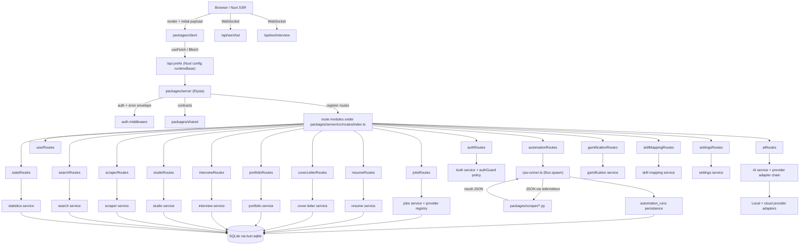

```text
    ____              ____        _ _     _ ____            _     _
   | __ )  __ _  ___ | __ ) _   _(_) | __| | __ ) _   _  __| | __| |_   _
   |  _ \ / _` |/ _ \|  _ \| | | | | |/ _` |  _ \| | | |/ _` |/ _` | | | |
   | |_) | (_| | (_) | |_) | |_| | | | (_| | |_) | |_| | (_| | (_| | |_| |
   |____/ \__,_|\___/|____/ \__,_|_|_|\__,_|____/ \__,_|\__,_|\__,_|\__, |
                                                                      |___/
                     v1.0  ~  Local Operations Manual
```

# BaoBuildBuddy v1.0 Local Setup Guide

```text
                    ___________
                   |           |
                   | NEW GAME  |     ~~~ QUEST LOG ~~~
                   | CONTINUE  |
                   | OPTIONS   |     1) Prepare environment
                   |___________|     2) Configure services
                                     3) Start server + client
         .-----.                     4) Verify contracts
        / /   \ \                    5) Run automation paths
       | | O O | |
        \ \   / /        "It's dangerous to go alone!
         '-----'          Take this setup guide."
```

BaoBuildBuddy is a full-stack, Bun-first monorepo for building game-industry career automation workflows.

- `packages/server` -- Bun + Elysia API, Drizzle ORM, WebSocket endpoints, process orchestration
- `packages/client` -- Nuxt 3 (SSR-first), Tailwind CSS v4, daisyUI v5
- `packages/shared` -- shared types, contracts, constants, schemas, validation utilities
- `packages/scraper` -- Python RPA scripts executed via Bun native subprocess I/O

## 1) Scope of this document

This is the canonical local setup runbook for BaoBuildBuddy v1.0. It covers:

- Local install and startup for all four packages
- Environment configuration via `.env` and source-of-truth config files
- Data flow between UI, API, DB, AI providers, and RPA
- How automation and AI requests are validated, executed, and persisted
- Troubleshooting and verification steps

## 2) Architecture overview

```text
          _____
         |     |    "The cake is a lie."
         | GLa |    But the architecture diagram is real.
         |  D  |
         | 0S  |
         |_____|

    Browser ──> Nuxt SSR ──> Elysia API ──> SQLite
       |                        |    |
       |── WebSocket ──> /ws/chat    |── AI providers
       |── WebSocket ──> /ws/interview   |── RPA subprocess
```



## 3) Implementation principles

Each Elysia route module owns its service directly -- routes call services, services call the database or external providers. Typed contracts in `packages/shared` are the source of truth for request/response shapes across client and server. Python automation runs in a Bun subprocess with JSON over stdin/stdout. All runtime values (ports, keys, endpoints) come from environment configuration.

## 4) Python RPA subsystem

```text
         ___
        |   |      ~~~~~~~~~~~~~~~~~~~~~~~~~~~~~~~
        | ! |      CAUTION: Entering RPA territory
        |___|      Automation runs are persisted to
        /   \      automation_runs in SQLite for full
       / BAO \     audit trail and replay capability.
      /_______\    ~~~~~~~~~~~~~~~~~~~~~~~~~~~~~~~
```

Automation execution is invoked from `automationRoutes` and routed through `application-automation-service.ts` --> `rpa-runner.ts`.

### 4.1 Execution model

1. API route receives typed payload for a job apply request.
2. Service resolves required domain entities from DB (resume and optional cover letter).
3. Service writes an `automation_runs` record with:
   - unique run ID
   - type (`job_apply`)
   - status (`pending` / `running` / `success` / `error`)
   - input/output snapshots and metadata
4. `rpa-runner.ts` starts Python with `Bun.spawn`.
5. Request payload is sent as JSON on `stdin`.
6. Python script executes RPA operations (navigation, field population, clicks, screenshot).
7. Script prints structured JSON result to `stdout`.
8. `rpa-runner.ts` parses and persists result, then updates the run status.

### 4.2 Required script contract

Python script must read JSON from `stdin`, produce JSON on `stdout`, and exit non-zero on hard failure.

**Input payload:**

```json
{
  "jobUrl": "https://example.com/job/application",
  "resume": {
    "fullName": "Player One",
    "email": "player@example.com",
    "phone": "+1 555 0100",
    "location": "Remote",
    "linkedin": "https://linkedin.com/in/player",
    "github": "https://github.com/player",
    "portfolio": "https://portfolio.example.com",
    "education": ["..."],
    "experience": ["..."]
  },
  "coverLetter": "This is a targeted application message.",
  "customAnswers": {
    "q_salary": "120000",
    "q_relocation": "No"
  }
}
```

**Success response:**

```json
{
  "success": true,
  "error": null,
  "screenshots": ["/tmp/job-apply-step-01.png", "/tmp/job-apply-step-02.png"],
  "steps": [
    { "action": "navigate", "status": "ok" },
    { "action": "fill_full_name", "status": "ok" },
    { "action": "submit", "status": "ok" }
  ]
}
```

**Failure response:**

```json
{
  "success": false,
  "error": "No matching submit button",
  "screenshots": [],
  "steps": [{ "action": "click_submit", "status": "failed" }]
}
```

### 4.3 Python API used by scripts

The Python entry points use these RPA primitives:

- `r.init(turbo_mode=True)`
- `r.url(jobUrl)`
- `r.type(selector, text)`
- `r.click(selector)`
- `r.snap("page", outputPath)`
- `r.close()`

`packages/scraper/apply_job_rpa.py` keeps all browser interaction inside these primitives and returns JSON as defined above.

### 4.4 Bun subprocess contract

`rpa-runner.ts` calls `Bun.spawn` with:

- `stdin: "pipe"`
- `stdout: "pipe"`
- `stderr: "pipe"`

It passes payload to stdin, reads both stdout/stderr, and fails with structured context on non-zero exit.

## 5) AI integration and provider chain

```text
     .---------.
    /   LOCAL   \       Provider selection order:
   |  INFERENCE  |
   |   SERVER    |      1. Local model (when LOCAL_MODEL_ENDPOINT is set)
    \           /       2. Cloud adapters (OpenAI, Gemini, Claude, HuggingFace)
     '---------'        3. Per-request validation via shared schemas
          |
     .----+----.
    /  CLOUD    \       Five provider adapters:
   | PROVIDERS   |       - packages/server/src/services/ai/local-provider.ts
   | OpenAI      |       - packages/server/src/services/ai/openai-provider.ts
   | Gemini      |       - packages/server/src/services/ai/gemini-provider.ts
   | Claude      |       - packages/server/src/services/ai/claude-provider.ts
   | HuggingFace |       - packages/server/src/services/ai/huggingface-provider.ts
    \           /
     '---------'        All implement provider-interface.ts
```

### 5.1 Environment keys

- `LOCAL_MODEL_ENDPOINT` -- local inference server URL
- `LOCAL_MODEL_NAME` -- model identifier for local provider
- `OPENAI_API_KEY` -- optional cloud OpenAI
- `GEMINI_API_KEY` -- optional cloud Gemini
- `CLAUDE_API_KEY` -- optional cloud Anthropic
- `HUGGINGFACE_TOKEN` -- optional cloud HuggingFace

### 5.2 Provider selection

1. Local provider is used when `LOCAL_MODEL_ENDPOINT` and `LOCAL_MODEL_NAME` are set.
2. Cloud adapters are selected based on which API keys are configured.
3. The AI context manager (`context-manager.ts`) handles conversation state and prompt construction (`prompts.ts`).

All AI calls are server-owned. The client communicates through API routes and WebSocket endpoints, never directly to AI providers.

## 6) Install and local setup

```text
              ,    ,
             /(    )\        LEVEL 1: PREREQUISITES
            /  ||||  \
           /   ||||   \      You need these items in your
          /    ||||    \     inventory before proceeding.
         / ,   ||||   , \
        /  |   ||||   |  \   Missing items = Game Over.
       /___|___||||___|___\
```

### 6.1 Prerequisites

| Required              | Version      | Purpose                        |
|-----------------------|-------------|-------------------------------|
| Bun                   | 1.3.x       | Runtime, package manager, test runner |
| Git                   | any recent  | Source control                 |
| Python                | 3.10+       | RPA script execution           |
| Chrome or Chromium    | any recent  | Browser automation target      |

Optional: `curl` and `jq` for command-line diagnostics.

### 6.2 Clone and install

```bash
cd /path/to/workspace
git clone https://github.com/d4551/baobuildbuddy.git
cd baobuildbuddy
bun install
```

### 6.3 Python environment setup

```bash
python3 -m venv .venv
source .venv/bin/activate  # Windows: .venv\Scripts\activate
python -m pip install --upgrade pip
python -m pip install -r packages/scraper/requirements.txt
```

### 6.4 Environment bootstrap

```bash
cp .env.example .env
```

Edit `.env` with your environment-specific values. Defaults are already defined in source config files -- you only need to set what differs from defaults.

### 6.5 Source-of-truth config files

| File                                     | Governs                        |
|------------------------------------------|-------------------------------|
| `packages/server/src/config/env.ts`      | Server environment validation  |
| `packages/client/nuxt.config.ts`         | Client runtime config, proxy, modules |
| `packages/scraper/requirements.txt`      | Python RPA dependencies        |
| `.env.example`                           | Template for all env vars      |

## 7) Configuration reference

### 7.1 Server (`.env`)

| Key | Purpose | Details |
|-----|---------|---------|
| `PORT` | API bind port | Validated in range `1..65535` |
| `HOST` | API bind host | Passed to Elysia listener |
| `DB_PATH` | SQLite database file location | Parent directory must be writable |
| `LOG_LEVEL` | Logging verbosity | `info`, `debug`, `warn`, `error` |
| `CORS_ORIGINS` | Comma-separated allowed origins | Defaults include localhost variants |
| `BAO_DISABLE_AUTH` | Disable auth for local dev | Set `true` or `1` to skip auth checks |

### 7.2 Client (`.env`)

| Key | Purpose |
|-----|---------|
| `NUXT_PUBLIC_API_BASE` | API base URL for `useFetch` / `$fetch` calls |
| `NUXT_PUBLIC_WS_BASE` | WebSocket base URL for chat and interview |
| `NUXT_PUBLIC_API_PROXY` | Dev proxy target for API server |
| `NUXT_PUBLIC_QUERY_STALE_TIME_MS` | TanStack Query stale time |
| `NUXT_PUBLIC_QUERY_RETRY_COUNT` | TanStack Query retry budget |
| `NUXT_PUBLIC_QUERY_REFETCH_ON_FOCUS` | Refetch on window focus |

### 7.3 AI provider keys

| Key | Purpose |
|-----|---------|
| `LOCAL_MODEL_ENDPOINT` | Local inference server URL |
| `LOCAL_MODEL_NAME` | Local model identifier |
| `OPENAI_API_KEY` | OpenAI cloud provider |
| `GEMINI_API_KEY` | Google Gemini cloud provider |
| `CLAUDE_API_KEY` | Anthropic Claude cloud provider |
| `HUGGINGFACE_TOKEN` | HuggingFace Inference API |

## 8) Start procedures

```text
     _____________
    |  ___  ___  |
    | | 1 || 2 | |      PLAYER SELECT
    | |___||___| |
    |  ___  ___  |      1 = Full stack (bun run dev)
    | | 3 || 4 | |      2 = Server only
    | |___||___| |      3 = Client only
    |_____________|      4 = Split terminals
```

### 8.1 Full stack (recommended)

```bash
bun run dev
```

Runs both services in parallel:
- `bun run dev:server` (packages/server on `PORT`, default 3000)
- `bun run dev:client` (packages/client, default 3001)

### 8.2 Split terminal startup

Terminal 1:
```bash
bun run dev:server
```

Terminal 2:
```bash
bun run dev:client
```

### 8.3 Expected endpoints

| Endpoint | Default | Config key |
|----------|---------|-----------|
| API server | `http://localhost:3000` | `NUXT_PUBLIC_API_BASE` |
| Client / UI | `http://localhost:3001` | `NUXT_PUBLIC_WS_BASE` |
| Chat WebSocket | `ws://localhost:3000/api/ws/chat` | derived from API base |
| Interview WebSocket | `ws://localhost:3000/api/ws/interview` | derived from API base |

## 9) End-to-end verification

```text
         ______
        |      |      ~~~ SAVE POINT ~~~
        | SAVE |
        |______|      Before you open the UI, run these
         /    \       verification checks. Every check that
        /  ()  \      passes is XP earned. Every check
       /________\     skipped is a ghost that haunts you later.
```

### 9.1 Build and lint checks

```bash
bun run typecheck
bun run lint
bun run test
```

### 9.2 Database setup

```bash
bun run db:generate
bun run db:push
```

### 9.3 ASCII geometry validation

```bash
bun run scripts/validate-ascii-geometry.ts README.md
```

### 9.4 Live service checks

```bash
API_BASE="${NUXT_PUBLIC_API_BASE:-http://localhost:3000}"
curl -fsS "${API_BASE}/api/health"
curl -fsS "${API_BASE}/api/auth/status"
curl -fsS "${API_BASE}/api/jobs" | head
curl -fsS "${API_BASE}/api/automation/runs" | head
curl -fsS "${API_BASE}/api/stats" | head
```

### 9.5 Route health matrix

| Endpoint | Purpose | Expected response |
|----------|---------|-------------------|
| `/api/health` | Readiness probe | JSON with `status` and `database` fields |
| `/api/auth/status` | Auth state | Whether auth system is initialized |
| `/api/studio` | Studio data | Studio list structure |
| `/api/jobs` | Job search | Paginated job list |
| `/api/automation/runs` | Automation audit | Persisted run records |
| `/api/stats` | Usage statistics | Aggregate stat payload |
| `/api/ws/chat` | AI chat | WebSocket upgrade handshake |
| `/api/ws/interview` | Mock interview | WebSocket upgrade handshake |

## 10) Project structure

```text
    baobuildbuddy/
    +-- packages/
    |   +-- server/              Bun + Elysia API server
    |   |   +-- src/
    |   |   |   +-- routes/      16 route modules (auth, jobs, resume, AI, automation...)
    |   |   |   +-- services/    Business logic layer
    |   |   |   |   +-- ai/      5 provider adapters + context manager + prompts
    |   |   |   |   +-- automation/  RPA runner + application automation service
    |   |   |   |   +-- jobs/    Aggregator + matching + dedup + provider registry
    |   |   |   +-- db/
    |   |   |   |   +-- schema/  14 Drizzle schema files (users, jobs, resumes, automation_runs...)
    |   |   |   |   +-- migrations/
    |   |   |   |   +-- seed/
    |   |   |   +-- middleware/  auth, error-handler, logger
    |   |   |   +-- ws/          chat.ws.ts, interview.ws.ts
    |   |   |   +-- config/      env.ts (validation), paths.ts
    |   +-- client/              Nuxt 3 SSR application
    |   |   +-- pages/           28 page components across 8 feature areas
    |   |   +-- components/      25 Vue components (AI, resume, jobs, interview, layout, UI)
    |   |   +-- composables/     24 composables (useJobs, useAI, useAutomation, useResume...)
    |   |   +-- plugins/         vue-query, toast, eden (Elysia client)
    |   |   +-- middleware/      auth guard
    |   |   +-- layouts/         default, onboarding
    |   +-- shared/              Cross-package contracts
    |   |   +-- src/
    |   |   |   +-- types/       13 type definition files
    |   |   |   +-- schemas/     5 validation schemas (user, resume, job, interview, settings)
    |   |   |   +-- constants/   7 constant files (gaming roles, technologies, XP levels, salary...)
    |   |   |   +-- utils/       4 utility modules (validation, dates, salary parsing, resume transform)
    |   +-- scraper/             Python RPA scripts
    |       +-- apply_job_rpa.py
    |       +-- job_scraper_gamedev.py
    |       +-- studio_scraper.py
    |       +-- requirements.txt
    +-- scripts/
    |   +-- validate-ascii-geometry.ts
    +-- .env.example
    +-- package.json
    +-- drizzle.config.ts
    +-- biome.json
```

## 11) Client pages and features

The Nuxt client provides 28 pages organized by feature:

| Feature area | Pages | Key composables |
|-------------|-------|-----------------|
| **Home & Setup** | `index.vue`, `setup.vue`, `settings.vue` | `useAuth`, `useSettings`, `useTheme` |
| **Resume** | `resume/index`, `resume/build`, `resume/preview` | `useResume` |
| **Cover Letter** | `cover-letter/index`, `cover-letter/[id]` | `useCoverLetter` |
| **Portfolio** | `portfolio/index`, `portfolio/preview` | `usePortfolio` |
| **Interview** | `interview/index`, `interview/session`, `interview/history` | `useInterview`, `useWebSocket` |
| **AI Chat** | `ai/dashboard`, `ai/chat` | `useAI`, `useSpeech`, `useTTS`, `useSTT` |
| **Studios** | `studios/index`, `studios/[id]`, `studios/analytics` | `useStudio` |
| **Jobs** | `jobs/index`, `jobs/[id]` | `useJobs`, `useSearch` |
| **Automation** | `automation/index`, `automation/job-apply`, `automation/scraper`, `automation/runs`, `automation/runs/[id]` | `useAutomation` |
| **Skills & XP** | `skills/index`, `skills/pathways`, `gamification.vue` | `useSkillMapping`, `useGamification` |

### UI implementation standards

- SSR-first data loading by default; composables for client-side interactivity.
- `useFetch` for route/page-level data, `$fetch` for user-triggered actions.
- Async state (`idle`, `pending`, `success`, `error`) mapped to daisyUI components (`loading`, `alert`, `stat`, `card`, `table`).

### daisyUI component references

- https://daisyui.com/components/button/
- https://daisyui.com/components/card/
- https://daisyui.com/components/stats/
- https://daisyui.com/components/table/
- https://daisyui.com/components/alert/
- https://daisyui.com/components/loading/

## 12) Troubleshooting

```text
        .--------.
       / YOU DIED \       Don't panic. Check the matrix below.
      |  ________  |      Every problem has a save file.
      | |CONTINUE| |
      | |________| |
       \__________/
```

### 12.1 API does not start

| Check | Command / action |
|-------|-----------------|
| Dependencies installed? | `bun install` |
| Port already in use? | `lsof -i :3000` or change `PORT` in `.env` |
| DB path writable? | Verify parent directory of `DB_PATH` exists and is writable |
| Detailed logs | Set `LOG_LEVEL=debug` in `.env` and restart |

### 12.2 Client cannot reach API

| Check | Command / action |
|-------|-----------------|
| API base configured? | Verify `NUXT_PUBLIC_API_BASE` in `.env` |
| Proxy configured? | Verify `NUXT_PUBLIC_API_PROXY` points to running server |
| CORS issue? | Ensure `CORS_ORIGINS` includes client origin |
| Server running? | `curl http://localhost:3000/api/health` |

### 12.3 WebSocket handshake fails

| Check | Command / action |
|-------|-----------------|
| WS base correct? | Verify `NUXT_PUBLIC_WS_BASE` |
| Routes registered? | Server logs should show `/api/ws/chat` and `/api/ws/interview` |
| Firewall blocking? | Test with `wscat -c ws://localhost:3000/api/ws/chat` |

### 12.4 RPA automation fails

| Check | Command / action |
|-------|-----------------|
| Python venv active? | `source .venv/bin/activate && python -c "import rpa"` |
| Chrome available? | `which google-chrome` or `which chromium` |
| Script output? | Check server logs for stdout/stderr from subprocess |
| Run record? | Query `/api/automation/runs` for the run ID, check `error` and `screenshots` |

### 12.5 AI providers not responding

| Check | Command / action |
|-------|-----------------|
| Keys configured? | Verify API keys are set in `.env` |
| Local model running? | Confirm `LOCAL_MODEL_ENDPOINT` is reachable |
| Provider logs? | Set `LOG_LEVEL=debug` and check AI service output |

## 13) ASCII art and geometry validation

All ASCII art blocks in this document use consistent box geometry. After editing any ASCII block, validate:

```bash
bun run scripts/validate-ascii-geometry.ts README.md
```

## 14) Final checklist

```text
    ========================================
    |  FINAL BOSS: DEPLOYMENT READINESS    |
    |                                      |
    |     ,%%%,                            |
    |    ,%%%` %==--     HP: [==========]  |
    |   ,%%`( '|                           |
    |  ,%%@ /\_/          Clear all checks |
    |  ,%.-"""--,         to defeat this   |
    |  %%/      |         boss and go live.|
    |  %'  \   /                           |
    |   |  /   |                           |
    |   |  |   |                           |
    ========================================
```

- [ ] `bun install` completed successfully
- [ ] Python venv created and `rpa` installed from `packages/scraper/requirements.txt`
- [ ] `.env` populated from `.env.example` with environment-specific values
- [ ] `bun run typecheck` passes
- [ ] `bun run lint` passes
- [ ] `bun run test` passes
- [ ] `bun run db:generate` + `bun run db:push` complete
- [ ] `bun run dev` starts both server and client
- [ ] `/api/health` returns healthy status
- [ ] `/api/auth/status` responds
- [ ] `/api/jobs` returns job list
- [ ] `/api/automation/runs` returns run records
- [ ] `/api/ws/chat` WebSocket handshake succeeds
- [ ] `/api/ws/interview` WebSocket handshake succeeds
- [ ] AI provider responds (local or cloud)
- [ ] `bun run scripts/validate-ascii-geometry.ts README.md` passes

```text
    +=============================================+
    |                                             |
    |   __  __ ___ ____ ____ ___ ___  _   _       |
    |  |  \/  |_ _/ ___/ ___|_ _/ _ \| \ | |     |
    |  | |\/| || |\___ \___ \| | | | |  \| |     |
    |  | |  | || | ___) |__) | | |_| | |\  |     |
    |  |_|  |_|___|____/____/___\___/|_| \_|     |
    |                                             |
    |   ____ ___  __  __ ____  _     _____ _____ ___|
    |  / ___/ _ \|  \/  |  _ \| |   | ____|_   _| __|
    | | |  | | | | |\/| | |_) | |   |  _|   | | |  _|
    | | |__| |_| | |  | |  __/| |___| |___  | | | |__|
    |  \____\___/|_|  |_|_|   |_____|_____| |_| |____|
    |                                             |
    |          BaoBuildBuddy v1.0 is ready.       |
    |                                             |
    +=============================================+
```
