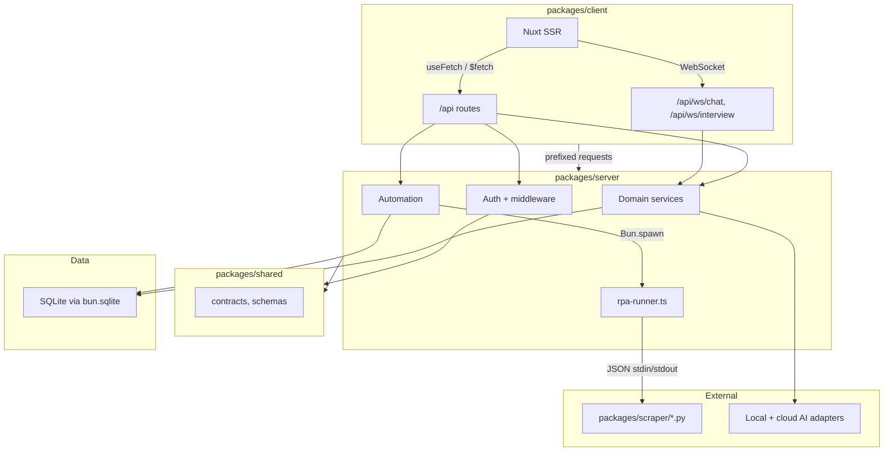

```text
+-------------------------------+
|  BaoBuildBuddy v1.0.0         |
|  Initial release setup guide  |
+-------------------------------+
```

# BaoBuildBuddy Local Setup Guide

```text
+---------------------+
|   /\/\   /\/\ /\/\  |
|  ( o.o )     o o    |
|   > ^ <   Start!    |
+---------------------+
```

BaoBuildBuddy is a Bun-first, monorepo production template:

- `packages/server` — Bun + Elysia API, direct Drizzle usage, Bun-native process execution
- `packages/client` — Nuxt (SSR-first), Tailwind CSS v4, daisyUI v5
- `packages/shared` — contracts, schemas, constants
- `packages/scraper` — RPA-Python scripts executed via Bun native process streams



```text
+-------------------------------+
|   LEVEL PATH CHECKPOINTS      |
+-------------------------------+
| 1) deps install               |
| 2) env compile-time defaults  |
| 3) schema & migration         |
| 4) service boot               |
| 5) WS & route smoke           |
| 6) runbook complete           |
+-------------------------------+
```

## 0) Prerequisites

- Bun 1.3.x
- Git
- Python 3 (for `packages/scraper`)
- Google Chrome/Chromium if you run automation scripts
- Optional CLI helpers: `curl`, `jq`

## 1) Install dependencies

```bash
cd /path/to/workspace
git clone https://github.com/d4551/baobuildbuddy.git
cd baobuildbuddy
bun install
```

```text
+--------------------------+
|  [PYTHON WIZARD]         |
|  python3 −m venv .venv   |
| source .venv/bin/activate|
+--------------------------+
```

```bash
python3 -m venv .venv
source .venv/bin/activate   # Windows: .venv\Scripts\activate
python -m pip install --upgrade pip
python -m pip install -r packages/scraper/requirements.txt
```

## 2) Configuration (no hardcoded values)

Copy config from example:

```bash
cp .env.example .env
```

### Server configuration source (`packages/server/src/config/env.ts`)

- `PORT` (default `3000`)
- `HOST` (default `0.0.0.0`)
- `DB_PATH` (default `~/.bao/bao.db`)
- `LOG_LEVEL` (default `info`)
- `CORS_ORIGINS` (default loopback + localhost endpoints)
- `BAO_DISABLE_AUTH` (truthy disables auth checks in local mode)

### Client configuration source (`packages/client/nuxt.config.ts`)

- `NUXT_PUBLIC_API_BASE` (default `/`)
- `NUXT_PUBLIC_WS_BASE` (default `/`)
- `NUXT_PUBLIC_API_PROXY`
- `NUXT_PUBLIC_QUERY_STALE_TIME_MS` (default `60000`)
- `NUXT_PUBLIC_QUERY_RETRY_COUNT` (default `1`)
- `NUXT_PUBLIC_QUERY_REFETCH_ON_FOCUS` (default `true`)

### AI/provider configuration source

- `GEMINI_API_KEY`
- `OPENAI_API_KEY`
- `CLAUDE_API_KEY`
- `HUGGINGFACE_TOKEN`
- `LOCAL_MODEL_ENDPOINT` (default `http://localhost:8080/v1`)
- `LOCAL_MODEL_NAME`

## 3) Why this is not shimmed, bridged, or papered over

- Uses Bun-native process execution in `packages/server` (`Bun.spawn`) for Python automation.
- Uses direct JSON over subprocess stdin/stdout for script contracts.
- Uses direct Elysia contracts and shared models in `packages/shared`.
- Uses Nuxt-native fetch primitives (`useFetch` for SSR-capable reads, `$fetch` for user actions).
- No Node shims, no wrapper transport layer, no proxy service in between.
- No hardcoded URLs for service routing in the app logic; runtime config and constants are the source.

## 4) Environment-specific runbook

### Boot everything from repo root

```bash
bun run dev
```

This runs both processes:

- `bun run dev:server`
- `bun run dev:client`

### Optional isolated startup

```bash
bun run dev:server
# in another terminal
bun run dev:client
```

### Expected endpoints

- API base: `${NUXT_PUBLIC_API_BASE:-http://localhost:3000}`
- UI base: `${NUXT_PUBLIC_WS_BASE:-http://localhost:3001}`
- Health: `${NUXT_PUBLIC_API_BASE:-http://localhost:3000}/api/health`
- Auth status: `${NUXT_PUBLIC_API_BASE:-http://localhost:3000}/api/auth/status`
- Automation runs: `${NUXT_PUBLIC_API_BASE:-http://localhost:3000}/api/automation/runs`

## 5) Validation sequence (industry-safe defaults)

### Script commands

```bash
bun run typecheck
bun run lint
bun run test
bun run db:generate
bun run db:push
bun run scripts/validate-ascii-geometry.ts README.md
```

### Live verification

```bash
API_BASE="${NUXT_PUBLIC_API_BASE:-http://localhost:3000}"
curl -fsS "${API_BASE}/api/health" | cat
curl -fsS "${API_BASE}/api/studio" | head
curl -fsS "${API_BASE}/api/jobs" | head
curl -fsS "${API_BASE}/api/automation/runs" | head
```

```text
+----------------------------+
|  [ROUTE SMOKE CHECKLIST]   |
+----------------------------+
| /api/health                |
| /api/auth/status           |
| /api/user                  |
| /api/jobs                  |
| /api/automation/runs       |
+----------------------------+
```

## 6) Migrations and automation data contract

1. `bun run db:generate`
2. `bun run db:push`
3. `bun run db:studio` (optional inspection)

Automation execution state is persisted in `automation_runs` and surfaced via:

- `POST /api/automation/job-apply`
- `GET /api/automation/runs`
- `GET /api/automation/runs/:id`

The architecture keeps automation explicit and typed through direct calls, shared schema, and direct DB insert/write operations.

## 7) Contracts, anti-pattern checks, and no hardcodes

### Required implementation principles

- No endpoint strings hardcoded in service code. Route targets come from:
  - Nuxt runtime config (`apiBase`)
  - shared route schema/constants where appropriate
- No environment values silently assumed; all config defaults are defined in the env and Nuxt config files.
- No transport bridge for Python automation.
- No wrapper that hides subprocess output parsing.

### Anti-patterns to avoid

- child-process APIs outside Bun native API
- manual socket HTTP transport for local Python execution
- custom client layer that bypasses `useFetch/$fetch`
- inline API base rewriting in components
- inconsistent naming in docs and examples

## 8) UI/UX implementation notes (daisyUI + Nuxt)

The client stack remains daisyUI-first:

- `stats`, `stat`, `stat-title`, `stat-value`, `stat-desc`
- `card`, `card-body`, `card-title`, `card-actions`
- `table`, `table-zebra`, and active row patterns
- `button`, `btn`, `btn-primary`, `btn-loading`, `loading-spinner`
- `alert`, `alert-info`, `alert-success`, `alert-error`

For API fetching, prefer:

```ts
const { data, refresh, status, error } = await useFetch("/api/automation/runs");
```

For imperative actions:

```ts
await $fetch("/api/automation/job-apply", { method: "POST", body: payload });
```

## 9) Useful references

- Bun process spawning and stdio: https://bun.sh/docs/api/spawn
- Bun docs for runtime spawning examples: https://github.com/oven-sh/bun/blob/main/docs/runtime/child-process.mdx
- Nuxt data fetching contract (`useFetch`): https://nuxt.com/docs/4.x/getting-started/data-fetching
- Nuxt composable API (`useFetch`): https://nuxt.com/docs/3.x/api/composables/use-fetch
- daisyUI component syntax:
  - https://daisyui.com/components/card/
  - https://daisyui.com/components/stats/
  - https://daisyui.com/components/table/
  - https://daisyui.com/components/alert/
  - https://daisyui.com/components/button/
  - https://daisyui.com/components/loading/

## 10) ASCII policy and geometric safety

All ASCII geometry blocks in this document should remain boxed with closed `+`, `-`, and `|` edges.

```text
+-------------------------------------------+
|  If geometry fails, rerun the validator.  |
|  Keep edges complete and rectangular.     |
+-------------------------------------------+
```

```text
+----------------------------+
| "No hardcoded maps remain."|
| "No bridges. No wrappers." |
| "Only direct,config driven"|
+----------------------------+
```

```text
+--------------------------------------+
|            QUEST STATUS              |
| [ ] Bootstrap                        |
| [ ] Runtime Config                   |
| [ ] Type & Lint & Tests              |
| [ ] DB Sync                          |
| [ ] Health & Route Probe             |
| [ ] UI / WS Validate                 |
+--------------------------------------+
```

```text
+-------------------------+
|  /_/   /_/              |
| ( ._. ) ( 0 .0 )        |
|  > ^ <   > ^ <          |
|  LEVEL COMPLETE         |
+-------------------------+
```

## Final delivery checklist (copy into your terminal)

- [ ] `bun install` completes
- [ ] Python env + `rpa` installed
- [ ] `.env` mirrors deployment intent and overrides only environment-specific values
- [ ] `bun run db:generate` + `bun run db:push` complete
- [ ] `bun run dev` serves API and UI
- [ ] `API_BASE="${NUXT_PUBLIC_API_BASE:-http://localhost:3000}"`
- [ ] `curl "${API_BASE}/api/health"` returns healthy status
- [ ] `curl "${API_BASE}/api/automation/runs"` returns collection
- [ ] `bun run scripts/validate-ascii-geometry.ts README.md` is clean
- [ ] Setup docs use correct package and route names
