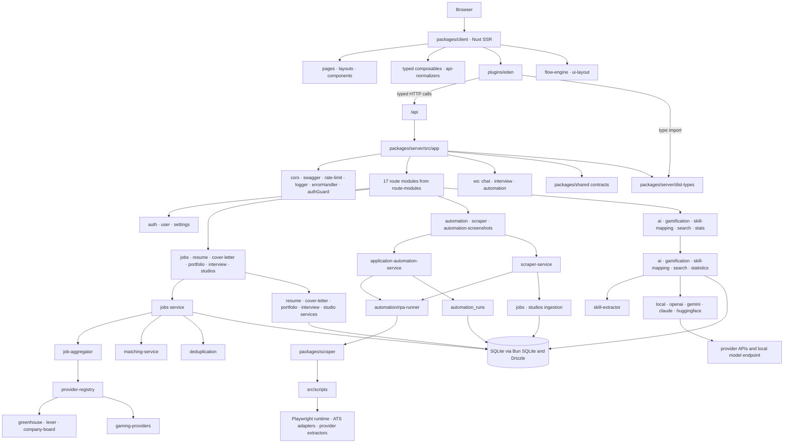
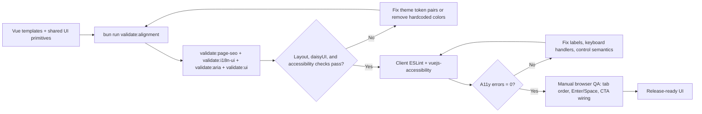

# Don't code? No problem! The easy install guide is available at [bao.builders](https://bao.builders/)


```text ascii-box
    ____              ____        _ _     _ ____            _     _
   | __ )  __ _  ___ | __ ) _   _(_) | __| | __ ) _   _  __| | __| |_   _
   |  _ \ / _` |/ _ \|  _ \| | | | | |/ _` |  _ \| | | |/ _` |/ _` | | | |
   | |_) | (_| | (_) | |_) | |_| | | | (_| | |_) | |_| | (_| | (_| | |_| |
   |____/ \__,_|\___/|____/ \__,_|_|_|\__,_|____/ \__,_|\__,_|\__,_|\__, |
                                                                    |___/
                        Local Operations Manual
```

# BaoBuildBuddy

[](https://bun.sh/)
[](https://nuxt.com/)
[](https://www.typescriptlang.org/)
[](https://github.com/d4551/baobuildbuddy/blob/main/LICENSE)
[](https://github.com/d4551/baobuildbuddy/commits/main)

BaoBuildBuddy is a full-stack toolkit for game-industry job seekers. It aggregates job listings, helps you build resumes and cover letters, runs AI-powered mock interviews, automates job applications with browser RPA, and tracks your progress with a gamification system.

```text ascii-box
/------------------------------\
|           BAO WORLD          |
|     Press START to begin!    |
|------------------------------|
| 1) Prepare environment       |
| 2) Configure services        |
| 3) Start server and client   |
| 4) Verify contracts          |
| 5) Run your automation       |
\------------------------------/
```

## Pick Your Guide

Not sure where to start? Choose the guide that matches your goal:

| I want to...                              | Go here                                                        |
|-------------------------------------------|----------------------------------------------------------------|
| Understand the app in plain English       | [ELI5 System Walkthrough](docs/ELI5_SYSTEM_WALKTHROUGH.md)     |
| Get BaoBuildBuddy running for the first time | [First-Time Setup Guide](docs/STARTER_GUIDE.md)             |
| Set up local AI with Ollama               | [Local AI Setup Guide](docs/LOCAL_AI_SETUP.md)                 |
| Learn the automation and RPA flows        | [Automation Guide](docs/AUTOMATION.md)                         |
| Deploy to Railway                         | [Railway Deployment Guide](docs/RAILWAY.md)                    |
| Install a desktop app (no dev setup)      | [Non-Technical Install](#non-technical-install)                |
| Read the full technical reference         | Keep reading this file                                         |

### The building blocks

- **Nuxt** is the screen you click on.
- **Elysia** is the traffic controller.
- **SQLite** is the notebook that remembers things.
- **Playwright** is the robot browser.
- **Bun** is the runtime, package manager, bundler, and test runner.
- **Tauri** is the desktop wrapper.

---

## Table of Contents

- [Pick Your Guide](#pick-your-guide)
- [Quick Start](#quick-start)
- [Local AI Quick Path](#local-ai-quick-path)
- [Non-Technical Install](#non-technical-install)
- [Architecture](#architecture)
- [Configuration](#configuration)
- [Running the App](#running-the-app)
- [Automation & RPA](#automation--rpa)
- [Job Provider Registry](#job-provider-registry)
- [AI Integration](#ai-integration)
- [Additional Services](#additional-services)
- [Internationalization](#internationalization)
- [Database Schema](#database-schema)
- [Project Structure](#project-structure)
- [Client Pages & Features](#client-pages--features)
- [Validation & Quality Gates](#validation--quality-gates)
- [Desktop Packaging (Tauri)](#desktop-packaging-tauri)
- [Troubleshooting](#troubleshooting)
- [Final Checklist](#final-checklist)
- [Documentation Index](#documentation-index)

---

## Quick Start

### Prerequisites

| Required        | Purpose                               |
|-----------------|---------------------------------------|
| Bun (>=1.3.10)  | Runtime, package manager, test runner |
| Git             | Source control                        |

Optional: Rust + Cargo (for desktop builds), `curl`/`jq` (for diagnostics), at least one AI provider key.

Check your Bun version against the workspace manifest:

```bash
bun pm pkg get packageManager
# -> "bun@1.3.10"
```

### Automated setup (recommended)

**macOS / Linux:**
```bash
git clone https://github.com/d4551/baobuildbuddy.git
cd baobuildbuddy
bash scripts/setup.sh
```

**Windows (PowerShell):**
```powershell
git clone https://github.com/d4551/baobuildbuddy.git
cd baobuildbuddy
powershell -ExecutionPolicy Bypass -File scripts\setup.ps1
```

The setup script installs dependencies, sets up Playwright Chromium, creates `.env` from `.env.example`, bootstraps the database, and runs validation checks.

| Flag                          | Bash                       | PowerShell               | Effect                                     |
|-------------------------------|----------------------------|--------------------------|--------------------------------------------|
| Skip verification             | `--skip-checks`            | `-SkipChecks`            | Skip typecheck, lint, and test runs        |
| Skip browser install          | `--skip-browser-install`   | `-SkipBrowserInstall`    | Skip Playwright Chromium installation      |
| Include build                 | `--include-build`          | `-IncludeBuild`          | Run `bun run build` after setup            |
| Include desktop build         | `--include-desktop-build`  | `-IncludeDesktopBuild`   | Run Tauri desktop build after setup        |
| Help                          | `--help`                   | `-Help`                  | Print usage and exit                       |

### Manual setup

```bash
git clone https://github.com/d4551/baobuildbuddy.git
cd baobuildbuddy
bun install
bun run automation:browsers:install
cp .env.example .env          # Windows: copy .env.example .env
bun run db:generate
bun run db:push
```

### Start it up

```bash
bun run dev
```

This starts the API server (port 3000) and Nuxt client (port 3001) together via `scripts/dev-stack.ts`.

Verify everything is working:

```bash
curl -fsS http://localhost:3000/api/health
curl -fsS http://localhost:3000/api/auth/status
curl -fsS http://localhost:3000/api/jobs?limit=1 | head
```

Then open `http://localhost:3001` in your browser.

---

## Local AI Quick Path

Want BaoBuildBuddy to use AI on your own computer without cloud API keys?

1. Install Ollama from [ollama.com/download](https://ollama.com/download/).
2. Read the official [Ollama Quickstart](https://docs.ollama.com/quickstart) if you want the vendor walkthrough.
3. Download a first model: `ollama pull llama3.2`
4. Open BaoBuildBuddy and go to **Settings > AI Providers**.
5. Set the local endpoint to `http://localhost:11434/v1` and leave the model blank for auto-detect.

For the full beginner walkthrough, see [docs/LOCAL_AI_SETUP.md](docs/LOCAL_AI_SETUP.md).

---

## Non-Technical Install

Use the packaged desktop installers in `packages/desktop/releases` when you want to skip the developer setup entirely.

> A wild installer appeared. Choose your OS in `packages/desktop/releases`.

| Operating System      | Artifact Pattern                                                                         |
|-----------------------|------------------------------------------------------------------------------------------|
| macOS (Apple Silicon) | `<PRODUCT_NAME>_<VERSION>_aarch64.dmg`                                                   |
| Windows (x64)         | `<PRODUCT_NAME>_<VERSION>_x64-setup.exe` or `<PRODUCT_NAME>_<VERSION>_x64-portable.zip`  |
| Linux (ARM64)         | `<PRODUCT_NAME>_<VERSION>_arm64.deb` or `<PRODUCT_NAME>-<VERSION>-1.aarch64.rpm`         |

Windows builds are 64-bit only. See `packages/desktop/releases/README.md` for the current artifact catalog.

---

## Architecture

```text
          _____
         |     |
         | GLa |    "The cake is a lie."
         |  D  |     But the architecture diagram is real.
         | 0S  |
         |_____|

    Browser ──> Nuxt SSR ──> Elysia API ──> SQLite
       |                        |    |
       |── WebSocket ──> /ws/chat        |── AI providers (5 adapters)
       |── WebSocket ──> /ws/interview   |── RPA subprocess (Bun.spawn)
       |── WebSocket ──> /ws/automation  |
                                    |
                          Job provider registry
                          (ATS + gaming boards + company boards)
```

### Packages

| Package        | Path               | What it does                                              |
|----------------|--------------------|-----------------------------------------------------------|
| `@bao/server`  | `packages/server`  | Bun + Elysia API, Drizzle ORM, WebSockets, orchestration  |
| `@bao/client`  | `packages/client`  | Nuxt 4 SSR frontend, Tailwind CSS v4, daisyUI v5          |
| `@bao/shared`  | `packages/shared`  | Shared types, contracts, constants, schemas, validation    |
| `@bao/scraper` | `packages/scraper` | Bun + Playwright automation executables                    |
| `@bao/desktop` | `packages/desktop` | Tauri desktop packaging and release staging                |

### How it fits together


```mermaid
flowchart TD
  Browser["Browser"] --> Client["packages/client · Nuxt SSR"]
  Client --> Pages["pages · layouts · components"]
  Client --> Composables["typed composables · api-normalizers"]
  Client --> EdenClient["plugins/eden"]
  Client --> FlowEngine["flow-engine · ui-layout"]

  ServerTypes["packages/server/dist-types"]
  Shared["packages/shared contracts"]
  EdenClient -->|"typed HTTP calls"| ApiPrefix["/api"]
  EdenClient -->|"type import"| ServerTypes
  ApiPrefix --> App["packages/server/src/app"]
  App --> Middleware["cors · swagger · rate-limit · logger · errorHandler · authGuard"]
  App --> Routes["17 route modules from route-modules"]
  App --> WebSockets["ws: chat · interview · automation"]
  App --> Shared
  App --> ServerTypes

  Routes --> AuthRoutes["auth · user · settings"]
  Routes --> CareerRoutes["jobs · resume · cover-letter · portfolio · interview · studios"]
  Routes --> AutomationRoutes["automation · scraper · automation-screenshots"]
  Routes --> PlatformRoutes["ai · gamification · skill-mapping · search · stats"]

  CareerRoutes --> JobsSvc["jobs service"]
  JobsSvc --> JobAggregator["job-aggregator"]
  JobAggregator --> ProviderRegistry["provider-registry"]
  ProviderRegistry --> ATSProviders["greenhouse · lever · company-board"]
  ProviderRegistry --> GamingProviders["gaming-providers"]
  JobsSvc --> MatchingSvc["matching-service"]
  JobsSvc --> DedupSvc["deduplication"]

  CareerRoutes --> DomainServices["resume · cover-letter · portfolio · interview · studio services"]
  PlatformRoutes --> PlatformServices["ai · gamification · skill-mapping · search · statistics"]
  PlatformServices --> SkillExtractor["skill-extractor"]
  PlatformServices --> AiProviders["local · openai · gemini · claude · huggingface"]
  AiProviders --> ExternalAI["provider APIs and local model endpoint"]

  AutomationRoutes --> AutomationSvc["application-automation-service"]
  AutomationRoutes --> ScraperSvc["scraper-service"]
  AutomationSvc --> Runner["automation/rpa-runner"]
  ScraperSvc --> Runner
  Runner --> ScraperPkg["packages/scraper"]
  ScraperPkg --> Scripts["src/scripts"]
  Scripts --> Runtime["Playwright runtime · ATS adapters · provider extractors"]

  JobsSvc --> DB[("SQLite via Bun SQLite and Drizzle")]
  DomainServices --> DB
  PlatformServices --> DB
  AutomationSvc --> AutomationRuns["automation_runs"]
  ScraperSvc --> JobsStudios["jobs · studios ingestion"]
  AutomationRuns --> DB
  JobsStudios --> DB
```

### Design principles

Each Elysia route module owns its service directly -- routes call services, services call the database or external providers. Typed contracts in `packages/shared` are the source of truth for request/response shapes. Bun automation executables run in isolated subprocesses with JSON/NDJSON over stdin/stdout.

Key conventions:
- Global flow decisions live in `packages/client/constants/flow-engine.ts` and are consumed via `useFlowEngine.ts`.
- Layout is tokenized in `packages/client/constants/ui-layout.ts` and rendered through `PageScaffold`, `PageHeaderBlock`, `SectionGrid`, and `AppModalFrame`.
- AI provider display uses locale-driven keys (`aiProviderCatalog.*`) and `AIProviderIcon` -- no hardcoded provider labels.
- Interview role selection is adaptive: profile role, readiness rankings, pathway scores, and live job signals drive recommendations.
- Skills readiness uses typed IDs (`feedbackId`, `improvementSuggestions`, `nextSteps`) so all UI copy is locale-driven.

---

## Configuration

```text
      .---------.
     | .-------. |      ~~~ OPTIONS MENU ~~~
     | |  .env | |
     | |       | |      Every configurable value lives
     | '-------' |      in .env or a source-of-truth
     '----( )----'      config file. Nothing is hardcoded.
          | |
          | |           "Hey! Listen!" -- set your
          '-'            LOCAL_MODEL_ENDPOINT first.
```

### Server environment (`.env`)

| Key                | Purpose                         | Details                          |
|--------------------|---------------------------------|----------------------------------|
| `PORT`             | API bind port                   | Validated in range `1..65535`     |
| `HOST`             | API bind host                   | Passed to Elysia listener        |
| `DB_PATH`          | SQLite database file location   | Parent directory must be writable |
| `LOG_LEVEL`        | Logging verbosity               | `info`, `debug`, `warn`, `error` |
| `CORS_ORIGINS`     | Comma-separated allowed origins | Defaults include localhost        |
| `BAO_DISABLE_AUTH` | Disable auth for local dev      | Set `true` or `1`                |

### Client environment (`.env`)

| Key                                    | Purpose                             |
|----------------------------------------|-------------------------------------|
| `NUXT_PUBLIC_API_BASE`                 | API base URL for `useFetch`/`$fetch` |
| `NUXT_PUBLIC_WS_BASE`                  | WebSocket base URL                  |
| `NUXT_PUBLIC_API_PROXY`                | Dev proxy target (defaults to `http://localhost:${PORT}`) |
| `NUXT_PUBLIC_QUERY_STALE_TIME_MS`      | TanStack Query stale time           |
| `NUXT_PUBLIC_QUERY_RETRY_COUNT`        | TanStack Query retry budget         |
| `NUXT_PUBLIC_QUERY_REFETCH_ON_FOCUS`   | Refetch on window focus             |
| `NUXT_PUBLIC_I18N_DEFAULT_LOCALE`      | Initial locale (`en-US` default)    |
| `NUXT_PUBLIC_I18N_FALLBACK_LOCALE`     | Fallback when translations are missing |
| `NUXT_PUBLIC_I18N_LOCALE_COOKIE_KEY`   | Cookie key for persisted locale     |

> **Do NOT set `NUXT_PUBLIC_I18N_SUPPORTED_LOCALES`** in `.env`. Nuxt runtime config replaces the parsed array with a raw string, which breaks the i18n plugin. The default is handled in `nuxt.config.ts`.

### AI provider keys

At least one provider is needed for AI features (chat, interviews, email drafts, resume review, cover letters). Keys can also be set via **Settings > AI Providers** in the UI.

| Key                    | Purpose                              |
|------------------------|--------------------------------------|
| `LOCAL_MODEL_ENDPOINT` | Local inference server URL           |
| `LOCAL_MODEL_NAME`     | Local model identifier               |
| `OPENAI_API_KEY`       | OpenAI cloud provider                |
| `GEMINI_API_KEY`       | Google Gemini cloud provider         |
| `CLAUDE_API_KEY`       | Anthropic Claude cloud provider      |
| `HUGGINGFACE_TOKEN`    | HuggingFace Inference API (free tier requires a token) |

### RPA / Automation environment

| Key                            | Purpose                              | Default   |
|--------------------------------|--------------------------------------|-----------|
| `AUTOMATION_STDIO_BUFFER_LIMIT`| Max stdout lines from scraper scripts| `200` (increase to `2000` for large outputs) |
| `AUTOMATION_SCRIPT_TIMEOUT_MS` | Max execution time per script        | `30000`   |

Install bundled Chromium: `bun run automation:browsers:install`

### Settings table (runtime tuning)

Provider configuration for job ingestion is stored in `settings.automationSettings.jobProviders`. Populate it via `PUT /api/settings` before running ingestion. Required keys include `providerTimeoutMs`, `greenhouseBoards[]`, `leverCompanies[]`, `companyBoards[]`, `gamingPortals[]`, and related defaults. See the settings schema for the full shape.

### Source-of-truth config files

| File                                    | Governs                             |
|-----------------------------------------|-------------------------------------|
| `packages/server/src/config/env.ts`     | Server environment validation       |
| `packages/server/src/config/paths.ts`   | File system paths used by server    |
| `packages/client/nuxt.config.ts`        | Client runtime config, proxy, modules |
| `packages/scraper/package.json`         | Bun automation runtime dependencies |
| `.env.example`                          | Template for all env vars           |

---

## Running the App

```text
     _____________
    |  ___  ___   |
    | | 1 || 2 |  |      PLAYER SELECT
    | |___||___|  |
    |  ___  ___   |      1 = Full stack   (bun run dev / scripts/dev-stack.ts)
    | | 3 || 4 |  |      2 = Server only  (bun run dev:server)
    | |___||___|  |      3 = Client only  (bun run dev:client)
    |_____________|      4 = Split terminals

     "Press START to begin"
```

### Full stack (recommended)

```bash
bun run dev
```

Starts server + client via `scripts/dev-stack.ts`:
- API server on `PORT` (default 3000)
- Nuxt client on port 3001

### Split terminals

Terminal 1:
```bash
bun run dev:server
```

Terminal 2:
```bash
bun run dev:client
```

### Default endpoints

| Endpoint             | Default URL                              | Config key               |
|----------------------|------------------------------------------|--------------------------|
| API server           | `http://localhost:3000`                   | `PORT`                  |
| Client UI            | `http://localhost:3001`                   | client `nuxt dev`       |
| Chat WebSocket       | `ws://localhost:3000/api/ws/chat`         | `NUXT_PUBLIC_WS_BASE`   |
| Interview WebSocket  | `ws://localhost:3000/api/ws/interview`    | `NUXT_PUBLIC_WS_BASE`   |
| Automation WebSocket | `ws://localhost:3000/api/ws/automation`   | `NUXT_PUBLIC_WS_BASE`   |

### All available scripts

| Script                      | Command                                                | Purpose                                             |
|-----------------------------|--------------------------------------------------------|-----------------------------------------------------|
| Dev (full)                  | `bun run dev`                                          | Start server + client via `scripts/dev-stack.ts`    |
| Dev (stack)                 | `bun run dev:stack`                                    | Alias to `scripts/dev-stack.ts`                     |
| Dev server                  | `bun run dev:server`                                   | Start API server only                               |
| Dev client                  | `bun run dev:client`                                   | Start Nuxt client only                              |
| Dev desktop                 | `bun run dev:desktop`                                  | Start Tauri desktop wrapper                         |
| Build                       | `bun run build`                                        | Build server and client                             |
| Build desktop               | `bun run build:desktop`                                | Build Tauri installer for current host              |
| Typecheck                   | `bun run typecheck`                                    | TypeScript checking across all packages             |
| Test                        | `bun run test`                                         | Run all test suites                                 |
| Lint                        | `bun run lint`                                         | All validators + Biome + ESLint + typecheck         |
| Lint fix                    | `bun run lint:fix`                                     | Autofix with guardrails preserved                   |
| Format                      | `bun run format`                                       | Apply Biome formatter                               |
| Format check                | `bun run format:check`                                 | Verify formatter output                             |
| DB generate                 | `bun run db:generate`                                  | Generate Drizzle migration files                    |
| DB push                     | `bun run db:push`                                      | Push schema changes to SQLite                       |
| DB studio                   | `bun run db:studio`                                    | Open Drizzle Studio GUI                             |
| Release desktop (macOS)     | `bun run release:desktop:macos`                        | Native macOS release artifacts                      |
| Release desktop (Windows)   | `bun run release:desktop:windows`                      | Native Windows release artifacts                    |
| Release desktop (Linux ARM) | `bun run release:desktop:linux-arm64`                  | Native Linux ARM64 release artifacts                |
| Release refresh (all OS)    | `bun run release:refresh:all-os`                       | Assemble multi-platform release + checksums         |
| Verify pages                | `bun run verify:pages`                                 | Validate SSR routes return proper HTML              |
| Server type contract        | `bun run --filter '@bao/server' build:types`           | Generate dist-types for client typecheck            |
| Validate ARIA               | `bun run validate:aria`                                | Interactive labeling + dialog semantics             |
| Validate layout tokens      | `bun run validate:ui-layout-tokens`                    | Block hardcoded width/grid literals                 |
| Validate UI                 | `bun run validate:ui`                                  | WCAG contrast + hardcoded color checks              |
| Validate page SEO           | `bun run validate:page-seo`                            | Require SSR `useServerSeoMeta` on core pages        |
| Validate i18n               | `bun run validate:i18n-ui`                             | Reject static template copy / missing `t()` keys    |
| Validate no try/catch       | `bun run validate:no-try-catch`                        | Enforce no-`try/catch` policy                       |
| ASCII validation            | `bun run scripts/validate-ascii-geometry.ts README.md` | Verify ASCII-art geometry                           |
| Audit official LLM docs     | `bun run audit:official-llms`                          | Check Bun/Nuxt/Elysia `llms.txt` reachability       |

---

## Automation & RPA

```text
         ___
        |   |      ~~~~~~~~~~~~~~~~~~~~~~~~~~~~~~~
        | ! |      CAUTION: Entering RPA territory
        |___|
        /   \      Automation runs are persisted to
       / BAO \     automation_runs in SQLite for full
      /_______\    audit trail and replay capability.
                   ~~~~~~~~~~~~~~~~~~~~~~~~~~~~~~~
       "Do a barrel roll!" -- but only after
       Playwright Chromium is installed.
```

Automation execution flows from `automationRoutes` through `application-automation-service.ts` to `rpa-runner.ts`.

### How it works

1. API route receives a typed job-apply payload.
2. Service resolves required entities from the database (resume, optional cover letter).
3. A new `automation_runs` record is created with a unique run ID.
4. `rpa-runner.ts` spawns a Bun subprocess with `Bun.spawn`.
5. The request payload goes to the script on `stdin`.
6. The Playwright script navigates, fills forms, clicks, and captures screenshots.
7. NDJSON/JSON protocol output is parsed and persisted.
8. The run status is updated (`success` or `error`).

### Script registry

| Script ID                | File                                                     | Purpose                         |
|--------------------------|----------------------------------------------------------|---------------------------------|
| `job-apply`              | `packages/scraper/src/scripts/job-apply.ts`              | Job application form automation |
| `scraper-hitmarker`      | `packages/scraper/src/scripts/scraper-hitmarker.ts`      | Scrape Hitmarker jobs           |
| `scraper-grackle`        | `packages/scraper/src/scripts/scraper-grackle.ts`        | Scrape GrackleHQ jobs           |
| `scraper-workwithindies` | `packages/scraper/src/scripts/scraper-workwithindies.ts` | Scrape Work With Indies         |
| `scraper-remotegamejobs` | `packages/scraper/src/scripts/scraper-remotegamejobs.ts` | Scrape RemoteGameJobs           |
| `scraper-gamesjobsdirect`| `packages/scraper/src/scripts/scraper-gamesjobsdirect.ts`| Scrape GamesJobsDirect          |
| `scraper-pocketgamer`    | `packages/scraper/src/scripts/scraper-pocketgamer.ts`    | Scrape PocketGamer.biz          |
| `studio-scraper`         | `packages/scraper/src/scripts/studio-scraper.ts`         | Curated studio directory        |

### Script contract

Scripts read JSON from `stdin`, produce protocol-compliant JSON/NDJSON on `stdout`, and exit non-zero on hard failure.

**Input:**
```json
{
  "jobUrl": "https://example.com/job/application",
  "resume": {
    "personalInfo": {
      "fullName": "Player One",
      "email": "player@example.com",
      "phone": "+1 555 0100",
      "location": "Remote"
    },
    "education": ["..."],
    "experience": ["..."],
    "skills": ["..."]
  },
  "coverLetter": {
    "company": "Acme",
    "position": "Senior Game Designer",
    "content": {}
  },
  "customAnswers": {
    "q_salary": "120000",
    "q_relocation": "No"
  }
}
```

**Success:**
```json
{
  "success": true,
  "error": null,
  "screenshots": ["step-01.png", "step-02.png"],
  "steps": [
    { "action": "navigate", "status": "ok" },
    { "action": "fill_full_name", "status": "ok" },
    { "action": "submit", "status": "ok" }
  ]
}
```

**Failure:**
```json
{
  "success": false,
  "error": "No matching submit button",
  "screenshots": [],
  "steps": [{ "action": "click_submit", "status": "error" }]
}
```

Screenshots are served through `GET /api/automation/screenshots/:runId/:index`.

### Subprocess contract

`rpa-runner.ts` calls `Bun.spawn` with `stdin: "pipe"`, `stdout: "pipe"`, `stderr: "pipe"`. It passes the payload to stdin, reads both streams, and returns structured context on non-zero exit.

### Scheduling

All automation types support scheduling through one persisted model:

- `POST /api/automation/job-apply/schedule`
- `POST /api/automation/email-response/schedule`
- `POST /api/automation/scrape/schedule`

Each writes a `pending` row to `automation_runs` with the requested time at `input.schedule.runAt`, then queues an in-memory timer. On restart, pending rows are reloaded and timers restored. No separate cron table.

### Error codes

- `AUTOMATION_RUNTIME_ERROR`
- `AUTOMATION_TIMEOUT`
- `AUTOMATION_CANCELLED`
- `SCRIPT_PROTOCOL_ERROR`
- `SCRIPT_OUTPUT_INVALID`
- `OUTPUT_PERSISTENCE_ERROR`
- `OUTPUT_VALIDATION_ERROR`

---

## Job Provider Registry

```text
       .-----------.
      /  JOBS BOARD  \      "War. War never changes."
     |  +-----------+ |      But job boards do. The provider
     |  | Greenhouse| |      registry normalizes provider behavior
     |  | Lever     | |      so the aggregator doesn't have to
     |  | Company   | |      care which ATS you're scraping.
     |  +-----------+ |
      \              /
       '------------'
```

The job system lives in `packages/server/src/services/jobs/`:

| File                                | What it does                                           |
|-------------------------------------|--------------------------------------------------------|
| `job-aggregator.ts`                 | Orchestrates fetching across all providers             |
| `matching-service.ts`               | Scores jobs against user profile and skills            |
| `deduplication.ts`                  | Deduplicates listings from multiple boards             |
| `providers/provider-interface.ts`   | Common interface all providers implement               |
| `providers/provider-registry.ts`    | Add/remove providers at runtime                        |
| `providers/greenhouse.ts`           | Greenhouse ATS integration                             |
| `providers/lever.ts`                | Lever ATS integration                                  |
| `providers/company-board.ts`        | Direct company career page scraping                    |
| `providers/provider-settings.ts`    | Settings-backed provider configuration                 |
| `providers/gaming-providers.ts`     | Game-industry board aggregation                        |

The default set includes Greenhouse, Lever, Hitmarker, GrackleHQ, Work With Indies, RemoteGameJobs, GamesJobsDirect, PocketGamer.biz, plus configured SmartRecruiters/Workday/Ashby company boards.

The aggregator calls each provider, deduplicates results, scores them against your profile, and persists everything to SQLite.

---

## AI Integration

```text
                    .-------------.
                   /    CHOOSE     \
                  /    YOUR CLASS   \
                 /                   \
                |  [1] Local Mage     |
                |  [2] OpenAI Knight  |
                |  [3] Gemini Ranger  |      "Would you kindly"
                |  [4] Claude Healer  |       configure at least
                |  [5] HF Summoner    |       one provider?
                 \                   /
                  \_________________/
```

The AI subsystem is in `packages/server/src/services/ai/`:

| File                     | What it does                                                  |
|--------------------------|---------------------------------------------------------------|
| `ai-service.ts`          | Routes requests to the active provider                        |
| `provider-interface.ts`  | Common interface for all providers                            |
| `local-provider.ts`      | Connects to Ollama, LM Studio, etc.                           |
| `openai-provider.ts`     | OpenAI API adapter                                            |
| `gemini-provider.ts`     | Google Gemini API adapter                                     |
| `claude-provider.ts`     | Anthropic Claude API adapter                                  |
| `huggingface-provider.ts`| HuggingFace Inference API adapter                             |
| `context-manager.ts`     | Manages conversation history and context windows              |
| `prompts.ts`             | Prompt templates for resume review, interviews, cover letters |

### Provider selection

1. Local provider is used when `LOCAL_MODEL_ENDPOINT` and `LOCAL_MODEL_NAME` are set.
2. Cloud adapters are selected based on which API keys are configured.
3. The context manager handles conversation state and prompt construction.

All AI calls are server-owned. The client communicates through API routes and WebSocket endpoints, never directly to providers.

---

## Additional Services

```text
     ____________________________
    |     SERVICE INVENTORY      |
    |____________________________|
    |                            |
    | "I used to be an           |
    |  adventurer like you,      |
    |  then I took a service     |
    |  layer to the knee."       |
    |____________________________|
```

| Service           | File                          | Purpose                                               |
|-------------------|-------------------------------|-------------------------------------------------------|
| CV Questionnaire  | `cv-questionnaire-service.ts` | Guided questionnaire flow for building resume data    |
| Data Service      | `data-service.ts`             | Shared data access patterns                           |
| Export Service    | `export-service.ts`           | Export resumes, portfolios, cover letters to PDF/JSON |
| Skill Extractor   | `skill-extractor.ts`          | Extract and normalize skills from listings/resumes    |
| Skill Mapping     | `skill-mapping-service.ts`    | Map user skills to job requirements for scoring       |

---

## Internationalization

BaoBuildBuddy ships these locale packs:

| Locale   | File                                  |
|----------|---------------------------------------|
| `en-US`  | `packages/client/locales/en-US.ts`    |
| `es-ES`  | `packages/client/locales/es-ES.ts`    |
| `fr-FR`  | `packages/client/locales/fr-FR.ts`    |
| `ja-JP`  | `packages/client/locales/ja-JP.ts`    |

**Source of truth:** `packages/client/plugins/i18n.ts` registers catalogs. `nuxt.config.ts` defines i18n runtime config. Locale files follow the schema in `en-US.ts`.

**Resolution order:** saved cookie locale -> `Accept-Language` header (q-weighted) -> browser locale -> configured default.

**To add a language:**
1. Add a catalog file under `packages/client/locales`.
2. Register it in `I18N_MESSAGE_CATALOG`.
3. Add the locale to `NUXT_PUBLIC_I18N_SUPPORTED_LOCALES`.
4. Add matching preference/voice mappings where needed.

---

## Database Schema

```text
      .-----------.
     /             \       "A man chooses. A slave obeys."
    |   13 TABLES   |       But a schema migrates.
    |   IN SQLite   |
     \             /       All tables are defined in
      '-----------'        packages/server/src/db/schema/
```

| Schema File            | Tables                               | Purpose                                |
|------------------------|--------------------------------------|----------------------------------------|
| `user.ts`              | users                                | User accounts and profiles             |
| `auth.ts`              | auth tokens                          | Authentication sessions and tokens     |
| `resumes.ts`           | resumes                              | Resume data with structured sections   |
| `cover-letters.ts`     | cover_letters                        | Generated and custom cover letters     |
| `portfolios.ts`        | portfolios, portfolio_projects       | Portfolio collections and projects     |
| `interviews.ts`        | interviews, interview_messages       | Mock interview sessions and transcripts |
| `studios.ts`           | studios                              | Game studio directory                  |
| `jobs.ts`              | jobs                                 | Aggregated job listings                |
| `skill-mappings.ts`    | skill_mappings                       | User skill profiles and gap analysis   |
| `gamification.ts`      | achievements, xp_events              | XP tracking and achievements           |
| `settings.ts`          | settings                             | User preferences and app configuration |
| `automation-runs.ts`   | automation_runs                      | RPA execution audit trail              |
| `chat-history.ts`      | chat_messages                        | AI conversation history                |

Migrations live in `packages/server/src/db/migrations/`. Seed data in `packages/server/src/db/seed/` provides initial studio records and industry reference data.

---

## Project Structure

```text
     "The right man in the wrong place
      can make all the difference in the world."
      -- But the right file in the wrong directory? Not so much.
```

```text
    baobuildbuddy/
    +-- packages/
    |   +-- server/                 Bun + Elysia API server
    |   |   +-- src/
    |   |   |   +-- routes/         API route modules with route-level tests
    |   |   |   |   +-- auth.routes.ts
    |   |   |   |   +-- user.routes.ts
    |   |   |   |   +-- settings.routes.ts
    |   |   |   |   +-- jobs.routes.ts
    |   |   |   |   +-- resume.routes.ts
    |   |   |   |   +-- cover-letter.routes.ts
    |   |   |   |   +-- portfolio.routes.ts
    |   |   |   |   +-- interview.routes.ts
    |   |   |   |   +-- studio.routes.ts
    |   |   |   |   +-- scraper.routes.ts
    |   |   |   |   +-- ai.routes.ts
    |   |   |   |   +-- gamification.routes.ts
    |   |   |   |   +-- skill-mapping.routes.ts
    |   |   |   |   +-- search.routes.ts
    |   |   |   |   +-- stats.routes.ts
    |   |   |   |   +-- automation.routes.ts
    |   |   |   |   +-- automation-screenshots.routes.ts
    |   |   |   +-- services/       Business logic layer
    |   |   |   |   +-- ai/         5 provider adapters + context manager + prompts
    |   |   |   |   +-- automation/ application-automation-service.ts, rpa-runner.ts
    |   |   |   |   +-- jobs/       Aggregator, matching, dedup, provider registry
    |   |   |   |   |   +-- providers/  greenhouse, lever, company-board, gaming-providers
    |   |   |   |   +-- resume-service.ts
    |   |   |   |   +-- cover-letter-service.ts
    |   |   |   |   +-- portfolio-service.ts
    |   |   |   |   +-- interview-service.ts
    |   |   |   |   +-- gamification-service.ts
    |   |   |   |   +-- scraper-service.ts
    |   |   |   |   +-- search-service.ts
    |   |   |   |   +-- statistics-service.ts
    |   |   |   |   +-- export-service.ts
    |   |   |   |   +-- data-service.ts
    |   |   |   |   +-- cv-questionnaire-service.ts
    |   |   |   |   +-- skill-extractor.ts
    |   |   |   |   +-- skill-mapping-service.ts
    |   |   |   +-- db/
    |   |   |   |   +-- schema/     Drizzle table modules + schema-modules.ts
    |   |   |   |   |   +-- user.ts, auth.ts, resumes.ts, cover-letters.ts
    |   |   |   |   |   +-- portfolios.ts, interviews.ts, studios.ts, jobs.ts
    |   |   |   |   |   +-- skill-mappings.ts, gamification.ts, settings.ts
    |   |   |   |   |   +-- automation-runs.ts, chat-history.ts
    |   |   |   |   +-- migrations/
    |   |   |   |   +-- seed/       Initial gaming data and studio records
    |   |   |   |   +-- client.ts, init.ts
    |   |   |   +-- middleware/     auth.ts, error-handler.ts, logger.ts
    |   |   |   +-- ws/             chat.ws.ts, interview.ws.ts, automation.ws.ts
    |   |   |   +-- config/         env.ts (validation), paths.ts
    |   +-- client/                 Nuxt 4 SSR application
    |   |   +-- pages/              SSR routes for setup, jobs, studios, interview, AI, automation, docs
    |   |   +-- components/         Shared UI and feature Vue components
    |   |   |   +-- ai/             AIChatBubble, AIStreamingResponse, BaoFairy
    |   |   |   +-- resume/         ResumePreview, ExperienceList, PersonalInfoForm,
    |   |   |   |                   SkillsEditor, EducationList
    |   |   |   +-- jobs/           JobCard, JobMatchScore, JobSearchBar, JobFilters
    |   |   |   +-- interview/      InterviewChat, ScoreCard, StudioSelector
    |   |   |   +-- gamification/   DailyChallenge, XPBar, AchievementBadge
    |   |   |   +-- portfolio/      PortfolioGrid, ProjectCard
    |   |   |   +-- layout/         AppNavbar, AppSidebar, AppDock
    |   |   |   +-- ui/             ConfirmDialog, LoadingSkeleton
    |   |   +-- composables/        Typed data, websocket, speech, and view-state composables
    |   |   |   +-- useApi, useAuth, useUser, useSettings, useSettingsQuery
    |   |   |   +-- useTheme, useWebSocket, useSpeech, useTTS, useSTT
    |   |   |   +-- useJobs, useSearch, useResume, useCoverLetter
    |   |   |   +-- usePortfolio, useStudio, useInterview, useAI
    |   |   |   +-- useAutomation, useGamification, useSkillMapping, useStatistics
    |   |   +-- plugins/            vue-query.ts, toast.client.ts, eden.ts
    |   |   +-- middleware/         auth.ts (client-side auth guard)
    |   |   +-- layouts/            default.vue, onboarding.vue
    |   |   +-- utils/              errors.ts
    |   |   +-- types/              nuxt.d.ts, speech.d.ts
    |   |   +-- assets/css/         main.css
    |   +-- shared/                 Cross-package contracts
    |   |   +-- src/
    |   |   |   +-- types/          Shared domain types
    |   |   |   |   +-- user, ai, resume, interview, jobs, cover-letter
    |   |   |   |   +-- portfolio, studio, gamification, skill-mapping
    |   |   |   |   +-- settings, search
    |   |   |   +-- schemas/        Shared validation and protocol schemas
    |   |   |   |   +-- user.schema, resume.schema, job.schema
    |   |   |   |   +-- interview.schema, settings.schema
    |   |   |   |   +-- portfolio.schema, skill-mapping.schema
    |   |   |   +-- constants/      Runtime, API, automation, AI, and UI contract constants
    |   |   |   +-- utils/          Shared parsing, validation, and formatting helpers
    |   |   |   +-- public-api.ts   Package export surface
    |   +-- scraper/                Bun automation runtime
    |       +-- src/scripts/        Bun/TS automation entrypoints
    |       +-- src/providers/      Playwright scraper extractors
    |       +-- src/job-apply/      ATS adapter runtime
    |       +-- src/runtime/        IO/protocol/browser helpers
    |       +-- package.json
    +-- scripts/
    |   +-- setup.sh                    Automated setup for macOS / Linux
    |   +-- setup.ps1                   Automated setup for Windows (PowerShell)
    |   +-- validate-ascii-geometry.ts  ASCII art geometry checker
    |   +-- validate-no-try-catch.ts    Repository no-try/catch policy validator
    |   +-- validate-ui-accessibility.ts WCAG + hardcoded-color drift validator
    +-- docs/
    |   +-- ELI5_SYSTEM_WALKTHROUGH.md  Plain-English system overview
    |   +-- STARTER_GUIDE.md            First-time setup guide
    |   +-- LOCAL_AI_SETUP.md           Local AI with Ollama
    |   +-- AUTOMATION.md               Automation contracts and runtime
    |   +-- RAILWAY.md                  Railway deployment guide
    +-- .env.example
    +-- package.json
    +-- drizzle.config.ts
    +-- biome.json
```

---

## Client Pages & Features

```text
       _____________________
      |  _______________    |
      | |               |   |     "All your base
      | |  WORLD MAP    |   |      are belong to us."
      | |               |   |
      | |  CORE ROUTES  |   |      Navigate the SSR app across
      | |  + FEATURES   |   |      the main product surfaces.
      | |_______________|   |
      |_____________________|
```

| Feature Area                | Pages                                                                               | Key Composables                        |
|-----------------------------|-------------------------------------------------------------------------------------|----------------------------------------|
| **Home, Setup & Docs**      | `index`, `setup`, `settings`, `docs/api`                                            | `useAuth`, `useSettings`, `useTheme`   |
| **Resume**                  | `resume/index`, `resume/build`, `resume/preview`                                    | `useResume`                            |
| **Cover Letter**            | `cover-letter/index`, `cover-letter/[id]`                                           | `useCoverLetter`                       |
| **Portfolio**               | `portfolio/index`, `portfolio/preview`                                              | `usePortfolio`                         |
| **Interview**               | `interview/index`, `interview/session`, `interview/history`                         | `useInterview`, `useWebSocket`         |
| **AI Chat**                 | `ai/dashboard`, `ai/chat`                                                           | `useAI`, `useChatVoice`, `useSpeech`   |
| **Studios**                 | `studios/index`, `studios/[id]`, `studios/analytics`                                | `useStudio`                            |
| **Jobs**                    | `jobs/index`, `jobs/[id]`                                                           | `useJobs`, `useSearch`                 |
| **Automation**              | `automation/index`, `job-apply`, `email`, `scraper`, `runs`, `runs/[id]`            | `useAutomation`                        |
| **Skills & XP**             | `skills/index`, `skills/pathways`, `gamification`                                   | `useSkillMapping`, `useGamification`   |

### UI standards

- SSR-first data loading by default; composables for client-side interactivity.
- `useFetch` for page-level data, `$fetch` for user-triggered actions.
- Async state (`idle`, `pending`, `success`, `error`) mapped to daisyUI components.
- The Eden client (`plugins/eden.ts`) provides end-to-end type safety between Nuxt and the API.
- Dynamic endpoints use Eden function-param invocation (e.g. `api.resumes({ id }).get()`).
- API payloads are normalized in `composables/api-normalizers.ts` before binding to domain state.
- Error handling follows Elysia centralized `onError` middleware and Eden `{ data, error }` branching.
- TanStack Vue Query (`plugins/vue-query.ts`) manages cache, stale time, and retry.

### Reference links

- [daisyUI Button](https://daisyui.com/components/button/) | [Card](https://daisyui.com/components/card/) | [Stats](https://daisyui.com/components/stats/) | [Table](https://daisyui.com/components/table/) | [Alert](https://daisyui.com/components/alert/) | [Loading](https://daisyui.com/components/loading/)
- [Elysia error lifecycle](https://elysiajs.com/essential/life-cycle#on-error)
- [Eden treaty response](https://elysiajs.com/eden/treaty/response)

---

## Validation & Quality Gates

```text
         ______
        |      |      ~~~ SAVE POINT ~~~
        | SAVE |
        |______|      Before you open the UI, run these
         /    \       verification checks. Every check that
        /  ()  \      passes is XP earned. Every check
       /________\     skipped is a Boo that haunts you later.
```

### Core quality checks

```bash
bun run format:check
bun run typecheck
bun run lint
bun run test
bun run build
```

### UI and accessibility checks

```bash
bun run validate:page-seo
bun run validate:i18n-ui
bun run validate:aria
bun run validate:ui-layout-tokens
bun run validate:ui
bun run verify:pages
```

The UI validation pipeline enforces:

- WCAG AA color contrast for daisyUI theme pairs
- No hardcoded UI colors in client source
- No static user-facing copy or static ARIA/placeholder attributes in templates
- Core pages define SSR `useServerSeoMeta` with localized `title` and `description`
- All `t('...')` keys resolve in the `en-US` locale schema
- Form controls are programmatically labeled
- Clickable surfaces are keyboard-operable and focusable
- Modal surfaces use `AppModalFrame` with `aria-modal` and `aria-labelledby`
- Core pages use tokenized layout primitives (`PageScaffold`/`SectionGrid`)


```mermaid
flowchart LR
  Templates["Vue templates + shared UI primitives"] --> Alignment["bun run validate:alignment"]
  Alignment --> UIValidate["validate:page-seo + validate:i18n-ui + validate:aria + validate:ui"]
  UIValidate --> UIState{"Layout, daisyUI, and accessibility checks pass?"}
  UIState -->|No| UIFixes["Fix theme token pairs or remove hardcoded colors"]
  UIFixes --> Alignment
  UIState -->|Yes| A11yLint["Client ESLint + vuejs-accessibility"]
  A11yLint --> LintState{"A11y errors = 0?"}
  LintState -->|No| Fixes["Fix labels, keyboard handlers, control semantics"]
  Fixes --> A11yLint
  LintState -->|Yes| BrowserQA["Manual browser QA: tab order, Enter/Space, CTA wiring"]
  BrowserQA --> Ready["Release-ready UI"]
```

### Stack version contract

Context7 verification references:
- Nuxt 4 docs (`/websites/nuxt_4_x`) confirm `nuxt` latest tag is v4.
- Drizzle ORM docs (`/drizzle/team/drizzle`) confirm runtime data layer guidance.
- Bun docs (`/oven-sh/bun`) confirm Bun runtime/toolchain guidance.

Verify stack alignment:

```bash
bun run ci:alignment
bun run audit:stack-versions
bun run verify:bun-baseline
bun run validate:alignment
```

### Release validation workflow

Full local quality gate and desktop verification:

```bash
bun run lint
bun run typecheck
bun run test
bun run build
bun run build:desktop
```

Per-platform native release staging:

```bash
bun run release:desktop:macos -- --output-root .desktop-release-artifacts
bun run release:desktop:windows -- --output-root .desktop-release-artifacts
bun run release:desktop:linux-arm64 -- --output-root .desktop-release-artifacts
```

Assemble multi-platform release set:

```bash
bun run release:refresh:all-os
```

### Expected outcomes

| Command                         | Expected result                                      |
|---------------------------------|------------------------------------------------------|
| `bun run lint`                  | No warnings or errors                                |
| `bun run typecheck`             | No TypeScript diagnostics                            |
| `bun run test`                  | All test suites pass                                 |
| `bun run build`                 | All packages build successfully                      |
| `bun run build:desktop`         | Current-host desktop packaging succeeds              |
| `bun run verify:pages`          | All SSR routes and content checks pass               |
| `bun run ci:alignment`          | Frozen-lockfile install + alignment gate passes      |
| `bun run validate:alignment`    | Bun + daisyUI alignment passes                       |

### Route health matrix

| Endpoint                                      | Purpose                          | Expected Response                             |
|-----------------------------------------------|----------------------------------|-----------------------------------------------|
| `/api/health`                                 | Readiness probe                  | JSON with `status` and `database`             |
| `/api/auth/status`                            | Auth state                       | Whether auth system is initialized            |
| `/api/jobs`                                   | Job search                       | Paginated job list                            |
| `/api/studios`                                | Studio data                      | Studio list                                   |
| `/api/resumes`                                | Resume CRUD                      | Resume list                                   |
| `/api/cover-letters`                          | Cover letter CRUD                | Cover letter list                             |
| `/api/portfolio`                              | Portfolio CRUD                   | Portfolio project list                        |
| `/api/interview/sessions`                     | Interview sessions               | Interview history                             |
| `/api/skills/mappings`                        | Skill mapping CRUD               | Mapped skills list                            |
| `/api/skills/pathways`                        | Career pathways                  | Ranked pathways by match score                |
| `/api/skills/readiness`                       | Career readiness                 | Readiness score and breakdown                 |
| `/api/automation/job-apply`                   | Start job automation             | `RpaRunExecutionEnvelope` (status `running`)  |
| `/api/automation/email-response`              | Generate email response          | `{ runId, status, reply, provider, model }`   |
| `/api/automation/scrape`                      | Run scraper now                  | `RpaRunExecutionEnvelope`                     |
| `/api/automation/runs`                        | Automation audit                 | Persisted run records                         |
| `/api/automation/screenshots/:runId/:index`   | Run screenshot                   | PNG/JPEG/WebP image stream                    |
| `/api/gamification/progress`                  | XP and level progression         | Gamification progress payload                 |
| `/api/stats/dashboard`                        | Usage statistics                 | Aggregate stat payload                        |
| `/api/ws/chat`                                | AI chat                          | WebSocket upgrade handshake                   |
| `/api/ws/interview`                           | Mock interview                   | WebSocket upgrade handshake                   |
| `/api/ws/automation`                          | Automation progress events       | WebSocket event stream                        |

---

## Desktop Packaging (Tauri)


```text
     ______________________
    /|                     |\    Desktop packaging uses a native shell and
   / |        TAURI        | \   no separate Electron runtime.
  /__|_____________________|__\  It launches the existing Bun stack and opens
  |  |                     |  |  it in a desktop window.
  |__|  .-.\         /.-.  |__|  This keeps one codebase for web + desktop.
  |  |  |o|           |o|  |  |
  |  |  '-'           '-'  |  |
  |  |_____________________|  |
  |___________________________|
```

Tauri is the default desktop path because it reuses your existing Bun stack with a thin native shell and no extra runtime overhead.

### Prerequisites

- Rust toolchain (`rustup` + `cargo`)
- macOS/Linux: system C/C++ build tools
- Windows: Visual C++ Build Tools

```bash
rustc --version
cargo --version
```

### Development mode

```bash
bun run dev:desktop
```

This auto-starts the server/client stack if needed and opens the app at `http://127.0.0.1:3001` in a Tauri window.

### Building installers

**Single-host build (current platform):**
```bash
bun run build:desktop
```

**Matching-host release builds (run each on its target platform):**
```bash
bun run release:desktop:macos -- --output-root .desktop-release-artifacts
bun run release:desktop:windows -- --output-root .desktop-release-artifacts
bun run release:desktop:linux-arm64 -- --output-root .desktop-release-artifacts
```

**Assemble all platforms:**
```bash
bun run release:refresh:all-os
```

This assembles previously built artifacts into `packages/desktop/releases/`, regenerates checksums, and verifies provenance.

**Output locations:**
- Raw build output: `packages/desktop/src-tauri/target/release/bundle`
- Release artifacts: `packages/desktop/releases/{macos,linux,windows}`
- Checksums: `packages/desktop/releases/sha256.txt`

### Platform notes

| Platform                            | Build target                        | Notes                                                                               |
|-------------------------------------|-------------------------------------|-------------------------------------------------------------------------------------|
| macOS (`aarch64-apple-darwin`)      | `release:desktop:macos`             | Split flow: `bun tauri build --no-bundle` then `bun tauri bundle --bundles app,dmg` |
| Windows (`x86_64-pc-windows-msvc`)  | `release:desktop:windows`    | NSIS installer + portable zip. 64-bit only.                                                |
| Linux (`aarch64-unknown-linux-gnu`) | `release:desktop:linux-arm64`| Deb + RPM bundles. Requires ARM64 host or emulated runner.                                 |

For macOS DMG packaging with non-UTF8 locale defaults:
```bash
LANG=en_US.UTF-8 LC_ALL=en_US.UTF-8 bun run build:desktop
```

### Environment overrides

| Variable                       | Default       | Purpose                        |
|--------------------------------|---------------|--------------------------------|
| `BAO_STACK_BOOTSTRAP_COMMAND`  | `bun`         | Stack command override         |
| `BAO_STACK_HOST`               | `127.0.0.1`   | Health-check host              |
| `PORT`                         | `3000`        | API port                       |
| `CLIENT_PORT`                  | `3001`        | Client readiness check port    |
| `BAO_DISABLE_AUTH`             | -             | Pass through to stack startup  |

If desktop build fails with `failed to run 'cargo metadata'`:
```bash
curl --proto '=https' --tlsv1.2 -sSf https://sh.rustup.rs | sh
```

---

## Troubleshooting

```text
        .--------.
       / YOU DIED \       Don't panic. Check the matrix below.
      |  ________  |      Every problem has a save file.
      | |CONTINUE| |
      | |________| |      "Had to be me. Someone else might
       \__________/        have gotten it wrong." -- debug carefully.
```

### API does not start

| Check                   | Fix                                                    |
|-------------------------|--------------------------------------------------------|
| Dependencies installed? | `bun install`                                          |
| Port already in use?    | `lsof -i :3000` or change `PORT` in `.env`             |
| DB path writable?       | Verify parent directory of `DB_PATH` exists            |
| Need more detail?       | Set `LOG_LEVEL=debug` in `.env` and restart            |

### Client cannot reach API

| Check                   | Fix                                                                    |
|-------------------------|------------------------------------------------------------------------|
| API base configured?    | Verify `NUXT_PUBLIC_API_BASE` in `.env`                                |
| Proxy configured?       | Set `NUXT_PUBLIC_API_PROXY` or ensure `localhost:${PORT}` is reachable |
| CORS issue?             | Add client origin to `CORS_ORIGINS`                                    |
| Server running?         | `curl http://localhost:3000/api/health`                                |

### WebSocket handshake fails

| Check                   | Fix                                                                                |
|-------------------------|------------------------------------------------------------------------------------|
| WS base correct?        | Verify `NUXT_PUBLIC_WS_BASE`                                                       |
| Routes registered?      | Server logs should show `/api/ws/chat`, `/api/ws/interview`, `/api/ws/automation`  |
| Firewall blocking?      | `wscat -c ws://localhost:3000/api/ws/chat`                                         |

### RPA automation fails

| Check                       | Fix                                                |
|-----------------------------|----------------------------------------------------|
| Playwright browser installed?| `bun run automation:browsers:install`             |
| Chrome available?           | `which google-chrome` or `which chromium`          |
| Script output?              | Check server logs for stdout/stderr                |
| Run record?                 | Query `/api/automation/runs` for the run ID        |

### AI providers not responding

| Check                   | Fix                                                    |
|-------------------------|--------------------------------------------------------|
| Keys configured?        | Verify API keys in `.env`                              |
| Local model running?    | `curl ${LOCAL_MODEL_ENDPOINT}/api/tags`                |
| Provider logs?          | Set `LOG_LEVEL=debug` and check AI service output      |
| Context overflow?       | Check conversation length in `context-manager.ts`      |

### Job aggregation returns empty

| Check                   | Fix                                                    |
|-------------------------|--------------------------------------------------------|
| Providers registered?   | Check server logs for provider registration            |
| Network access?         | Verify outbound HTTP to Greenhouse, Lever, etc.        |
| DB seeded?              | Run seed if studios table is empty                     |
| Dedup too aggressive?   | Check thresholds in `deduplication.ts`                 |

---

## Final Checklist

```text
    ========================================
    |  FINAL BOSS: DEPLOYMENT READINESS    |
    |                                      |
    |     ,%%%,                            |
    |    ,%%%` %==--     HP: [==========]  |
    |   ,%%`( '|                           |
    |  ,%%@ /\_/          Clear all checks |
    |  ,%.-"""--,         to defeat this   |
    |  %%/      |         boss and go live.|
    |  %'  \   /                           |
    |   |  /   |          "Finish Him!"    |
    |   |  |   |                           |
    ========================================
```

- [ ] `bun install` completed successfully
- [ ] `bun run automation:browsers:install` completed successfully
- [ ] `.env` populated from `.env.example` with environment-specific values
- [ ] `bun run typecheck` passes
- [ ] `bun run validate:no-try-catch` passes
- [ ] `bun run validate:page-seo` passes
- [ ] `bun run validate:i18n-ui` passes
- [ ] `bun run lint` passes
- [ ] `bun run test` passes
- [ ] `bun run db:generate` + `bun run db:push` complete
- [ ] `bun run dev` starts both server and client
- [ ] `/api/health` returns healthy status
- [ ] `/api/auth/status` responds
- [ ] `/api/jobs` returns job list
- [ ] `/api/automation/runs` returns run records
- [ ] `/api/ws/chat` WebSocket handshake succeeds
- [ ] `/api/ws/interview` WebSocket handshake succeeds
- [ ] `/api/ws/automation` WebSocket handshake succeeds
- [ ] AI provider responds (local or cloud)
- [ ] `bun run scripts/validate-ascii-geometry.ts README.md` passes
```text
  +============================================================+
  |                                                            |
  |    __  __ ___ ____ ____ ___ ___  _   _                     |
  |   |  \/  |_ _/ ___/ ___|_ _/ _ \| \ | |                    |
  |   | |\/| || |\___ \___ \| | | | |  \| |                    |
  |   | |  | || | ___) |__) | | |_| | |\  |                    |
  |   |_|  |_|___|____/____/___\___/|_| \_|                    |
  |                                                            |
  |     ____ ___  __  __ ____  _     _____ _____ _____         |
  |    / ___/ _ \|  \/  |  _ \| |   | ____|_   _| ____|        |
  |   | |  | | | | |\/| | |_) | |   |  _|   | | |  _|          |
  |   | |__| |_| | |  | |  __/| |___| |___  | | | |___         |
  |    \____\___/|_|  |_|_|   |_____|_____| |_| |_____|        |
  |                                                            |
  |                  BaoBuildBuddy is ready.                   |
  |                                                            |
  |               "Thank you Mario!                            |
  |                But our princess is in                      |
  |                another castle."                            |
  |                                                            |
  |               Just kidding. You're done.                   |
  |                                                            |
  +============================================================+
```

---

## Documentation Index

| Document                                                               | Purpose                                   |
|------------------------------------------------------------------------|-------------------------------------------|
| [ELI5 System Walkthrough](docs/ELI5_SYSTEM_WALKTHROUGH.md)             | Plain-English system overview             |
| [First-Time Setup Guide](docs/STARTER_GUIDE.md)                        | Step-by-step first install                |
| [Local AI Setup Guide](docs/LOCAL_AI_SETUP.md)                         | Ollama setup for local AI                 |
| [Automation Guide](docs/AUTOMATION.md)                                 | RPA contracts and runtime behavior        |
| [Railway Deployment Guide](docs/RAILWAY.md)                            | Deploy to Railway                         |
| [Feature Trace Matrix](docs/feature-trace-matrix.md)                   | Route-to-service-to-UI traceability       |
| [Job Board Service Layer](packages/server/src/services/jobs/README.md) | Job aggregation API reference             |
| [Server routes](packages/server/src/routes)                            | API route modules                         |
