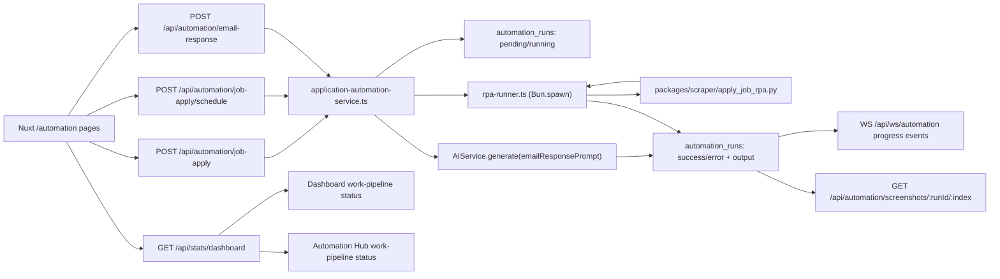
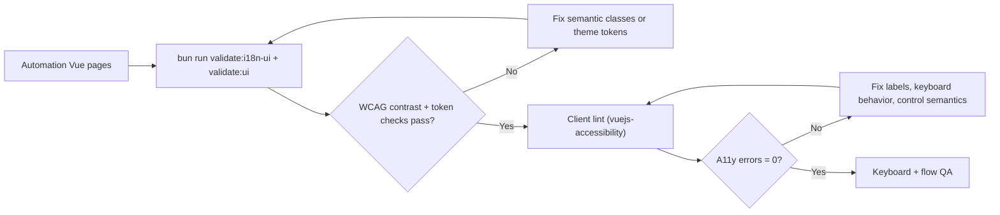

# Automation & RPA

BaoBuildBuddy uses RPA-Python for browser automation workflows through direct subprocess JSON I/O.

## Why this approach

- Direct automation bridge with no API abstraction layer.
- Deterministic input/output contract: JSON over stdin/stdout.
- No HTTP automation proxy or long-running adapter process.

## Implementation

- Scraper scripts live in `packages/scraper/`:
  - `apply_job_rpa.py`
  - `job_scraper_gamedev.py`
  - `job_scraper_grackle.py`
  - `job_scraper_workwithindies.py`
  - `job_scraper_remotegamejobs.py`
  - `job_scraper_gamesjobsdirect.py`
  - `job_scraper_pocketgamer.py`
  - `studio_scraper.py`
- Automation runner on the server lives in `packages/server/src/services/automation/rpa-runner.ts` and launches Python with `Bun.spawn`.
- Job application orchestration is implemented in `packages/server/src/services/automation/application-automation-service.ts`.
- Job board scraper execution is implemented in `packages/server/src/services/scraper-service.ts` and sends typed stdin payload to scripts (`{ sourceUrl?: string }`), so runtime source endpoints are settings-driven instead of script hardcoded.



### RPA input contract (`apply_job_rpa.py`)

```json
{
  "jobUrl": "https://...",
  "resume": {
    "personalInfo": {
      "fullName": "...",
      "email": "...",
      "phone": "..."
    },
    "experience": [],
    "education": [],
    "skills": []
  },
  "coverLetter": {
    "company": "Acme",
    "position": "Senior Game Systems Engineer",
    "content": {}
  },
  "customAnswers": {
    "field_id": "value"
  }
}
```

### Job board scraper input contract

```json
{
  "sourceUrl": "https://example.com/jobs"
}
```

`sourceUrl` is optional for scraper scripts and is resolved from `settings.automationSettings.jobProviders.gamingPortals[].fallbackUrl` by the provider layer.

### RPA output contract

```json
{
  "success": true,
  "error": null,
  "screenshots": [
    "step-01.png",
    "step-02.png"
  ],
  "steps": [
    {
      "action": "navigate",
      "status": "ok",
      "message": "Loaded page"
    }
  ]
}
```

## API routes

- `POST /api/automation/job-apply` — starts a job-application automation run.
- `POST /api/automation/job-apply/schedule` — schedules a future job-application automation run.
- `POST /api/automation/email-response` — generates an AI-assisted email response and persists it as a run.
- `POST /api/automation/job-apply` response contract:
  - `200`: `{"runId": string, "status": "running"}`
  - `POST /api/automation/job-apply/schedule` `200`: `{"runId": string, "status": "pending", "scheduledFor": string}`
  - `POST /api/automation/email-response` `200`: `{"runId": string, "status": "success", "reply": string, "provider": string, "model": string}`
  - `400`: route-level validation rejection for malformed request envelopes
  - `404`: missing dependency (`resume` / `cover-letter`)
  - `409`: concurrency limit hit
  - `422`: schema/validation failure
  - `500`: unexpected execution failure
  - Error responses are deterministic JSON envelopes in the form `{"error": string}` on handled routes.
  - Error handling follows Elysia centralized `onError` semantics; client callers branch on Eden `{ data, error }` instead of `try/catch`.
- `GET /api/automation/runs` — list recent runs with optional `type` and `status`.
- `GET /api/automation/runs/:id` — fetch run detail payload.
- `GET /api/automation/screenshots/:runId/:index` — read stored screenshot bytes.
- `WS /api/ws/automation` — subscribe/unsubscribe to live run progress events (`type: "subscribe" | "unsubscribe", runId`).

### Deterministic run status semantics

- `pending`: queued for scheduled execution.
- `running`: actively executing.
- `success`: workflow completed successfully.
- `error`: workflow failed.

## Operation

1. Routes insert a row in `automation_runs` and return run metadata (`running` for immediate, `pending` for scheduled).
2. Immediate job-apply runs execute `apply_job_rpa.py` with typed JSON input; scheduled runs queue in-memory and recover on process boot.
3. Email-response runs call `AIService.generate(emailResponsePrompt(...))` and persist deterministic output (`reply`, `provider`, `model`).
4. Output is written back into the same run row (`success`, `error`, `screenshots`, `output`).
5. Screenshots are normalized to safe filename tokens and stored under the managed run directory.
6. Settings-driven automation options (`headless`, `defaultTimeout`, `autoSaveScreenshots`, `defaultBrowser`) are validated, sanitized, and passed to the runner. Job-ingestion provider runtime controls are sourced from `settings.automationSettings.jobProviders`.
7. Completed runs trigger a retention pass (`screenshotRetention`, capped 1–30 days) that deletes stale screenshot directories from disk.
8. Temporary RPA working directories are removed after each script execution.
9. UI pages under `/automation` track history, subscribe to `/api/ws/automation` for run updates, and request screenshot bytes from `GET /api/automation/screenshots/:runId/:index`.

### Job provider runtime contract

`settings.automationSettings.jobProviders` is the single runtime source for ingestion providers (Greenhouse, Lever, company ATS boards, Hitmarker, and scraper portals). The payload must include:

- timeout/limits: `providerTimeoutMs`, `companyBoardResultLimit`, `gamingBoardResultLimit`
- fallback labels: `unknownLocationLabel`, `unknownCompanyLabel`
- Hitmarker config: `hitmarkerApiBaseUrl`, `hitmarkerDefaultQuery`, `hitmarkerDefaultLocation`
- Greenhouse config: `greenhouseApiBaseUrl`, `greenhouseMaxPages`, `greenhouseBoards[]`
- Lever config: `leverApiBaseUrl`, `leverMaxPages`, `leverCompanies[]`
- Generic ATS templates: `companyBoardApiTemplates`
- Company board sources: `companyBoards[]`
- Scraper portals: `gamingPortals[]`

Use `PUT /api/settings` with `automationSettings.jobProviders` to change any runtime source without code changes or redeploys. The service does not auto-fill provider runtime defaults; a complete valid `jobProviders` object must be present before ingestion runs.
`automationSettings` patch payloads are merged with persisted settings and revalidated against the full schema before commit, so invalid or incomplete updates are rejected with a deterministic `422` response.

## UI dashboard accessibility and wiring checks

Automation pages under `/automation` must pass the same UI wiring/accessibility gate as the rest of the client:

```bash
bun run validate:no-try-catch
bun run validate:i18n-ui
bun run validate:ui
bun run --filter '@bao/client' lint
```

Required behavior:

1. Interactive elements triggered by click must be keyboard-operable (`Enter`/`Space`) and focusable.
2. Form controls must have programmatic labels (`label` association or ARIA label).
3. Icon-only controls and anchor-only icon links must expose accessible names.
4. Run actions (`start`, `retry`, history navigation, screenshot browsing) must remain reachable without pointer input.



## Verification commands

Run these before shipping automation changes:

```bash
bun run format:check
bun run validate:no-try-catch
bun run typecheck
bun run lint
bun run test
```

`bun run typecheck` generates `packages/server/dist-types` first so client-side Nuxt typechecking validates against the typed API contract surface.
`bun run lint` includes `validate:no-try-catch` and `validate:i18n-ui`, which enforce the no-`try/catch` rule and i18n-safe UI copy standards in source files.

### Integration coverage

Automation functionality is integrated across:

1. API routes: `/api/automation/*`
2. Service orchestration: `application-automation-service.ts`
3. Python runner: `rpa-runner.ts` via `Bun.spawn`
4. Dashboard stats contract: `/api/stats/dashboard` feeding shared `WorkPipeline` state on `/` and `/automation`
5. UI pages: `/automation`, `/automation/job-apply`, `/automation/email`, `/automation/runs`, `/automation/runs/:id`
6. Real-time progress: `WS /api/ws/automation`
7. Pipeline gamification awards: `usePipelineGamification` for jobs search, scraper runs, and resume customization milestones

Route-level regression coverage exists in `packages/server/src/routes/automation.test.ts`.

## Environment

- Python dependency: `rpa` (TagUI backend)
- Install in the Python environment used by Bun:

```bash
pip install rpa
```

Automation requires `python3` on Unix and `python` on Windows.
