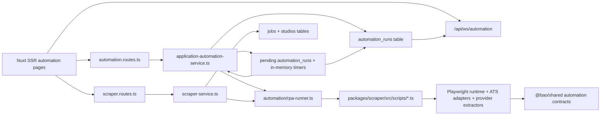
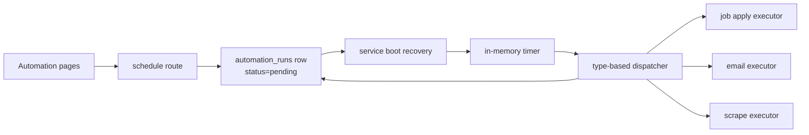
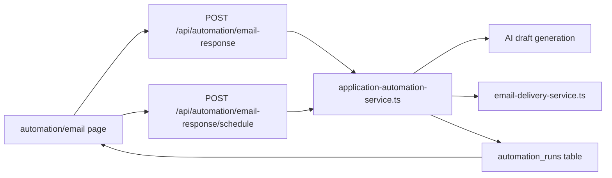

# Automation & RPA Guide

BaoBuildBuddy runs browser automation through the Bun/TypeScript workspace package at `packages/scraper`. The server keeps process isolation with `Bun.spawn`.

For a plain-English overview, see [ELI5 System Walkthrough](./ELI5_SYSTEM_WALKTHROUGH.md).

---

## How it works


```mermaid
flowchart LR
  UI["Nuxt SSR automation pages"] --> AutomationRoutes["automation.routes.ts"]
  UI --> ScraperRoutes["scraper.routes.ts"]
  UI --> AutomationWs["/api/ws/automation"]
  AutomationRoutes --> Service["application-automation-service.ts"]
  ScraperRoutes --> ScraperService["scraper-service.ts"]
  Service --> Runner["automation/rpa-runner.ts"]
  ScraperService --> Runner
  Runner --> Scripts["packages/scraper/src/scripts/*.ts"]
  Scripts --> Runtime["Playwright runtime + ATS adapters + provider extractors"]
  Runtime --> Shared["@bao/shared automation contracts"]
  Service --> Scheduler["pending automation_runs + in-memory timers"]
  Service --> Runs["automation_runs table"]
  Scheduler --> Runs
  Scheduler --> Service
  ScraperService --> JobsStudios["jobs + studios tables"]
  Runs --> AutomationWs
```

**Key files:**
- `packages/server/src/services/automation/rpa-runner.ts` -- resolves script IDs and spawns Bun entrypoints
- `packages/scraper/src/scripts` -- individual automation scripts
- `@bao/shared` -- script IDs, input schemas, and normalized row schemas

---

## Script registry

| Script ID                | File                                              | Purpose                        |
|--------------------------|---------------------------------------------------|--------------------------------|
| `job-apply`              | `src/scripts/job-apply.ts`                        | Job application form automation |
| `studio-scraper`         | `src/scripts/studio-scraper.ts`                   | Curated studio directory        |
| `scraper-hitmarker`      | `src/scripts/scraper-hitmarker.ts`                | Scrape Hitmarker jobs           |
| `scraper-grackle`        | `src/scripts/scraper-grackle.ts`                  | Scrape GrackleHQ jobs           |
| `scraper-workwithindies` | `src/scripts/scraper-workwithindies.ts`           | Scrape Work With Indies         |
| `scraper-remotegamejobs` | `src/scripts/scraper-remotegamejobs.ts`           | Scrape RemoteGameJobs           |
| `scraper-gamesjobsdirect`| `src/scripts/scraper-gamesjobsdirect.ts`          | Scrape GamesJobsDirect          |
| `scraper-pocketgamer`    | `src/scripts/scraper-pocketgamer.ts`              | Scrape PocketGamer.biz          |

---

## Scheduling

All automation types use one persisted scheduling model:

- `POST /api/automation/job-apply/schedule`
- `POST /api/automation/email-response/schedule`
- `POST /api/automation/scrape/schedule`


```mermaid
flowchart LR
  UI["Automation pages"] --> Route["schedule route"]
  Route --> Runs["automation_runs row<br/>status=pending"]
  Runs --> Restore["service boot recovery"]
  Restore --> Timer["in-memory timer"]
  Timer --> Dispatch["type-based dispatcher"]
  Dispatch --> JobApply["job apply executor"]
  Dispatch --> Email["email executor"]
  Dispatch --> Scrape["scrape executor"]
  Dispatch --> Runs
```

Each route writes a `pending` row to `automation_runs` with the timestamp at `input.schedule.runAt`, then queues an in-memory timer. On restart, pending rows are reloaded and timers restored. No separate cron table.

---

## Job-apply contract

Input is validated through `jobApplyScriptEnvelopeSchema` in `@bao/shared`:

```json
{
  "protocolVersion": "1.0",
  "runId": "run_123",
  "outputDir": "/abs/path/to/artifacts",
  "settings": {
    "headless": true,
    "defaultTimeout": 30,
    "autoSaveScreenshots": true
  },
  "jobUrl": "https://example.com/jobs/123",
  "resume": {
    "personalInfo": {
      "fullName": "Ada Lovelace",
      "email": "ada@example.com",
      "phone": "+1 555 0100"
    }
  },
  "coverLetter": { "content": {} },
  "customAnswers": { "workAuthorization": "Yes" },
  "selectorMap": { "submit": ["button[type='submit']"] }
}
```

**Output:** NDJSON event protocol -- progress events on `stderr`, one terminal `result` or `error` event on `stdout`.

**Error codes:**
- `AUTOMATION_RUNTIME_ERROR`, `AUTOMATION_TIMEOUT`, `AUTOMATION_CANCELLED`
- `SCRIPT_PROTOCOL_ERROR`, `SCRIPT_OUTPUT_INVALID`
- `OUTPUT_PERSISTENCE_ERROR`, `OUTPUT_VALIDATION_ERROR`

---

## Email response and SMTP delivery

The email automation has two stages (immediate or scheduled):

1. **Draft:** Generate a reply with the configured AI provider.
2. **Deliver:** Optionally send through SMTP.


```mermaid
flowchart LR
  UI["automation/email page"] --> Route["POST /api/automation/email-response"]
  UI --> ScheduleRoute["POST /api/automation/email-response/schedule"]
  Route --> Service["application-automation-service.ts"]
  ScheduleRoute --> Service
  Service --> AI["AI draft generation"]
  Service --> SMTP["email-delivery-service.ts"]
  Service --> Runs["automation_runs table"]
  Runs --> UI
```

**SMTP settings** (loaded from the global settings row): host, port, transport security, username, from name, from email, auth method, password secret, connection timeout.

**Run output stores:** generated reply text, delivery status, recipient email, delivery timestamp, SMTP message ID.

---

## Scraper contract

Portal scrapers use `scraperScriptEnvelopeSchema`:

```json
{
  "protocolVersion": "1.0",
  "runId": "run_123",
  "sourceUrl": "https://example.com/jobs"
}
```

`sourceUrl` is required. The server resolves it from `settings.automationSettings.jobProviders.gamingPortals[].fallbackUrl` before spawning the script.

Normalized output is validated with `scrapedJobSchema` and `scrapedStudioSchema`.

---

## Setup

```bash
bun install
bun run automation:browsers:install
```

No Python venv or `PYTHON_BINARY` configuration is required.

### Environment variables

| Variable                                | Purpose                                    | Default   |
|-----------------------------------------|--------------------------------------------|-----------|
| `AUTOMATION_STDIO_BUFFER_LIMIT`         | Max stdout/stderr lines per script         | `200`     |
| `AUTOMATION_SCRIPT_TIMEOUT_MS`          | Max execution time per run                 | `30000`   |
| `AUTOMATION_NAVIGATION_TIMEOUT_MS`      | Playwright navigation timeout override     | derived   |
| `AUTOMATION_PAGE_SETTLE_DELAY_MS`       | Post-navigation settle delay               | `2000`    |
| `AUTOMATION_SECONDARY_NAVIGATION_DELAY_MS` | Apply-link redirect settle delay        | `2000`    |
| `AUTOMATION_POST_SUBMIT_DELAY_MS`       | Post-submit verification delay             | `3000`    |

---

## Verification

### Local quality gates

```bash
bun ci
bun run format:check
bun run lint
bun run typecheck
bun run test
bun run build
bun run ci:alignment
```

### Integration and release audits

```bash
bun run audit:integration       # audit:official-llms + verify:pages
bun run release:verify           # preflight, build, verify:desktop-runtime, verify:desktop-releases
bun run audit:full               # everything
```

`verify:pages` starts Nuxt preview automatically unless `VERIFY_BASE_URL` is supplied.

---

## UI contract checks

Automation pages use the same SSR-first layout/token model as the rest of the app:

- `validate:ui-layout-tokens` owns widths, grid tracks, modal sizing, and page scaffold tokens.
- `validate:daisyui-contracts` scans for blueprint-backed semantic classes: `btn`, `card`, `drawer`, `navbar`, `table`, `list`, `progress`, and `radial-progress` (with `role="progressbar"` and `aria-valuenow`).

---

## Tests

| Test                                   | Location                                                |
|----------------------------------------|---------------------------------------------------------|
| NDJSON runner contract tests           | `packages/server/src/services/automation/rpa-runner.test.ts` |
| Scraper service integration tests      | `packages/server/src/services/scraper-service.test.ts`  |
| Playwright extractor tests (fixtures)  | `packages/scraper/src/providers/provider-extractors.test.ts` |
| ATS adapter selection tests            | `packages/scraper/src/job-apply/adapters.test.ts`       |

---

## What to read next

| Topic                              | Guide                                            |
|------------------------------------|--------------------------------------------------|
| Plain-English system overview      | [ELI5 System Walkthrough](./ELI5_SYSTEM_WALKTHROUGH.md) |
| Local AI setup                     | [Local AI Setup](./LOCAL_AI_SETUP.md)             |
| Full technical reference           | [README.md](../README.md)                        |
