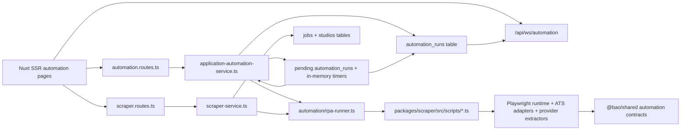
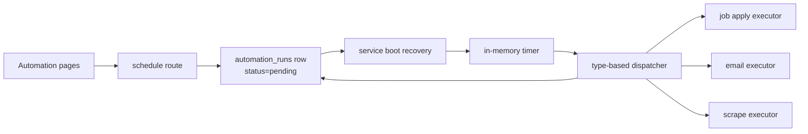
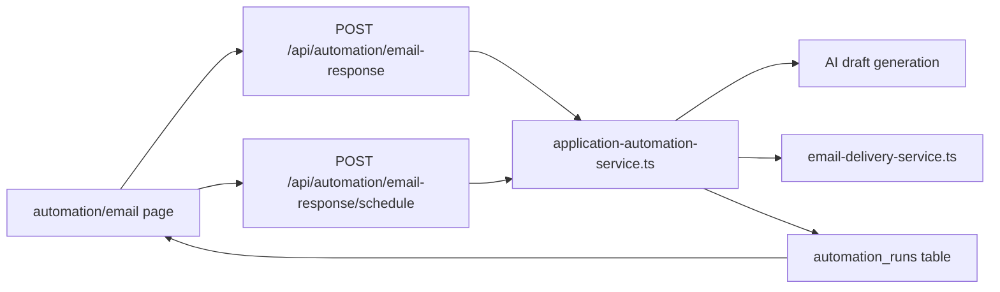

# Automation & RPA

BaoBuildBuddy now runs browser automation through the Bun/TypeScript workspace package at `packages/scraper`. The server keeps process isolation with `Bun.spawn`, but the executable surface is no longer Python-based.

If you want the short mental model first, read [Explain Like I'm 5 System Walkthrough](./ELI5_SYSTEM_WALKTHROUGH.md).

## Runtime model

- `packages/server/src/services/automation/rpa-runner.ts` resolves typed script IDs and spawns Bun entrypoints from `packages/scraper/src/scripts`.
- Job-apply automation keeps the NDJSON protocol contract defined in `@bao/shared` (`RPA_PROTOCOL_VERSION = "1.0"`).
- Scraper scripts keep plain JSON stdout payloads for row ingestion.
- Scheduled job-apply, email, and scraper runs are persisted in `automation_runs` with `status = "pending"` and `input.schedule.runAt`, then restored in-process on boot by `application-automation-service.ts`.
- Shared script IDs, input schemas, and normalized row schemas live in `packages/shared/src/schemas/automation-scripts.schema.ts`.

Current script registry:

- `job-apply` → `packages/scraper/src/scripts/job-apply.ts`
- `studio-scraper` → `packages/scraper/src/scripts/studio-scraper.ts`
- `scraper-hitmarker` → `packages/scraper/src/scripts/scraper-hitmarker.ts`
- `scraper-grackle` → `packages/scraper/src/scripts/scraper-grackle.ts`
- `scraper-workwithindies` → `packages/scraper/src/scripts/scraper-workwithindies.ts`
- `scraper-remotegamejobs` → `packages/scraper/src/scripts/scraper-remotegamejobs.ts`
- `scraper-gamesjobsdirect` → `packages/scraper/src/scripts/scraper-gamesjobsdirect.ts`
- `scraper-pocketgamer` → `packages/scraper/src/scripts/scraper-pocketgamer.ts`


```mermaid
flowchart LR
  UI["Nuxt SSR automation pages"] --> AutomationRoutes["automation.routes.ts"]
  UI --> ScraperRoutes["scraper.routes.ts"]
  UI --> AutomationWs["/api/ws/automation"]
  AutomationRoutes --> Service["application-automation-service.ts"]
  ScraperRoutes --> ScraperService["scraper-service.ts"]
  Service --> Runner["automation/rpa-runner.ts"]
  ScraperService --> Runner
  Runner --> Scripts["packages/scraper/src/scripts/*.ts"]
  Scripts --> Runtime["Playwright runtime + ATS adapters + provider extractors"]
  Runtime --> Shared["@bao/shared automation contracts"]
  Service --> Scheduler["pending automation_runs + in-memory timers"]
  Service --> Runs["automation_runs table"]
  Scheduler --> Runs
  Scheduler --> Service
  ScraperService --> JobsStudios["jobs + studios tables"]
  Runs --> AutomationWs
```

## Persisted scheduler

All automation scheduling now uses one persisted model:

- `POST /api/automation/job-apply/schedule`
- `POST /api/automation/email-response/schedule`
- `POST /api/automation/scrape/schedule`

Each route writes a `pending` row to `automation_runs`, stores the requested ISO timestamp at `input.schedule.runAt`, and queues an in-memory timer. On process restart, the service reloads pending rows and re-queues them. There is no separate cron table or shadow scheduler.


```mermaid
flowchart LR
  UI["Automation pages"] --> Route["schedule route"]
  Route --> Runs["automation_runs row<br/>status=pending"]
  Runs --> Restore["service boot recovery"]
  Restore --> Timer["in-memory timer"]
  Timer --> Dispatch["type-based dispatcher"]
  Dispatch --> JobApply["job apply executor"]
  Dispatch --> Email["email executor"]
  Dispatch --> Scrape["scrape executor"]
  Dispatch --> Runs
```

## Job-apply contract

Input is validated through `jobApplyScriptEnvelopeSchema` in `@bao/shared`:

```json
{
  "protocolVersion": "1.0",
  "runId": "run_123",
  "outputDir": "/abs/path/to/artifacts",
  "settings": {
    "headless": true,
    "defaultTimeout": 30,
    "autoSaveScreenshots": true
  },
  "jobUrl": "https://example.com/jobs/123",
  "resume": {
    "personalInfo": {
      "fullName": "Ada Lovelace",
      "email": "ada@example.com",
      "phone": "+1 555 0100"
    }
  },
  "coverLetter": {
    "content": {}
  },
  "customAnswers": {
    "workAuthorization": "Yes"
  },
  "selectorMap": {
    "submit": ["button[type='submit']"]
  }
}
```

Output stays on the NDJSON event protocol:

- progress events on `stderr`
- one terminal `result` or `error` event on `stdout`

Runtime-neutral error codes now use:

- `AUTOMATION_RUNTIME_ERROR`
- `AUTOMATION_TIMEOUT`
- `AUTOMATION_CANCELLED`
- `SCRIPT_PROTOCOL_ERROR`
- `SCRIPT_OUTPUT_INVALID`
- `OUTPUT_PERSISTENCE_ERROR`
- `OUTPUT_VALIDATION_ERROR`

## Email response and SMTP delivery

The automation email flow now has two stages, whether it is started immediately or scheduled:

1. Generate the reply draft with the configured AI provider.
2. Optionally deliver the reply through the configured SMTP transport.


```mermaid
flowchart LR
  UI["automation/email page"] --> Route["POST /api/automation/email-response"]
  UI --> ScheduleRoute["POST /api/automation/email-response/schedule"]
  Route --> Service["application-automation-service.ts"]
  ScheduleRoute --> Service
  Service --> AI["AI draft generation"]
  Service --> SMTP["email-delivery-service.ts"]
  Service --> Runs["automation_runs table"]
  Runs --> UI
```

When delivery is enabled, the server loads these settings from the global settings row:

- SMTP host
- SMTP port
- transport security (`tls`, `starttls`, or `plain`)
- username
- from name
- from email
- auth method
- stored password secret
- connection timeout

The completed run now stores:

- generated reply text
- whether the message was delivered
- recipient email
- delivery timestamp
- SMTP message ID

## Scraper contract

Portal scrapers consume the shared `scraperScriptEnvelopeSchema`:

```json
{
  "protocolVersion": "1.0",
  "runId": "run_123",
  "sourceUrl": "https://example.com/jobs"
}
```

`sourceUrl` is required. The server resolves it from `settings.automationSettings.jobProviders.gamingPortals[].fallbackUrl` before spawning the script, so scraper executables do not hardcode site defaults.

Normalized row output is validated with shared schemas:

- `scrapedJobSchema`
- `scrapedStudioSchema`

Scheduled scraping now also flows through `automation_runs`:

- `target = "studios"` runs the studio scraper and persists the summary in the run output.
- `target = "jobs_hitmarker"` runs the Hitmarker scraper and persists the summary in the run output.

## UI contract checks

Automation-related pages still use the same SSR-first layout/token model:

- `validate:ui-layout-tokens` remains the sole owner of widths, grid tracks, modal sizing, and page scaffold tokens.
- `validate:daisyui-contracts` now scans layouts, pages, and components across the app for the blueprint-backed semantic classes:
  - `btn`
  - `card`, `card-body`, `card-title`, `card-actions`
  - `drawer`, `drawer-toggle`, `drawer-content`, `drawer-side`, `drawer-overlay`
  - `navbar`, `navbar-start`, `navbar-center`, `navbar-end`
  - `table`
  - `list`, `list-row`
  - `progress`
  - `radial-progress` with `role="progressbar"` and `aria-valuenow`

## Setup

Install workspace dependencies and Playwright Chromium:

```bash
bun install
bun run automation:browsers:install
```

No Python venv or `PYTHON_BINARY` configuration is required.

Relevant environment variables:

| Variable | Purpose | Default |
|----------|---------|---------|
| `AUTOMATION_STDIO_BUFFER_LIMIT` | Max stdout/stderr line capture for spawned scripts | `200` |
| `AUTOMATION_SCRIPT_TIMEOUT_MS` | Max execution time per automation run | `30000` |
| `AUTOMATION_NAVIGATION_TIMEOUT_MS` | Optional override for Playwright navigation timeout | derived from shared automation defaults |
| `AUTOMATION_PAGE_SETTLE_DELAY_MS` | Optional post-navigation settle delay | `2000` |
| `AUTOMATION_SECONDARY_NAVIGATION_DELAY_MS` | Optional apply-link redirect settle delay | `2000` |
| `AUTOMATION_POST_SUBMIT_DELAY_MS` | Optional post-submit verification delay | `3000` |

## Verification model

Deterministic local quality gates:

- `bun ci`
- `bun run format:check`
- `bun run lint`
- `bun run typecheck`
- `bun run test`
- `bun run build`
- `bun run ci:alignment`

Integration and release audits:

- `bun run audit:integration`
  - `bun run audit:official-llms`
  - `bun run verify:pages`
- `bun run release:verify`
  - macOS host preflight
  - Rust / Xcode checks
  - `CI=true bun run build:desktop`
  - `bun run verify:desktop-runtime`
  - `bun run verify:desktop-releases` when assembled matching-host release metadata is present
- `bun run audit:full`

`verify:pages` now starts Nuxt preview automatically unless `VERIFY_BASE_URL` is supplied explicitly.

## Tests

Current test coverage for the Bun runtime includes:

- server-side NDJSON runner contract tests in `packages/server/src/services/automation/rpa-runner.test.ts`
- server-side scraper-service integration tests in `packages/server/src/services/scraper-service.test.ts`
- fixture-based Playwright extractor tests in `packages/scraper/src/providers/provider-extractors.test.ts`
- ATS adapter selection tests in `packages/scraper/src/job-apply/adapters.test.ts`
