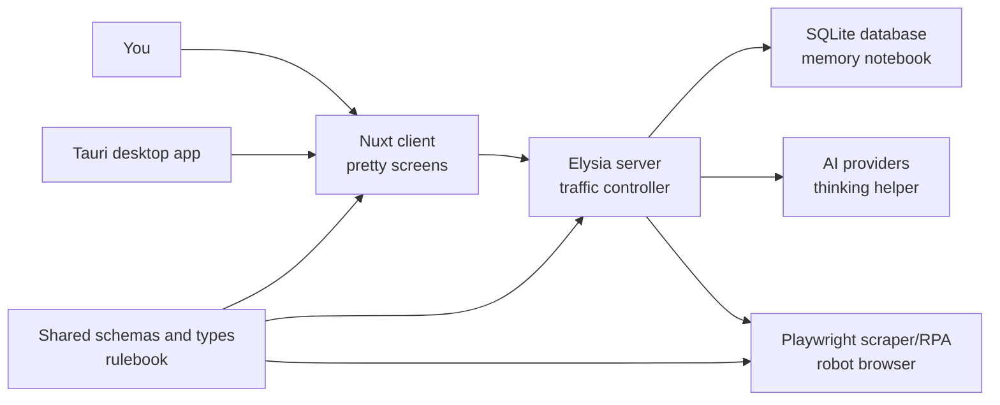
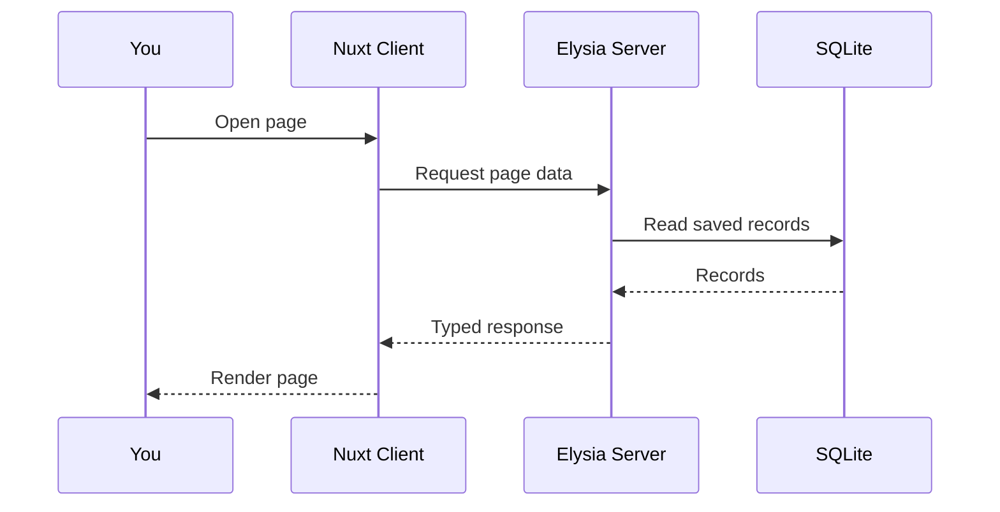
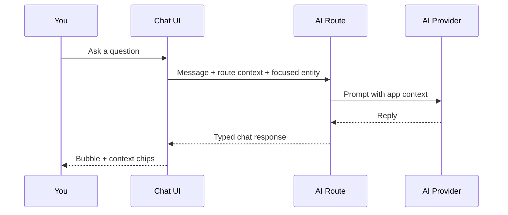
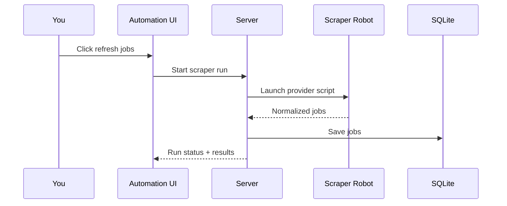
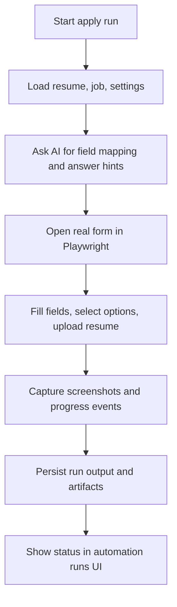
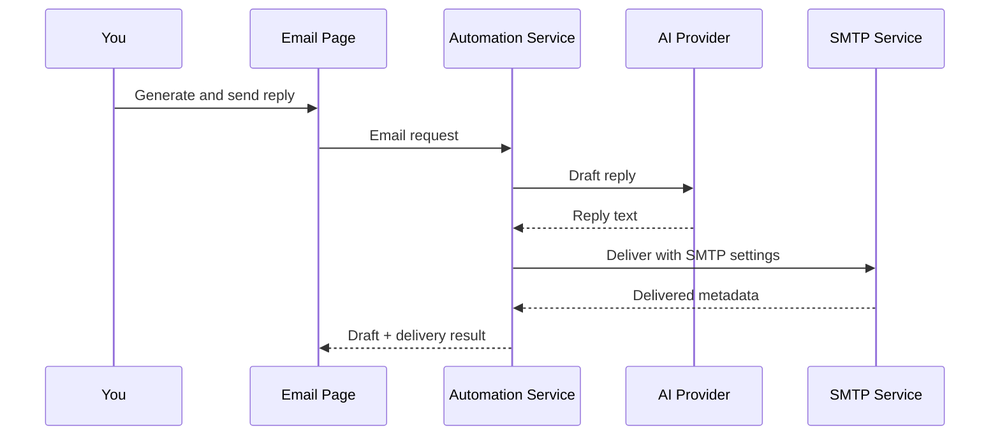
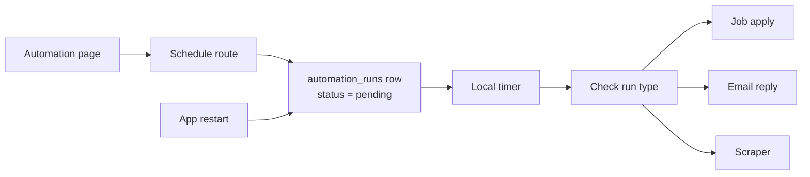
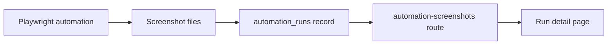

# BaoBuildBuddy -- Explained Like You're 5

This is the picture book version of the system. If the main [README](../README.md) feels like the full game manual, this is the one with diagrams.

If what you really want is "show me how to make local AI work," jump to [Local AI Setup](./LOCAL_AI_SETUP.md).

---

## The tiny version

BaoBuildBuddy is a helper for game-industry job hunting.

- The **client** is the screen you click on.
- The **server** is the manager that decides what should happen.
- The **database** is the notebook that remembers things.
- The **scraper** is the robot that visits job boards and fills out forms.
- The **desktop** app wraps the same system for local installs.
- The **shared** package is the rulebook that keeps every part speaking the same language.

---

## System map

---

## What happens when you click around

### Opening the app

The Nuxt client renders the page, asks the server for saved data, and the server reads from SQLite.

### Asking the AI for help

Your message goes to the server with page context. The server adds business rules, the AI writes a reply, and it comes back as a chat bubble.

### Refreshing jobs

The server launches the scraper robot, which visits job sources, normalizes everything into one format, and saves it for a clean list in the UI.

### Applying for a job

The server gathers your resume, job info, and settings. The AI helps map fields. The scraper robot opens the real form, fills it in, captures screenshots, and submits.

### Sending an email reply

The AI drafts the message. If delivery is enabled, the server sends it through SMTP.

### Scheduling a task for later

The server saves a `pending` run in the database and sets a timer. If the app restarts, it reloads pending runs and restores timers.

---

## Where screenshots come from

The browser robot creates screenshots during automation runs. They're stored in run records and served through the screenshot route.

---

## Why there are so many packages

Each package owns one job:

| Package              | Responsibility                                |
|----------------------|-----------------------------------------------|
| `packages/client`    | User interface                                |
| `packages/server`    | API, orchestration, persistence               |
| `packages/shared`    | Types, schemas, constants, validation         |
| `packages/scraper`   | Job scraping and RPA browser execution        |
| `packages/desktop`   | Desktop wrapper and installers                |

This split keeps one package from trying to do everything.

---

## The happy path

1. Open the app.
2. Configure settings and AI providers.
3. Refresh jobs from supported sources.
4. Review a job and prepare a resume or cover letter.
5. Run or schedule job-apply, email, or scraper automation.
6. Review screenshots and run history.
7. Generate and optionally deliver follow-up emails.

---

## Something broke -- where to look

| Symptom                           | Check here                         |
|-----------------------------------|------------------------------------|
| UI looks wrong                    | `packages/client`                  |
| Route or API issue                | `packages/server/src/routes`       |
| Data shape mismatch               | `packages/shared`                  |
| Browser automation issue          | `packages/scraper`                 |
| Installer or app shell issue      | `packages/desktop`                 |

---

## What to read next

| Topic                              | Guide                                            |
|------------------------------------|--------------------------------------------------|
| Full technical reference           | [README.md](../README.md)                        |
| Local AI setup                     | [Local AI Setup](./LOCAL_AI_SETUP.md)             |
| First-time setup                   | [Starter Guide](./STARTER_GUIDE.md)              |
| Automation details                 | [Automation Guide](./AUTOMATION.md)               |
