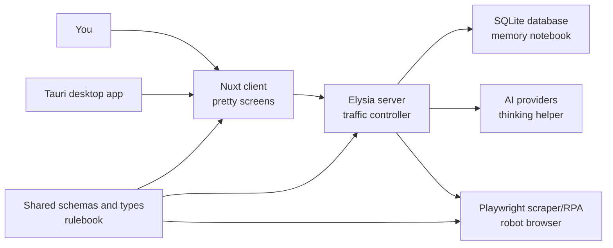
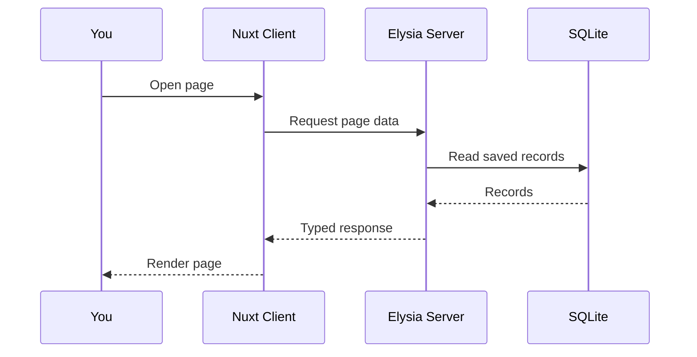
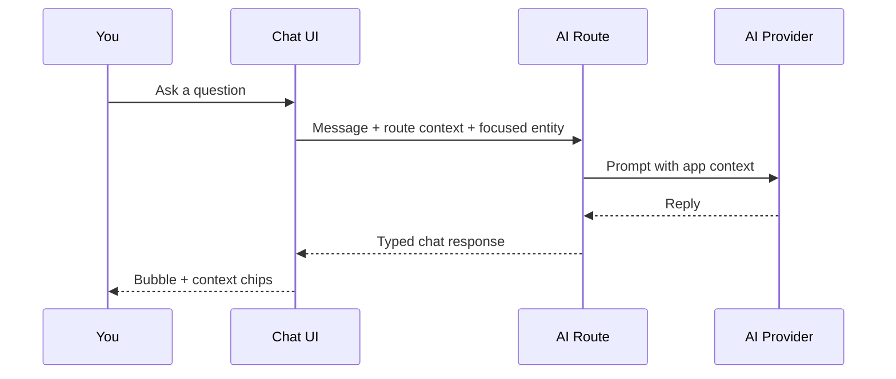
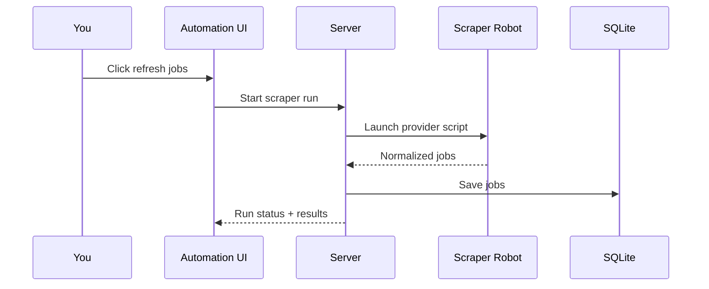
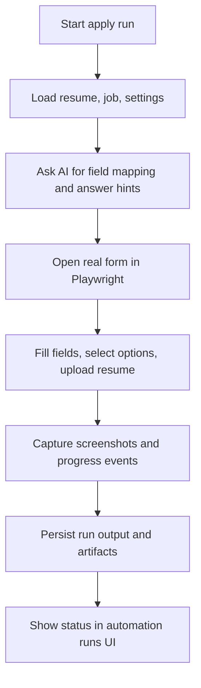
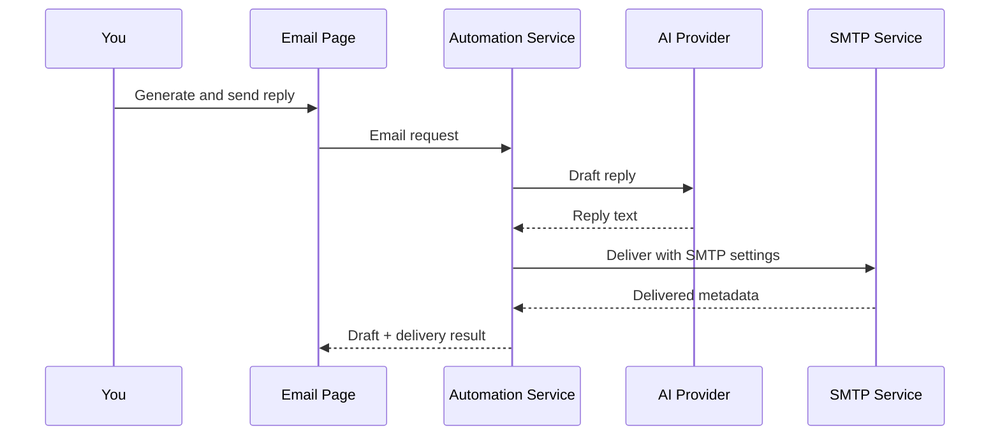
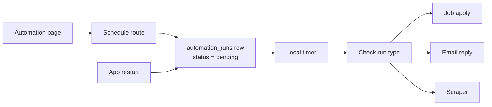
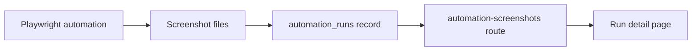

# BaoBuildBuddy Explained Like You're 5

This is the smallest mental model of the system.

If the main [README](../README.md) feels like the full game manual, this file is the picture book version.

## The tiny version

BaoBuildBuddy is a helper for game-job hunting.

- The `client` is the screen you click on.
- The `server` is the manager that decides what should happen.
- The `database` is the notebook that remembers things.
- The `scraper` is the robot that visits job boards and forms.
- The `desktop` app is a wrapped version of the same system for local installs.
- The `shared` package is the rulebook that keeps every part speaking the same language.

## One-picture system map

## What happens when you click around

### 1. You open the app

- The Nuxt client renders the page.
- The client asks the server for saved data.
- The server reads from SQLite and sends back typed results.

### 2. You ask the AI chat for help

- The client sends your message and page context.
- The server adds business rules and useful history.
- The AI writes a reply.
- The reply comes back to the chat bubble with context chips.

### 3. You refresh jobs

- The server starts the scraper robot.
- The robot visits job sources.
- It normalizes the jobs into one shared format.
- The server saves them so the UI can show one clean list.

### 4. You tell it to apply for a job

- The server collects your resume, job info, and saved settings.
- The AI helps map fields and generate missing answers.
- The scraper robot opens the real job form.
- The robot fills fields, uploads the resume, captures screenshots, and submits when allowed.
- The run record and screenshots are saved for review.

### 5. You generate and send an email reply

- The AI writes the message draft.
- If delivery is enabled, the server loads SMTP settings.
- The Bun SMTP service sends the message.
- The run stores the draft, delivery status, timestamp, and message ID.

### 6. You schedule a robot task for later

- The page tells the server what to run later and what time to use.
- The server writes a `pending` run into the database first.
- The server also sets a local timer.
- If the app restarts, it reads the pending runs back out and restores the timers.
- When the time arrives, the server looks at the run type and launches the right robot flow.

## Where screenshots come from

Screenshots are created by the browser robot during automation runs.

- The robot saves the image files.
- The server stores their metadata in the run record.
- The UI loads them through the screenshot route.

## Why there are so many packages

Each package owns one job:

- `packages/client`: user interface
- `packages/server`: API, orchestration, persistence
- `packages/shared`: types, schemas, constants, validation
- `packages/scraper`: job scraping and RPA browser execution
- `packages/desktop`: desktop wrapper and installers

This split keeps one package from trying to do everything.

## The normal happy path

1. Open the app.
2. Configure settings and AI providers.
3. Refresh jobs from supported sources.
4. Review a job and prepare a resume or cover letter.
5. Run or schedule job-apply, email, or scraper automation.
6. Review screenshots and run history.
7. Generate and optionally deliver follow-up emails.

## If something breaks, where to look

- UI looks wrong: `packages/client`
- Route or API issue: `packages/server/src/routes`
- Data shape mismatch: `packages/shared`
- Browser automation issue: `packages/scraper`
- Installer or app shell issue: `packages/desktop`

## Read next

- Full runbook: [README.md](../README.md)
- First-time setup: [STARTER_GUIDE.md](./STARTER_GUIDE.md)
- Automation details: [AUTOMATION.md](./AUTOMATION.md)
