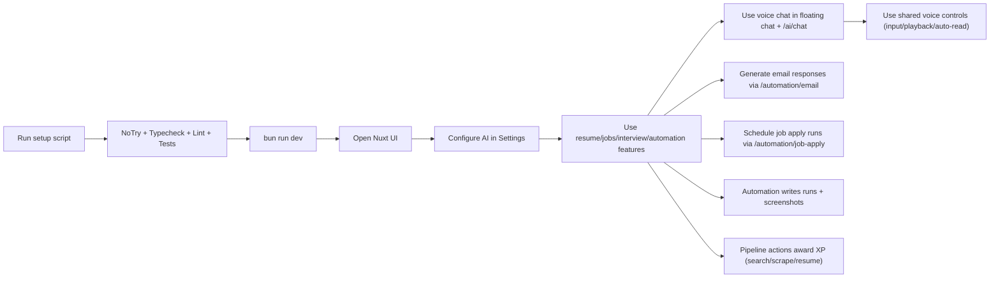

# BaoBuildBuddy Starter Guide (Non-Technical)

This guide is the simplest way to run BaoBuildBuddy on your computer.

## 1) What you need first

- Internet connection
- Bun installed: https://bun.sh
- Git installed: https://git-scm.com
- Python 3.10+ installed (required for automation features)
- Chrome installed (required for browser automation)

## 2) Download the project

### macOS / Linux

```bash
git clone https://github.com/d4551/baobuildbuddy.git
cd baobuildbuddy
```

### Windows (PowerShell)

```powershell
git clone https://github.com/d4551/baobuildbuddy.git
cd baobuildbuddy
```

## 3) Run setup (one command)

### macOS / Linux

```bash
bash scripts/setup.sh
```

### Windows (PowerShell)

```powershell
powershell -ExecutionPolicy Bypass -File scripts\setup.ps1
```

The setup script will:

1. Check required tools
2. Install dependencies
3. Create `.env` from `.env.example` if needed
4. Set up the database
5. Run checks (`typecheck`, `lint`, `test`) including no-`try/catch` and accessibility validation inside `lint`

## 4) Start the app

```bash
bun run dev
```

Then open:

- UI: URL shown as `Local:` in terminal (usually `http://localhost:3001`)
- API health: `http://localhost:3000/api/health`

## 5) First-time setup in the UI

1. Open the UI
2. Go to **Settings**
3. Configure AI provider:
   - Local model endpoint (recommended first)
   - Optional cloud API keys
4. Save settings

## 6) Run key features

1. Resume builder: `/resume`
2. Cover letters: `/cover-letter`
3. Job search: `/jobs`
4. Interview practice: `/interview`
5. Voice chat:
   - Floating assistant on every page (bottom-right bubble)
   - Full chat page at `/ai/chat`
   - Optional voice-output selection and auto-read toggles in both chat surfaces
6. Automation job apply + scheduling: `/automation/job-apply`
7. Automation email response: `/automation/email`
8. Automation run history: `/automation/runs`
9. Language support and locale switcher:
   - Interface locales are available in `packages/client/locales`.
   - Current runtime locales: `en-US`, `es-ES`, `fr-FR`, `ja-JP`.
- Switch language from the navbar language menu (all locales with message catalogs are listed).
- Settings also persist a locale preference under `settings.language` for supported locales:
  - `en-US`
  - `es-ES`
  - `fr-FR`
  - `ja-JP`
10. Pipeline gamification: searching jobs, running scrapers, and resume customization award XP in flow

## 6.1 Language support defaults

- Default locale: `NUXT_PUBLIC_I18N_DEFAULT_LOCALE`
- Fallback locale: `NUXT_PUBLIC_I18N_FALLBACK_LOCALE`
- Supported locales: `NUXT_PUBLIC_I18N_SUPPORTED_LOCALES`
- Cookie key: `NUXT_PUBLIC_I18N_LOCALE_COOKIE_KEY`

You can add a new locale by:

1. Creating `packages/client/locales/<locale>.ts` with the typed message schema.
2. Registering it in `packages/client/plugins/i18n.ts`.
3. Adding it to `NUXT_PUBLIC_I18N_SUPPORTED_LOCALES`.

## 7) How the system flow works



## 8) If something fails

- Re-run setup script and read the first `[FAIL]` line
- Run checks directly:

```bash
bun run validate:no-try-catch
bun run typecheck
bun run lint
bun run test
```

- For automation-specific issues:
  - Confirm Python 3.10+
  - Confirm `rpa` is installed in `.venv`
  - Confirm Chrome is installed
