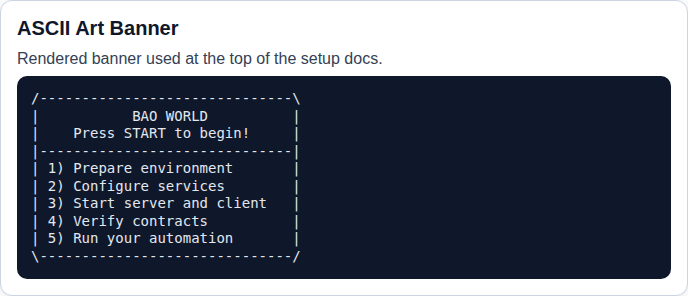
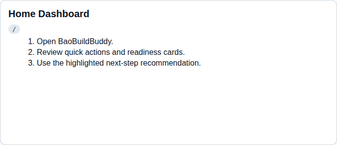
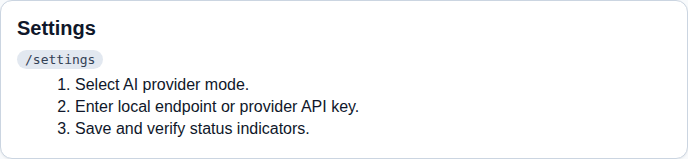
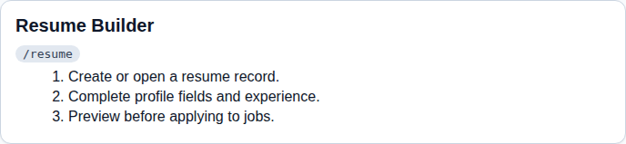
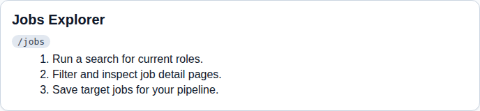
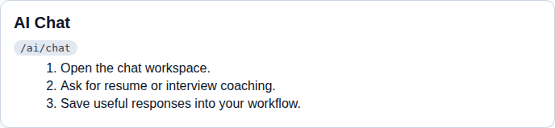
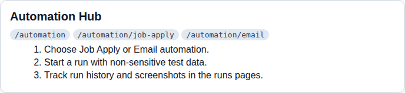

# BaoBuildBuddy User Manual (Step-by-Step)

This guide provides a step-by-step walkthrough of the core UI features, with screenshots for each element.

## 1) ASCII art banner (visual reference)

## 2) Home dashboard

1. Open BaoBuildBuddy at `/`.
2. Review the quick-action and readiness areas.
3. Follow the highlighted next-step recommendation.

## 3) Settings

1. Go to `/settings`.
2. Choose your AI mode (local endpoint or provider key).
3. Save, then confirm status updates.

## 4) Resume builder

1. Go to `/resume`.
2. Create or edit your resume profile and experience.
3. Use preview before applying to jobs.

## 5) Jobs explorer

1. Open `/jobs`.
2. Run a search and apply filters.
3. Save target jobs for your pipeline.

## 6) AI chat

1. Open `/ai/chat`.
2. Ask for resume/interview guidance.
3. Reuse useful outputs in your workflow.

## 7) Automation hub

1. Open `/automation` (and related routes like `/automation/job-apply` and `/automation/email`).
2. Start a run with non-sensitive sample data first.
3. Track progress/history in automation runs pages.
