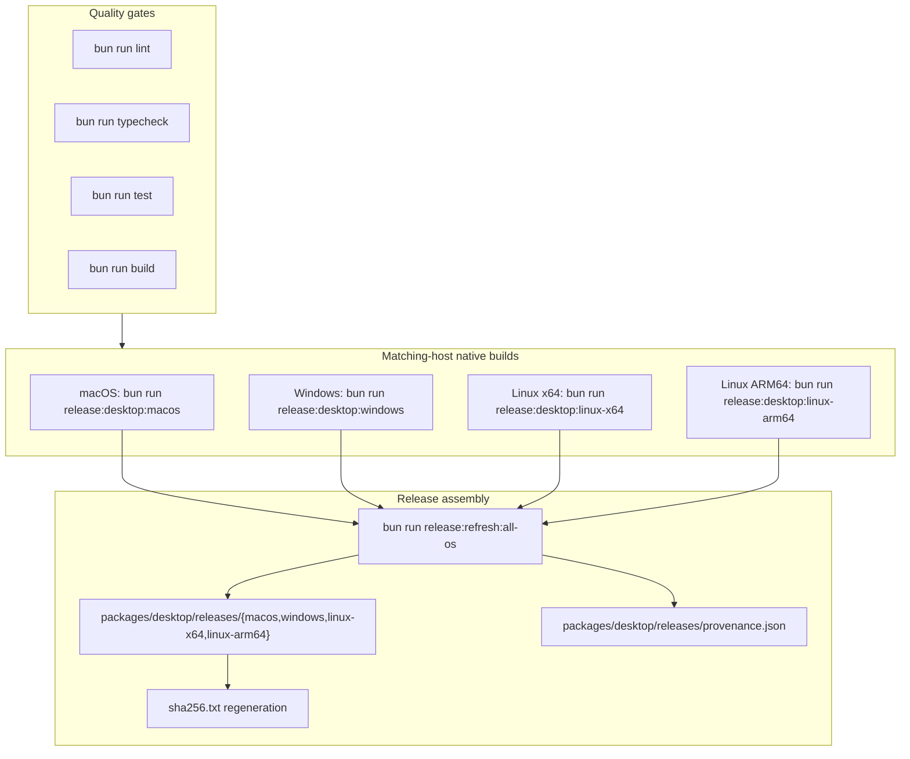

# Desktop Release Manifest

Canonical installer output manifest for this repository baseline

## Quality Gate Before Packaging

For the full validation sequence and script verification commands, see [README.md § Release Validation Workflow](../../../README.md#release-validation-workflow). Packaging docs in this file assume those quality gates succeed without masked diagnostics.

This repository now treats native matching-host Tauri bundles as the only canonical desktop release source. A single machine does not cross-build the full release set.

Optional SSR/page validation before packaging (when validating UI render contracts):

```bash
PORT=4105 bun run --filter '@bao/client' preview
VERIFY_HOST=127.0.0.1 VERIFY_PORT=4105 bun run verify:pages
```

## Packaging workflow



Run matching-host native staging on each platform:

```bash
bun run release:desktop:macos -- --output-root .desktop-release-artifacts
bun run release:desktop:windows -- --output-root .desktop-release-artifacts
bun run release:desktop:linux-x64 -- --output-root .desktop-release-artifacts
bun run release:desktop:linux-arm64 -- --output-root .desktop-release-artifacts
```

Then assemble the canonical release directory:

```bash
bun run release:refresh:all-os
```

Host/runtime requirements:

- repo-local `@tauri-apps/cli` invoked through Bun (`bun tauri build` / `bun tauri bundle`)
- macOS host for the macOS bundle flow
- Windows host for the Windows bundle flow
- Linux x64 host for the Linux x64 bundle flow
- Linux ARM64 host or ARM-emulated CI runner for the Linux ARM64 bundle flow

The canonical release flow performs:

- release quality gates (`lint`, `typecheck`, `test`, `build`)
- macOS-native split bundle flow: `bun tauri build --no-bundle`, then `bun tauri bundle --bundles app,dmg`
- Windows-native `bun tauri build` for the NSIS installer and portable zip
- Linux x64-native `bun tauri build --bundles deb,rpm` for deb and rpm bundles
- Linux ARM64-native `bun tauri build --bundles deb,rpm` for deb and rpm bundles
- staging native artifacts under `.desktop-release-artifacts/{macos,windows,linux-x64,linux-arm64}`
- assembly into `packages/desktop/releases/{macos,windows,linux-x64,linux-arm64}`
- provenance staging under `packages/desktop/releases/metadata/<target>` and `packages/desktop/releases/provenance.json`
- checksum regeneration in `packages/desktop/releases/sha256.txt`
- Bun-native post-staging verification via `bun run verify:desktop-releases`
- CI quality gates via `.github/workflows/desktop-release.yml` before any native packaging job runs

Windows note: the packaged runtime is `x64` only. There is no `x86` / `i686` desktop artifact. The canonical release set ships both the NSIS setup installer and a portable `.zip` that keeps the executable, bundled `gen/runtime` tree, and WebView2 bootstrapper together.

The `release:refresh:all-os:fast` alias points to the same assembly command. It does not perform hidden cross-target rebuilds.

Matching-host examples:

```bash
# macOS native bundle staging
bun run release:desktop:macos -- --output-root .desktop-release-artifacts

# Windows native bundle staging
bun run release:desktop:windows -- --output-root .desktop-release-artifacts

# Linux x64 native bundle staging
bun run release:desktop:linux-x64 -- --output-root .desktop-release-artifacts

# Linux ARM64 native bundle staging
bun run release:desktop:linux-arm64 -- --output-root .desktop-release-artifacts

# Assemble the canonical release directory after all matching-host jobs complete
bun run release:refresh:all-os
```

## Canonical release directories

- `macos/`
- `windows/`
- `linux-x64/`
- `linux-arm64/`

Raw Tauri build outputs are created under `packages/desktop/src-tauri/target/release/bundle`, staged per target under `.desktop-release-artifacts/<target>`, and then copied into these canonical release directories.

## Artifacts

### macOS

- `macos/${APP_PRODUCT_NAME}_<VERSION>_aarch64.dmg`

### Linux x64

- `linux-x64/${APP_PRODUCT_NAME}_<VERSION>_amd64.deb`
- `linux-x64/${APP_PRODUCT_NAME}-<VERSION>-1.x86_64.rpm`

### Linux ARM64

- `linux-arm64/${APP_PRODUCT_NAME}_<VERSION>_arm64.deb`
- `linux-arm64/${APP_PRODUCT_NAME}-<VERSION>-1.aarch64.rpm`

### Windows

- `windows/${APP_PRODUCT_NAME}_<VERSION>_x64-setup.exe`
- `windows/${APP_PRODUCT_NAME}_<VERSION>_x64-portable.zip`

## Integrity

- SHA-256 checksums are recorded in `sha256.txt`.
- Matching-host provenance is recorded in `provenance.json` and `metadata/<target>/provenance.json`.
- Run `bun run verify:desktop-releases` to validate version alignment, required Tauri icons, staged artifact names, bundle signatures, DMG integrity, matching-host provenance, and checksum matches.
