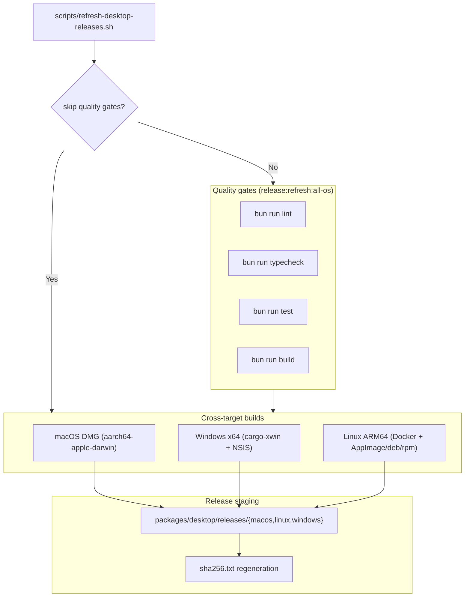

# Desktop Release Manifest

Canonical installer output manifest for this repository baseline

## Quality Gate Before Packaging

For the full validation sequence and script verification commands, see [README.md § Release Validation Workflow](../../../README.md#release-validation-workflow). Packaging docs in this file assume those quality gates succeed without masked diagnostics.

`release:refresh:all-os` uses a headless fallback for macOS DMG creation:

- First attempt uses `cargo tauri build --bundles dmg`.
- If the expected `.dmg` is missing or that step exits non-zero, the script rebuilds the `.app` bundle if needed and then creates the DMG from the emitted app bundle with a deterministic headless `hdiutil` flow.

If a direct `bun run build:desktop` run does not emit the expected DMG, use the refresh fallback directly:

```bash
bash scripts/refresh-desktop-releases.sh --skip-quality-gates --skip-linux --skip-windows
```

Optional SSR/page validation before packaging (when validating UI render contracts):

```bash
PORT=4105 bun run --filter '@bao/client' preview
VERIFY_HOST=127.0.0.1 VERIFY_PORT=4105 bun run verify:pages
```

## Packaging workflow (macOS host)



Use the canonical all-target refresh command:

```bash
bun run release:refresh:all-os
```

For fast local rebuilds after quality gates:

```bash
bun run release:refresh:all-os:fast
```

`bun run release:refresh:all-os:fast` is equivalent to `bash scripts/refresh-desktop-releases.sh --skip-quality-gates` and performs packaging + checksum regeneration only.

Host/runtime requirements:

- macOS host (required for DMG generation)
- Docker daemon running (required for Windows NSIS fallback and Linux cross-target packaging)
- `tauri-cli` (`cargo install tauri-cli --version 2.10.1 --locked`)
- `cargo-xwin` for Windows x64 cross-compilation (`cargo install cargo-xwin`)
- Outbound network access for Ubuntu package mirrors and Bun/Rust/AppImage downloads

This command performs:

- release quality gates (`lint`, `typecheck`, `test`, `build`)
- macOS DMG build (`aarch64-apple-darwin`)
- Windows x64 setup build (`x86_64-pc-windows-msvc`)
- Linux ARM64 `deb`/`rpm` build through `cargo tauri build --bundles deb,rpm` (`aarch64-unknown-linux-gnu`)
- Linux ARM64 AppImage build in a separate ARM-native/emulated step after `deb`/`rpm`
- staging into `packages/desktop/releases/{macos,linux,windows}`
- checksum regeneration in `packages/desktop/releases/sha256.txt`
- Bun-native post-staging verification via `bun run verify:desktop-releases`
- containerized Windows NSIS fallback when local `makensis` is unavailable/fails
- Linux AppImage creation via `appimagetool` from the staged ARM AppDir

Windows note: the packaged runtime is `x64` only. There is no `x86` / `i686` desktop artifact. The canonical release set ships both the NSIS setup installer and a portable `.zip` that keeps the executable, bundled `gen/runtime` tree, and WebView2 bootstrapper together.

Advanced target selection examples:

```bash
# Skip quality gates when only rebuilding artifacts
bash scripts/refresh-desktop-releases.sh --skip-quality-gates

# Rebuild only Linux + Windows artifacts
bash scripts/refresh-desktop-releases.sh --skip-macos

# Rebuild only macOS artifacts
bash scripts/refresh-desktop-releases.sh --skip-linux --skip-windows
```

## Canonical release directories

- `macos/`
- `linux/`
- `windows/`

Raw Tauri build outputs are created under `packages/desktop/src-tauri/target/release/bundle` and then copied into these canonical release directories.

## Artifacts

### macOS

- `macos/${APP_PRODUCT_NAME}_<VERSION>_aarch64.dmg`

### Linux

- `linux/${APP_PRODUCT_NAME}_<VERSION>_aarch64.AppImage`
- `linux/${APP_PRODUCT_NAME}_<VERSION>_arm64.deb`
- `linux/${APP_PRODUCT_NAME}-<VERSION>-1.aarch64.rpm`

### Windows

- `windows/${APP_PRODUCT_NAME}_<VERSION>_x64-setup.exe`
- `windows/${APP_PRODUCT_NAME}_<VERSION>_x64-portable.zip`

## Integrity

- SHA-256 checksums are recorded in `sha256.txt`.
- Run `bun run verify:desktop-releases` to validate version alignment, required Tauri icons, staged artifact names, bundle signatures, DMG integrity, and checksum matches.
