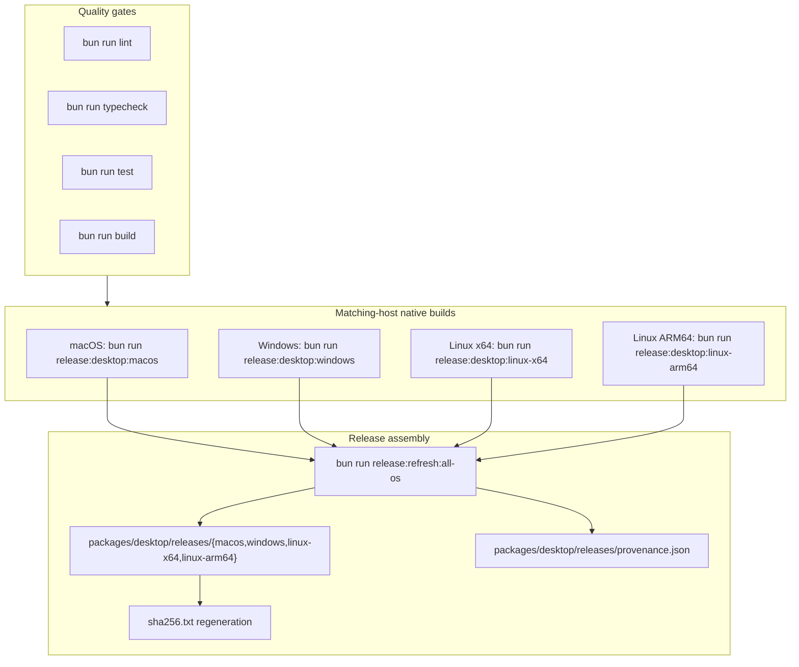

# Desktop Release Manifest

Canonical installer output manifest for this repository baseline

## Matching-host rule

Desktop release generation is intentionally matching-host only:

- macOS hosts generate `macos`
- Windows hosts generate `windows`
- Linux x64 hosts generate `linux-x64`
- Linux ARM64 hosts generate `linux-arm64`

Cross-host generation is blocked by `scripts/build-desktop-release.ts`. Use matching CI runners or matching local machines for the full release matrix. For the complete proof flow, including runtime verification and release verification, see [docs/VERIFICATION_RUNBOOK.md](../../../docs/VERIFICATION_RUNBOOK.md).

## Quality Gate Before Packaging

For the full validation sequence and script verification commands, see [README.md § Release Validation Workflow](../../../README.md#release-validation-workflow). Packaging docs in this file assume those quality gates succeed without masked diagnostics.

This repository now treats native matching-host Tauri bundles as the only canonical desktop release source. A single machine does not cross-build the full release set.

Optional SSR/page validation before packaging (when validating UI render contracts):

```bash
PORT=4105 bun run --cwd packages/client preview
VERIFY_HOST=127.0.0.1 VERIFY_PORT=4105 bun run verify:pages
```

## Packaging workflow



Run matching-host native staging on each platform:

```bash
bun run release:desktop:macos -- --output-root .desktop-release-artifacts --release
bun run release:desktop:windows -- --output-root .desktop-release-artifacts --release
bun run release:desktop:linux-x64 -- --output-root .desktop-release-artifacts --release
bun run release:desktop:linux-arm64 -- --output-root .desktop-release-artifacts --release
```

Then assemble the canonical release directory:

```bash
bun run release:refresh:all-os
```

Host/runtime requirements:

- repo-local `@tauri-apps/cli` invoked through Bun (`bun tauri build` / `bun tauri bundle`)
- macOS host for the macOS bundle flow
- Windows host for the Windows bundle flow
- Linux x64 host for the Linux x64 bundle flow
- Linux ARM64 host or ARM-emulated CI runner for the Linux ARM64 bundle flow

The canonical release flow performs:

- release quality gates (`lint`, `typecheck`, `test`, `build`)
- macOS-native split bundle flow: `bun tauri build --no-bundle`, then `bun tauri bundle --bundles app,dmg`
- Windows-native `bun tauri build` for the NSIS installer and portable zip
- Linux x64-native `bun tauri build --bundles deb,rpm` for deb and rpm bundles
- Linux ARM64-native `bun tauri build --bundles deb,rpm` for deb and rpm bundles
- optional macOS Intel / universal DMGs via `DESKTOP_RELEASE_MACOS_ARCHITECTURES=x86_64` or `aarch64,x86_64,universal`
- Windows MSI output by default (`DESKTOP_RELEASE_WINDOWS_MSI=false` to omit)
- Linux AppImage on x64 by default (`DESKTOP_RELEASE_LINUX_APPIMAGE=false` to omit)
- Linux detached GPG signatures by default (`DESKTOP_RELEASE_LINUX_SIGNATURES=false` to omit)
- staging native artifacts under `.desktop-release-artifacts/{macos,windows,linux-x64,linux-arm64}`
- assembly into `packages/desktop/releases/{macos,windows,linux-x64,linux-arm64}`
- provenance staging under `packages/desktop/releases/metadata/<target>` and `packages/desktop/releases/provenance.json`
- checksum regeneration in `packages/desktop/releases/sha256.txt`
- Bun-native post-staging verification via `bun run verify:desktop-releases -- --release`
- CI quality gates via `.github/workflows/desktop-release.yml` before any native packaging job runs
- CI installs **WiX Toolset** on Windows when MSI is enabled (`chocolatey` `wixtoolset`) so `candle` / `light` are on `PATH`
- CI installs **squashfs-tools** and **libfuse2** on Linux x64 to support Tauri’s AppImage bundling
- If `DESKTOP_GPG_PRIVATE_KEY` or `DESKTOP_RELEASE_GPG_KEY_ID` is not set, CI turns off **Linux detached signatures** for that run (Linux jobs and the assemble verify step stay aligned); configure those secrets to ship `.sig` files from automation
- **macOS stapler / `verify --release`:** The workflow runs `xcrun stapler validate` and `verify:desktop-releases -- --release` only when all of `APPLE_API_KEY_CONTENT`, `APPLE_API_ISSUER`, `APPLE_API_KEY`, `APPLE_SIGNING_IDENTITY`, `APPLE_CERTIFICATE`, `APPLE_CERTIFICATE_PASSWORD`, and `KEYCHAIN_PASSWORD` are set. Otherwise it verifies macOS artifacts **without** stapler expectations, and the assemble job matches that (it sets `DESKTOP_RELEASE_RELEASE_MODE=false` for the combined verify step when those secrets are incomplete).
- **Windows MSI (WiX):** Tauri needs the WiX toolset; CI installs it via Chocolatey. If `light.exe` fails with script errors, ensure the **VBSCRIPT** optional Windows feature is enabled (see [Tauri prerequisites — Windows](https://v2.tauri.app/start/prerequisites/)); GitHub-hosted runners usually have it on.
- **`DESKTOP_RELEASE_*` workflow env:** On `push`, **repository variables** (`vars.DESKTOP_RELEASE_*`) apply when set; otherwise env is empty and scripts use built-in defaults (MSI / AppImage / Linux signatures on). On `workflow_dispatch`, **boolean inputs always win** (including `false`); the workflow must not use `input || vars` for booleans because `false` would incorrectly fall through to vars. String inputs (e.g. macOS architectures) still use `input || vars`.
- **AppImage count:** The canonical contract includes **one** AppImage (Linux x64 only). Linux ARM64 intentionally omits AppImage (linuxdeploy instability). The Linux x64 CI job fails if AppImage is enabled but no `*.AppImage` is staged.
- **AppImage from macOS:** Use GitHub Actions (`desktop-release` workflow) or a real **x86_64 Linux** machine. Docker `--platform linux/amd64` on Apple Silicon often hits QEMU limitations and can abort the Tauri CLI mid-build.
- **Linux bundled server layout:** On Linux targets, `prepare-desktop-runtime.ts` ships `server/bao-desktop-server` and `bin/bao-bun` as POSIX shell launchers plus adjacent `*.payload.gz` blobs (gzip of the Bun binaries) so linuxdeploy does not run `ldd` on those payloads during AppImage creation. Manifest paths are unchanged; Rust `Command::new` still launches them.
- **Local commands:** Prefer `bun run test` (workspace-scoped) for CI parity. A bare `bun test` at the repo root uses [bunfig.toml](../../../bunfig.toml) (`preload` for server test env, `pathIgnorePatterns` for desktop `target/` when supported). Stale `packages/server/dist/**/*.test.js` from old builds duplicates server tests—`bun run --cwd packages/server build` clears `dist` first. After `prepare:desktop-runtime`, staged scraper sources omit `*.test.ts` so they are not shipped into app bundles.

Windows note: the packaged runtime is `x64` only. There is no `x86` / `i686` desktop artifact. The canonical release set ships both the NSIS setup installer and a portable `.zip` that keeps the executable, bundled `gen/runtime` tree, and WebView2 bootstrapper together.

The `release:refresh:all-os:fast` alias points to the same assembly command. It does not perform hidden cross-target rebuilds.

Matching-host examples:

```bash
# macOS native bundle staging
bun run release:desktop:macos -- --output-root .desktop-release-artifacts --release

# Windows native bundle staging
bun run release:desktop:windows -- --output-root .desktop-release-artifacts --release

# Linux x64 native bundle staging
bun run release:desktop:linux-x64 -- --output-root .desktop-release-artifacts --release

# Linux ARM64 native bundle staging
bun run release:desktop:linux-arm64 -- --output-root .desktop-release-artifacts --release

# Optional: extra macOS architectures, or turn off default MSI / AppImage / signatures
DESKTOP_RELEASE_MACOS_ARCHITECTURES=aarch64,x86_64,universal bun run release:desktop:macos -- --output-root .desktop-release-artifacts --release
DESKTOP_RELEASE_WINDOWS_MSI=false bun run release:desktop:windows -- --output-root .desktop-release-artifacts --release
DESKTOP_RELEASE_LINUX_APPIMAGE=false DESKTOP_RELEASE_LINUX_SIGNATURES=false bun run release:desktop:linux-x64 -- --output-root .desktop-release-artifacts --release

# Assemble the canonical release directory after all matching-host jobs complete
bun run release:refresh:all-os
```

## Canonical release directories

- `macos/`
- `windows/`
- `linux-x64/`
- `linux-arm64/`

Raw Tauri build outputs are created under `packages/desktop/src-tauri/target/release/bundle`, staged per target under `.desktop-release-artifacts/<target>`, and then copied into these canonical release directories.

## Artifacts

### macOS

- `macos/${APP_PRODUCT_NAME}_<VERSION>_aarch64.dmg`
- optional `macos/${APP_PRODUCT_NAME}_<VERSION>_x86_64.dmg`
- optional `macos/${APP_PRODUCT_NAME}_<VERSION>_universal.dmg`

### Linux x64

- `linux-x64/${APP_PRODUCT_NAME}_<VERSION>_amd64.deb`
- `linux-x64/${APP_PRODUCT_NAME}-<VERSION>-1.x86_64.rpm`
- `linux-x64/${APP_PRODUCT_NAME}_<VERSION>_amd64.AppImage` (omit with `DESKTOP_RELEASE_LINUX_APPIMAGE=false`)
- detached `.sig` files for each Linux artifact when signatures are enabled and GPG env is configured (omit with `DESKTOP_RELEASE_LINUX_SIGNATURES=false`)

### Linux ARM64

- `linux-arm64/${APP_PRODUCT_NAME}_<VERSION>_arm64.deb`
- `linux-arm64/${APP_PRODUCT_NAME}-<VERSION>-1.aarch64.rpm`
- detached `.sig` files for each Linux artifact when signatures are enabled and GPG env is configured

### Windows

- `windows/${APP_PRODUCT_NAME}_<VERSION>_x64-setup.exe`
- `windows/${APP_PRODUCT_NAME}_<VERSION>_x64-portable.zip`
- `windows/${APP_PRODUCT_NAME}_<VERSION>_x64_en-US.msi` (omit with `DESKTOP_RELEASE_WINDOWS_MSI=false`)

## Integrity

- SHA-256 checksums are recorded in `sha256.txt`.
- Matching-host provenance is recorded in `provenance.json` and `metadata/<target>/provenance.json`.
- Large binaries under this tree are tracked with **Git LFS**. After cloning, run `git lfs pull` before verification or you will see pointer files instead of real packages; checksum and archive checks fail until LFS objects are present.
- Run `bun run verify:desktop-releases -- --release` to validate version alignment, required Tauri icons, staged artifact names, bundle signatures, DMG integrity, matching-host provenance, **stapler / notarization** on macOS DMGs, and checksum matches for **every target listed in `provenance.json`** when you omit `--targets`. Omitted platforms are skipped until their artifacts are staged again.
- Omit `--release` when the staged macOS DMG is **not** stapled (e.g. local unsigned or ad-hoc builds): you still get DMG mount/payload and checksum verification without requiring a notarization ticket.
- For the full four-target matrix after assembling all host builds, pass explicit targets, for example: `bun run verify:desktop-releases -- --targets macos,windows,linux-x64,linux-arm64 --release`.
- For the current repository snapshot, the staged artifact buckets are `macos`, `windows`, and `linux-arm64`, so the direct verifier command is:

```bash
bun run verify:desktop-releases -- --targets macos,windows,linux-arm64
```

This validates the exact checked-in DMG, NSIS setup, Windows portable zip, Linux ARM64 deb, Linux ARM64 rpm, signatures, manifests, provenance, and checksums without pretending the current host rebuilt every platform.
- **Local `bun run build:desktop` (or `release:desktop:*`) updates only the current host’s bucket under `packages/desktop/releases/`** and merges into `provenance.json` / `sha256.txt` while **leaving other canonical targets on disk** (default). To delete every platform not present in this refresh, pass `--replace-release-tree` to `scripts/refresh-desktop-releases.ts`. Commit refreshed binaries only when you intend to ship that platform’s new build.

## Signing prerequisites

- macOS release signing uses `APPLE_SIGNING_IDENTITY`, `APPLE_API_KEY`, `APPLE_API_ISSUER`, and `APPLE_API_KEY_PATH`. CI also imports `APPLE_CERTIFICATE`, `APPLE_CERTIFICATE_PASSWORD`, and `KEYCHAIN_PASSWORD`.
- Windows release signing uses `WINDOWS_CERTIFICATE_THUMBPRINT`, optional `WINDOWS_DIGEST_ALGORITHM`, and optional `WINDOWS_TIMESTAMP_URL`. CI imports `WINDOWS_CERTIFICATE` and `WINDOWS_CERTIFICATE_PASSWORD` into the user certificate store before running `signtool`.
- Linux detached signatures use `DESKTOP_RELEASE_GPG_KEY_ID` and optional `DESKTOP_RELEASE_GPG_PASSPHRASE`. CI imports `DESKTOP_GPG_PRIVATE_KEY` before building.

## Installability checks

- macOS: open the staged `.dmg`, copy the app into `/Applications`, launch it, and confirm `xcrun stapler validate -v` succeeds for the DMG.
- Windows: confirm SmartScreen shows a signed publisher, install from the NSIS bundle, and verify the portable ZIP executable also passes `signtool verify /pa /v`.
- Linux: install the `.deb` or `.rpm` on a clean machine, then confirm the binary launches and optional `.sig` files verify against the expected GPG identity.
